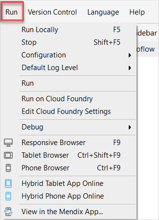

## 1 Introduction

The **Run** menu allows you to deploy and monitor your app:

## 2 Menu Items Overview 

The **Run** menu items are described in the table below:

| Menu Item | Description | Shortcut Key |
| --- | --- | --- |
| **Run Locally** | Runs the project locally so you can view the app. | <kbd>F5</kbd> |
| **Stop** | Stops the currently running project. | <kbd>Shift</kbd> + <kbd>F5</kbd> |
| **Configuration**               | Sets the configuration level (**Default**).                  |                                                    |
| **Default Log Level** | Allows setting the default log level before running the project locally. The options are **Trace**, **Debug**, **Info** (default), **Warning**, **Error**, **Critical**. |  |
| **Publish** | Deploys the project to cloud. The **Console** pane is activated and this shows the output of the server that runs the project. | <kbd>F5</kbd> |
| **Run on Cloud Foundry**        | Opens the **Edit Cloud Foundry Settings** dialog box so you can run your app on Cloud Foundry. |  |
| **Edit Cloud Foundry Settings** | Opens the **Edit Cloud Foundry Settings** dialog box so you can edit your Cloud Foundry settings. For more information on this dialog box, see [Edit Cloud Foundry Settings](edit-cloud-foundry-settings-dialog). | |
| **Debug** | Allows you to connect the [Debugger](view-menu#debugger). | |
| **Responsive Web** | Shows the web client for the currently running project in the browser. | <kbd>F9</kbd> |
| **Tablet Web** | Shows the tablet mobile client for the currently running project in the browser. | <kbd>Ctrl</kbd> + <kbd>Shift</kbd> + <kbd>F9</kbd> |
| **Phone Web** | Shows the mobile client for the currently running project in the browser. | <kbd>Ctrl</kbd> + <kbd>F9</kbd> |
| **View in the Mendix App** | Provides a link to allow you to view the app via the [Mendix Mobile app](getting-the-mendix-app). | |

## 3 Read More

* [Studio Pro Overview](studio-pro-overview)
