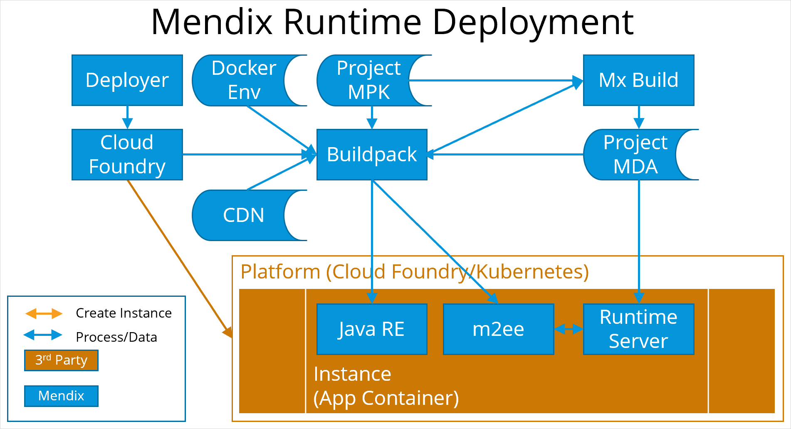

## 1 Introduction

SOMETHING HERE!

This description of deployment is based on an app running in the cloud. You can also run Mendix locally for testing, but this is conceptually the same.

## 2 Mendix Runtime Deployment

When you have created a Mendix app with no structural errors, you need run it by deploying it.

### Deployer

This is initiated by the Mendix Cloud Portal to manage the deployment of an app.

### Docker Env

This is the docker environment specification which specifies the docker environment in a Cloud-Foundry-like way for the Buildpack to process

### Project MPK

This is the project model as created by Studio Pro or Studio. It cannot be directly interpreted by the Mendix runtime.

### MX Build

This converts an app in mpk format to the mda format which can be interpreted by the Mendix runtime.

### Cloud Foundry

This is the command line interpreter which allows Cloud Foundry environments to be created, and code to be pushed into the environments to be executed.

### Buildpack

The buildpack is the Mendix script which controls the deployment of Mendix models to a cloud environment. it performs the following tasks:

- identifies the target environment and bound services such as database and file storage
- if it receives a project in mpk format it initiates Mxbuild to convert it into mda format
- it identifies the correct version of the Java Runtime Environment and pushes it to the environment
- it identifies the correct version of the Mendix runtime and uses m2ee to push the Runtime Server to the environment, with a link to the project mda which defines the project
### Project MDA

This is the Mendix app in mda format, which defines the app in a way which can be interpreted by the Mendix Runtime.

### CDN

This data repository stores components of the deployment process such as versions of the Mendix Runtime and Mx Build.

### Java RE

This is the Java Runtime Environment (JRE) used to run the Runtime Server. The version of the JRE depends on the version of the Runtime Server. For example, Mendix 7 runs on JRE version 8, and Mendix 8 runs on JRE version 11.

### M2ee

M2ee is a collection of helper tools written in python which is used to deploy Mendix apps. It comes in two forms: m2ee-tools and m2ee-sidecar depending on the target platform.
It starts the Runtime Server by starting a Java RE and pointing it at the relevant version of the Runtime Server binary (jar) files. Once it has started, m2ee connects to the Runtime Server to tell it which Mendix application model to load.

### Runtime Server

This is the interpreter which runs the app. For more information see Runtime Server, above.

