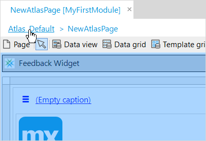
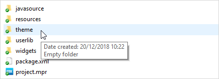
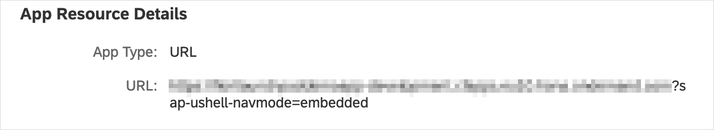
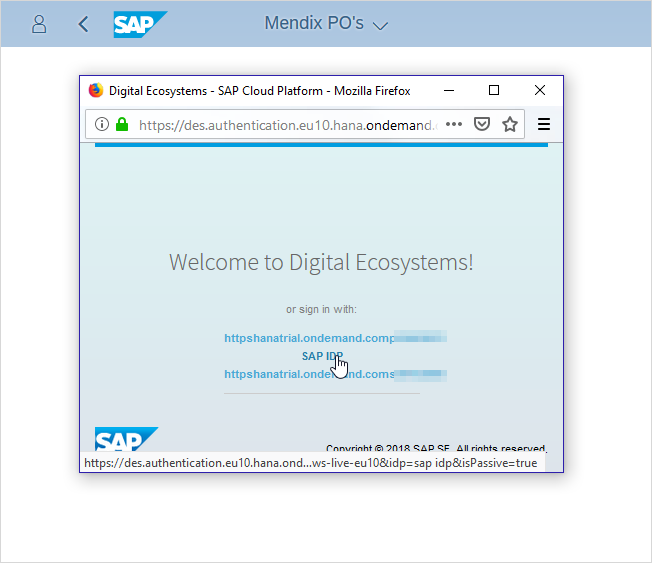

## 1. Introduction

Mendix apps can be added to the SAP Fiori launchpad. However, additional configuration is required to allow the user of the Mendix app to be authorized and prevent the Mendix app from being timed out prematurely.

This document explains how to configure your app to launch from the SAP Fiori launchpad.

{}
The files mentioned in the document are not currently available from the Mendix App Store; you will need to contact SAP or Mendix directly to obtain copies.
{}

## 2. Configuring the App Within the Desktop Modeler

To configure the app, perform the following steps:

### 2.1 SAP Authentication Module Redirect User

1.  Open your app in the Desktop Modeler.

2.  Add the *SapAuthentication* module using the instructions in [How to Import and Export Objects](https://docs.mendix.com/howto/integration/importing-and-exporting-objects)

3.  Set the value of the constant **RedirectUser** to *True*.


### 2.2 SAP Fiori Launchpad Heartbeat

The session management of SAP Fiori Launchpad and the Mendix App are decoupled so you need to tell SAP Fiori Launchpad that the app is still active. If SAP Fiori Launchpad does not hear from your app for twenty minutes, it will timeout.

To prevent the timeout being activated incorrectly, you need to add the **Heart Beat Widget for SAP Fiori launchpad** widget to every page of your app. The widget sends a message to the SAP Fiori Launchpad when the page is opened or refreshed. This extends the timeout by another twenty minutes.

You can add the widget in one of the following ways:

{}[Confirm what is in the starter apps and Fiori UI Package]{}

#### 2.2.1 Using the Blank App for SAP Fiori themed apps App Template

If you use the **Blank App for SAP Fiori themed apps** app template, the widget is inserted automatically into all the navigation layouts in the **SAP_UI_Resources** module. This means that if you create your pages based on any of the following *navigation layouts*, they will automatically contain the widget:

* SAP_Default
* SAP_Default_Letterbox
* SAP_MasterDetail
* SAP_MasterDetail_Embedded
* SAP_Launchpad
* SAP_Default_Embedded
* SAP_Default
* SAP_MasterDetail_Letterbox
* PopupLayout

The **Blank App for SAP Fiori themed apps** app template can chosen when creating a new app, or downloaded from the App Store here – https://appstore.home.mendix.com/link/app/53585/.

#### 2.2.2 Adding the UI Package for SAP Fiori themed apps

You can add SAP Fiori styling to an existing Mendix app by importing the **UI Package for SAP Fiori themed apps**. This will add a set of *navigation layouts* in a new **SAP_UI_Resources** module. If you create your pages based on any of the following *navigation layouts*, all the pages will automatically contain the widget:

* SAP_Default
* SAP_Default_Letterbox
* SAP_MasterDetail
* SAP_MasterDetail_Embedded
* SAP_Launchpad
* SAP_Default_Embedded
* SAP_Default
* SAP_MasterDetail_Letterbox
* PopupLayout

{}
Your app will still contain the original navigation layouts, such as those in the *Atlas_UI_Resources* module. Unless you add the widget manually (see below), any pages you add based on the layouts from these other modules will **not** contain the widget.
{}

The **UI Package for SAP Fiori themed apps** can be downloaded from the App Store here – https://appstore.home.mendix.com/link/app/107625/.

#### 2.2.3 Adding Heart Beat Widget for SAP Fiori launchpad Widget Manually

You can download the **Heart Beat Widget for SAP Fiori launchpad** widget from the App Store here: https://appstore.home.mendix.com/some_link_to_a_widget.

Once it is in your app, you can add it to your pages like any other widget.

Since you will need to put it on every page of your app, it is recommended that you add it to the navigation layout, rather than adding it to each individual page. To do this:

1. Open (or create) a page which is based on the navigation layout you want to update.

2. Click the *navigation layout* name on the page breadcrumb trail.

    

3. Drag the **Heart Beat Widget for SAP Fiori launchpad** widget into the layout page header.

    

4. Save the updated navigation layout.

5. Your page, and all other pages based on this navigation layout, now has the *Heart Beat Widget for SAP Fiori launchpad* widget which will be activated every time the page is opened or refreshed.

    

For more Information about managing layouts, see [How to Use Layouts & Snippets](/howto/front-end/layouts-and-snippets).

## 3. Configuring the Theme Folder

You now need to add some files to the theme folder of your project.

The easiest way to do this is as follows:

1.  Select the menu option **Project > Show Project Directory in Explorer** in the Desktop Modeler.

2.  Navigate to the **theme** folder.



3.  In the theme folder create the following files:

    * login.html
    * login.js
    * redirect.html
    * redirect.js

    {}These files should have been supplied to you by Mendix or SAP. You can also create them by copying the relevant text in the [Appendices](#appendices).{}

## 4 Final Steps

You have now customized your app. You now need to do the following

1. Deploy your app as usual.

2. Add your app to the SAP Fiori launchpad.
    
    * In **App Resource Details**, add the following parameter to the app URL

      `?sap-ushell-navmode=embedded`

      

3. In your browser, allow pop-up windows to be launched from SAP Fiori launchpad.

4. Launch your app from SAP Fiori launchpad.

    

## 5 Known Issues

### 5.1 SAP Fiori Client

If you are using an Android or iOS device, you can use Mendix apps from SAP Fiori Launchpad with a browser. However, owning to security constraints set in the client, it is not currently possible to use the **SAP Fiori Client** app to access your Mendix app.

## 6 Read More

* [How to Use Layouts & Snippets](/howto/front-end/layouts-and-snippets)

## Appendices{#appendices}

You can create the HTML and JavaScript files that you need by copying the content below. (To copy the code to the clipboard, hover over the code and select the **Copy** button which will appear)

### Appendix 1: login.html

```html
<!doctype html>
<html>
<head>
<meta charset="utf-8">
<meta http-equiv="X-UA-Compatible" content="IE=edge,chrome=1">
<title>Login</title>
<meta name="viewport" content="width=device-width, user-scalable=no, initial-scale=1, maximum-scale=1">
<meta name="apple-mobile-web-app-capable" content="yes">
<link rel="stylesheet" href="lib/bootstrap/css/bootstrap.min.css?{{cachebust}}">
<link rel="stylesheet" href="styles/login.css?{{cachebust}}">
</head>
<body>
<script src="js/login_i18n.js?{{cachebust}}"></script>
<script src="js/login.js?{{cachebust}}"></script>
<script type = "text/javascript" src="login.js"></script>
</body>
</html>
```

### Appendix 2: login.js

```javascript
const REDIRECT_PAGE = 'redirect.html'
const FIORI_ACCESS_COOKIE_NAME = 'redirect_access'
// open pop up directly
openLoginPageInNewWindow();
// add event listener to refresh when receive a message
window.addEventListener('message', function(event) {
  if(event.origin !== this.window.origin){
    return;
  }
  if(event.data === 'refresh') {
    window.location = '/';
  }
})
function openLoginPageInNewWindow() {
  deleteAccessCookie();
  window.open(REDIRECT_PAGE, 'Redirect', 'resizable,scrollbars,status,height=800,width=900');
}
function openLoginPageInNewTab() {
  deleteAccessCookie();
  window.open(REDIRECT_PAGE,'_blank');
}
function deleteAccessCookie(){
  document.cookie = FIORI_ACCESS_COOKIE_NAME + "=; expires=Thu, 01 Jan 1970 00:00:00 UTC; path=/;";
}
```

### Appendix 3: redirect.html

```html
<!doctype html>
<html>
<head></head>
<body>
<script type="text/javascript" src="redirect.js"></script>
<script type="text/javascript">
openLoginWithXSUAA();
</script>
</body>
</html>
```

### Appendix 4: redirect.js

```javascript
const XSAUAA_LOGIN_LOCATION = '/xsauaalogin/';
const FIORI_ACCESS_COOKIE_NAME = 'redirect_access'
// Called by redirect.html. Open XSUAA login page only when fiori access cookie is not available, otherwise we close the redirect.html.
// This is a workaround used in fiori
function openLoginWithXSUAA(){
  if (hasAccessCookie()) {
    let targetWindow = window.opener;
    targetWindow.postMessage("refresh", targetWindow.origin);
    window.close();
  }
  else {
    window.location = XSAUAA_LOGIN_LOCATION;
  }
}
function hasAccessCookie(){
  return document.cookie.indexOf(FIORI_ACCESS_COOKIE_NAME) != -1;
}
```
