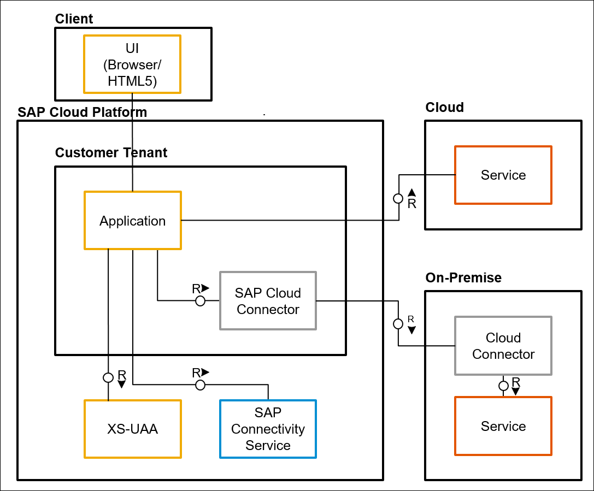
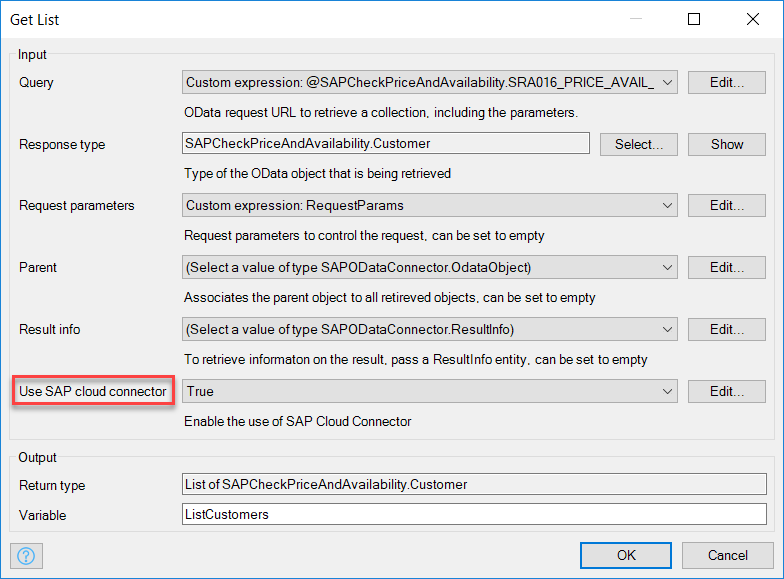

## 1 Introduction

{}
From October 2018, Cloud Connector functionality is provided by SAP Destination Services.
{}

A challenge when running an application in the cloud is to be able to access your on-premises systems in a secure way.

For SAP Cloud Platform users, this is solved by using the SAP Cloud Connector. With the SAP Cloud Connector, a Mendix application deployed on the SAP Cloud Platform can access any SAP system running on premises.

For more information, see [Cloud Connector](https://help.sap.com/viewer/cca91383641e40ffbe03bdc78f00f681/Cloud/en-US/e6c7616abb5710148cfcf3e75d96d596.html
) in the SAP Help Portal.

## 2 Setup

As is shown in the diagram above, a Mendix Application will automatically bind to a connectivity service after deployment on the SAP Cloud Platform. This service contains the secure credentials of the SAP Cloud Connector. With this configuration, it becomes possible  for the SAP OData Connector to get access to an on-premises SAP system.

An important dependency for the SAP Cloud Connector is the JWT token received from the SAP XSUAA service. This means that a Mendix app can only get access to the SAP Cloud Connector if the app has a XSUAA-authenticated user.

## 3 Usage

When the SAP XSUAA Connector and Cloud Connector are set up, the only thing a developer needs to do to use it is enable the **Use SAP cloud connector** flag on one of the SAP OData Connector operators (such as Get List, Create, or Delete).

## 4 Related Content

* [SAP XSUAA Connector](sap-xsuaa-connector)
* [How to Set Up the SAP XSUAA Connector](/howto/sap/use-sap-xsuaa-connector)
* [How to Use the SAP OData Connector](/howto/sap/use-sap-odata-connector)
