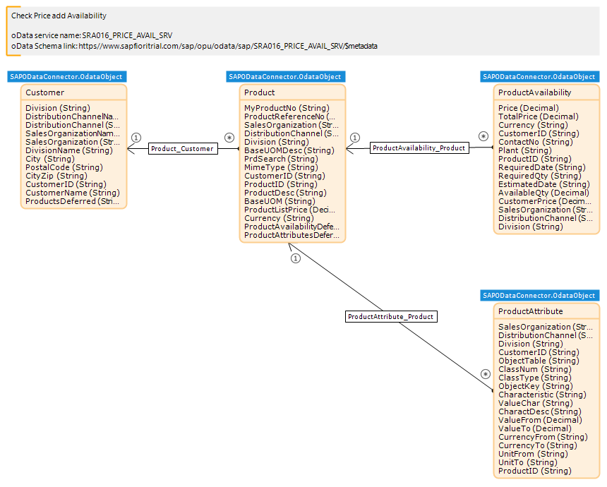

## 1 Introduction

Mendix apps can consume OData services exposed by SAP back-end systems. To do this you need to use the SAP OData Connector.

The SAP OData Connector needs to know details of the OData service which has been exposed. This involves mapping the data structures exposed by the OData service (via the $metadata URL) to entities and attributes of the domain model. This information is created as a Mendix module (.mpk) file which can be imported into your Mendix app.

Any OData service can generate a data model using the SAP OData Model Creator. See [How To Use the SAP OData Model Creator](/howto/sap/use-sap-odata-model-creator) for instructions on how to do this.

To accelerate the consumption of the SAP Business Suite services, Mendix also provides the full set of Business Suite for SAP Fiori Cloud apps as modules in the Mendix App Store.

## 2 SAP Data Models

In Mendix, each **SAP Data** module contains all the entities and attributes used in the apps of the service of the **SAP Business Suite** category.

For example, if you need a CRM app, it is recommended to use a **Field Sales Representative** service like **Check Price and Availability for Field Sales Representative**. The **Check Price and Availability for Field Sales Representative** > **SAP Service** module contains all the entities of the selected service. By using the **SAP Service** module with the **SAP OData Connector** module, you can retrieve those CRM entities from the SAP back-end system in your Mendix app.

The Data Model module contains up to four resources which help to consume the OData Service:

* Domain Model
* End Point
* Entity Set Names
* Function Names

### 2.1 Domain Model

Each Mendix SAP data model (previously referred to as "service modules") has a domain model that describes the information in the OData service. The domain model consists of entities and their relations represented by associations. For more information, see [Domain Model](../domain-model) in the Mendix Reference Guide.

### 2.2 End Point

The module contains a constant whose value is the end point of the OData service. For the **Check Price and Availability for Field Sales Representative** this is the constant SRA016_PRICE_AVAIL_SRV and has the value `https://www.sapfioritrial.com/sap/opu/odata/sap/SRA016_PRICE_AVAIL_SRV`.

### 2.3 Entity Set Names

The enumeration **EntitySetNames**

## 3 Related Content

* [SAP OData Connector](sap-odata-connector)
