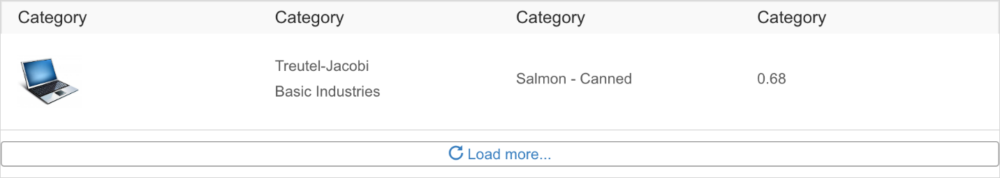

## 1 Introduction

This document contains a summary of the building blocks you can use to create an SAP Fiori themed app.

## 2 Mendix Building Blocks

You can use Mendix building blocks to create an SAP Fiori themed app. To use these building blocks, you can either:

* use the **Fiori Blank** app template; this can chosen when creating a new app, or be downloaded from the App Store here – https://appstore.home.mendix.com/link/app/53585/

* add the **SAP Fiori UI Package** to your app: this can be downloaded from the App Store here – https://appstore.home.mendix.com/link/app/107625/

### 2.1 Datagrid Border Fullpage

### 2.2 Datagrid Fullpage

### 2.3 Flex Container Left

### 2.4 Flex Container Left Center

### 2.5 Flex Container Right

### 2.6 Flex Container Right Center

### 2.7 Footer Accept Reject Edit Delete

### 2.8 Footer Confirm

### 2.9 Footer Edit Delete

### 2.10 Footer Icons

### 2.11 Footer Save Close

### 2.12 Footer Text Icons

### 2.13 Form Horizontal

### 2.14 Form Horizontal Columns

### 2.15 Form Horizontal Line

### 2.16 Form Readonly Compact

### 2.17 Form Vertical

### 2.18 Form Vertical Columns

### 2.19 Form Vertical Line

### 2.20 List

### 2.21 List Border

### 2.22 List Border Header

### 2.23 List Header

### 2.24 List Item Default

### 2.25 List Item Description

### 2.26 List Item Icon

### 2.27 List Item Info

### 2.28 List Item Multiline

### 2.29 Mainheader

### 2.30 Mainheader Columns

### 2.31 Object Status

### 2.32 Pageheader Columns

### 2.33 Pageheader Columns Title

### 2.34 Pageheader Content

### 2.35 Pageheader Content Item

### 2.36 Pageheader Default

### 2.37 Pageheader Space Between

### 2.38 Pageheader Title Buttons

### 2.39 Tile

### 2.40 Wizard

### 2.41 Wizard Step

### 2.42 Wizard Step Active

### 2.43 Wizard Step Visited

