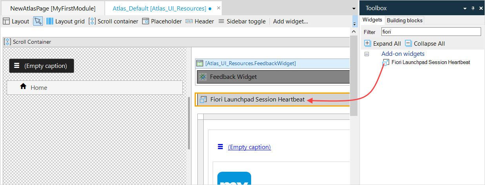
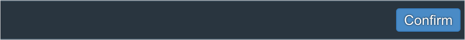
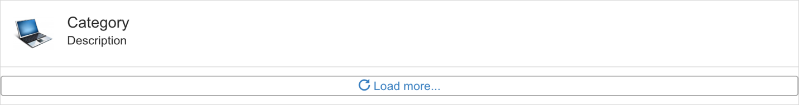
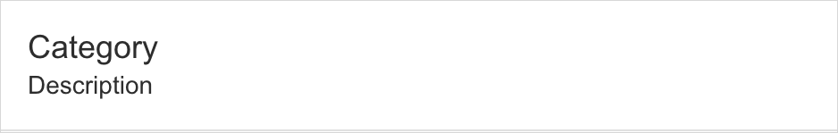

## 1 Introduction

This document explains extra configuration you need to make when running your app in the [SAP Fiori Launchpad](https://experience.sap.com/fiori-design-web/launchpad/). It also contains a summary of the building blocks you can use to create an SAP Fiori themed app.

## 2 SAP Fiori Launchpad

If you want to run your app from the **SAP Fiori Launchpad** you will need to configure your Mendix app. This is because the SAP Fiori Launchpad contains a timeout which does not identify that an unmodified Mendix App is still actively being used.

To prevent the timeout being activated incorrectly, you need to add the **Fiori Launchpad Session Heartbeat** widget to every page of your app. The widget sends a message to the SAP Fiori Launchpad when the page is opened or refreshed. This extends the timeout by another twenty minutes.

You can add the widget in one of the following ways:

{}[Confirm what is in the starter apps and Fiori UI Package]{}

### 2.1 Using the Fiori Blank App Template

If you use the **Fiori Blank** app template, the widget is inserted automatically into all the navigation layouts in the **SAP_UI_Resources** module. This means that if you create your pages based on any of the following *navigation layouts*, they will automatically contain the widget:

* SAP_Default
* SAP_Default_Letterbox
* SAP_MasterDetail
* SAP_MasterDetail_Embedded
* SAP_Launchpad
* SAP_Default_Embedded
* SAP_Default
* SAP_MasterDetail_Letterbox
* PopupLayout

The **Fiori Blank** app template can chosen when creating a new app, or downloaded from the App Store here – https://appstore.home.mendix.com/link/app/53585/.

### 2.2 Adding the SAP Fiori UI Package

You can add SAP Fiori styling to an existing Mendix app by importing the **SAP Fiori UI Package**. This will add a set of *navigation layouts* in a new **SAP_UI_Resources** module. If you create your pages based on any of the following *navigation layouts*, all the pages will automatically contain the widget:

* SAP_Default
* SAP_Default_Letterbox
* SAP_MasterDetail
* SAP_MasterDetail_Embedded
* SAP_Launchpad
* SAP_Default_Embedded
* SAP_Default
* SAP_MasterDetail_Letterbox
* PopupLayout

{}
Your app will still contain the original navigation layouts, such as those in the *Atlas_UI_Resources* module. Unless you add the widget manually (see below), any pages you add based on the layouts from these other modules will **not** contain the widget.
{}

The **SAP Fiori UI Package** can be downloaded from the App Store here – https://appstore.home.mendix.com/link/app/107625/.

### 2.3 Adding Fiori Launchpad Session Heartbeat Widget Manually

You can download the **Fiori Launchpad Session Heartbeat** widget from the App Store here: https://appstore.home.mendix.com/some_link_to_a_widget.

Once it is in your app, you can add it to your pages like any other widget.

Since you will need to put it on every page of your app, it is recommended that you add it to the navigation layout, rather than adding it to each individual page. To do this:

1. Open (or create) a page which is based on the navigation layout you want to update.

2. Click the *navigation layout* name on the page breadcrumb trail.

    

3. Drag the **Fiori Launchpad Session Heartbeat** widget into the layout page header.

    

4. Save the updated navigation layout.

5. Your page, and all other pages based on this navigation layout, now has the *Fiori Launchpad Session Heartbeat* widget which will be activated every time the page is opened or refreshed.

    

For more Information about managing layouts, see [How to Use Layouts & Snippets](/howto/front-end/layouts-and-snippets).

## 3 Mendix Building Blocks

You can use Mendix building blocks to create an SAP Fiori themed app. To use these building blocks, you can either:

* use the **Fiori Blank** app template; this can chosen when creating a new app, or be downloaded from the App Store here – https://appstore.home.mendix.com/link/app/53585/

* add the **SAP Fiori UI Package** to your app: this can be downloaded from the App Store here – https://appstore.home.mendix.com/link/app/107625/

### 3.1 Datagrid Border Fullpage

### 3.2 Datagrid Fullpage

### 3.3 Flex Container Left

### 3.4 Flex Container Left Center

### 3.5 Flex Container Right

### 3.6 Flex Container Right Center

### 3.7 Footer Accept Reject Edit Delete

### 3.8 Footer Confirm

### 3.9 Footer Edit Delete

### 3.10 Footer Icons

### 3.11 Footer Save Close

### 3.12 Footer Text Icons

### 3.13 Form Horizontal

### 3.14 Form Horizontal Columns

### 3.15 Form Horizontal Line

### 3.16 Form Readonly Compact

### 3.17 Form Vertical

### 3.18 Form Vertical Columns

### 3.19 Form Vertical Line

### 3.20 List

### 3.21 List Border

### 3.22 List Border Header

### 3.23 List Header

### 3.24 List Item Default

### 3.25 List Item Description

### 3.26 List Item Icon

### 3.27 List Item Info

### 3.28 List Item Multiline

### 3.29 Mainheader

### 3.30 Mainheader Columns

### 3.31 Object Status

### 3.32 Pageheader Columns

### 3.33 Pageheader Columns Title

### 3.34 Pageheader Content

### 3.35 Pageheader Content Item

### 3.36 Pageheader Default

### 3.37 Pageheader Space Between

### 3.38 Pageheader Title Buttons

### 3.39 Tile

### 3.40 Wizard

### 3.41 Wizard Step

### 3.42 Wizard Step Active

### 3.43 Wizard Step Visited

## 4 Read More

* [How to Use Layouts & Snippets](/howto/front-end/layouts-and-snippets)
