## 1 Introduction

SAP Leonardo Machine Learning Foundation is a toolbox of intelligent technologies, services, and industry expertise provided by SAP. It helps companies  transform into Intelligent Enterprises.

The SAP Leonardo Machine Learning Foundation Connector allows you to use a number of the models which are available in the SAP Leonardo Machine Learning Foundation. The connector provides access to pre-trained and customizable models.

The models which are supported by the SAP Leonardo Machine Learning Foundation Connector are:

* Classify Image (Customizable Image Classification)
* Classify Product from Image (Product Image Classification)
* Detect Face (Face Detection)
* Detect Topic (Topic Detection)
* Extract Image Features (Customizable Image Feature Extraction)
* Recognize Optical Character (OCR)
* Score Similarity (Similarity Scoring)
* Translate (Machine Translation)

## 2 Prerequisites {#prerequisites}

To use the SAP Leonardo Machine Learning Foundation Connector, you need the following prerequisites:

* The SAP Leonardo Machine Learning Foundation Connector downloaded into your app from the Mendix App Store; it can be found here: https://appstore.home.mendix.com/link/app/107221/Mendix/SAP-Leonardo-Machine-Learning-Foundation-Connector
* An API key obtained from the SAP API Business Hub

    1. Go to the SAP Leonardo Machine Learning Foundation - Functional Services page here: https://api.sap.com/package/SAPLeonardoMLFunctionalServices.

    2. Select one of the models shown on the page:

        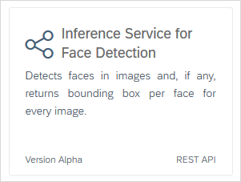

    3. Click Show API Key.

    4. Click Copy Key and Close.

        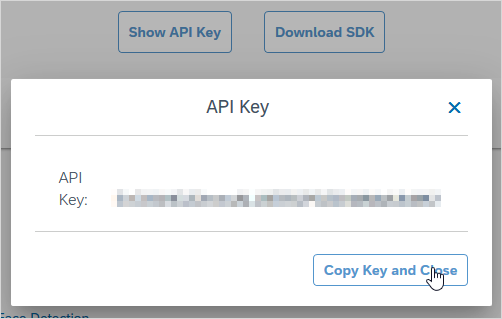

    5. Use the API key in your app, as described in the next section.

## 3 Setting up the API Key {#api-key}

The SAP Leonardo Machine Learning Foundation Connector actions are available in your microflows, once you have imported the SAP Leonardo Machine Learning Foundation Connector module from the Mendix App Store.

Every call to SAP Leonardo Machine Learning Foundation needs to be authenticated by a valid **API key**. Instructions for obtaining this are in the [Prerequisites](#prerequisites) section above.

The API key needs to be pasted as the value of the constant, **APIKey** which is found in *Project '...' > App Store modules > LeonardoMachineLearning > Constants*.

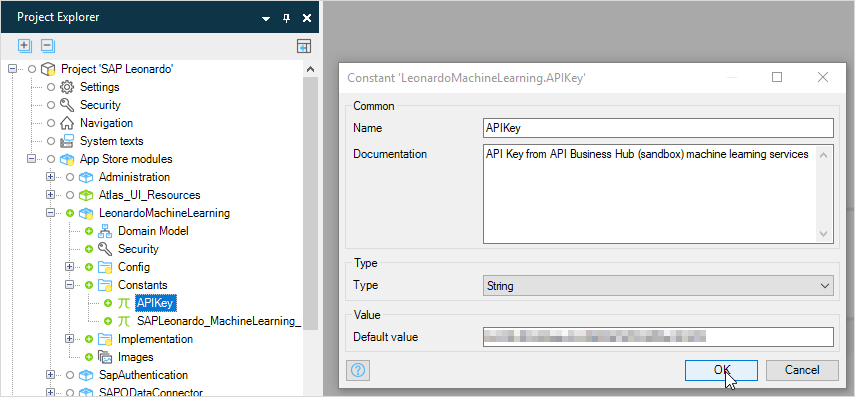

## 4 Microflow Actions

Each action from the SAP Leonardo Machine Learning Foundation Connector is described below.

### 4.1 ClassifyImage

This implements the [**Inference Service for Customizable Image Classification (classification)**](https://api.sap.com/api/image_classification_api/resource) service of SAP Leonardo Machine Learning Foundation. It takes an image and detects the dominant objects present in it from a set of 1000 categories such as trees, animals, food, vehicles, people, and more. A description of the service can be found on the SAP site here: [Inference Service for Customizable Image Classification](https://help.sap.com/viewer/b04a8fe9c04745b98ad8652ccd5d636f/1.0/en-US/d7b4564d6625412c9e50ad1514308043.html). 

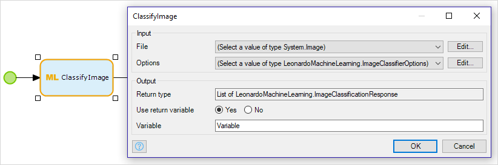

**Input**

There are two inputs to this action.

* File

    This is an image object which is a *System.Image* entity, or an entity which is based on the *System.Image* entity.

* Options

    This is an object of type *LeonardoMachineLearning.ImageClassifierOptions*. This contains two attributes, *ModelName* and *ModelVersion* (corresponding to *modelName* and *version* in the Leonardo API), which identify a specific model to be used in the inference.

    For the default inference model, and when using SAP API Business Hub, this value should be *empty*.

*Limitations*

The **ClassifyImage** action does not currently support a list of image objects, or images in an archive (.zip) file.

*Options* are not available on the SAP API Business Hub.

**Output**

The **ClassifyImage** action returns a list of objects of entity type *LeonardoMachineLearning.ImageClassificationResponse*. Note that this list will contain a single object.

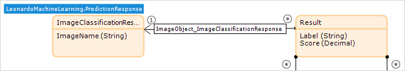

|Entity/Attribute|Leonardo Equivalent|Description|
|---|---|---|
|**ImageClassificationResponse**||One object for each image (currently only one)|
|ImageName|name|Name of the file provided for classification (this will be *empty*)|
|**Result**|results|One object per classification inferred, sorted by probability|
|Label||Name of a classification inferred from the image|
|Score||Probability of the classification provided by label|

### 4.2 ClassifyProductFromImage

This implements the [**Product Image Classification API (inference_sync)**](https://api.sap.com/api/product_image_classification_api/overview) service of SAP Leonardo Machine Learning Foundation. It takes an image or archive of images and classifies them into a fixed set of categories of products that are common in eCommerce. A description of the service can be found on the SAP site here: [Inference Service for Product Image Classification](https://help.sap.com/viewer/b04a8fe9c04745b98ad8652ccd5d636f/1.0/en-US/3013afaa529440429a6e63dfd31d1799.html). 

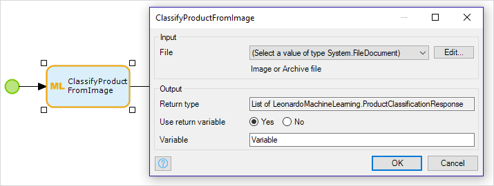

**Input**

The input is an object which is a *System.FileDocument* entity, or an entity which is based on the *System.FileDocument* entity. For example, it could be an object based on *System.Image* which is a single image. It could also be an object containing a *.zip* archive file containing images. 

*Limitations*

The **ClassifyProductFromImage** action does not currently support a list of image objects.

**Output**

The **ClassifyProductFromImage** action returns a list of objects of entity type *LeonardoMachineLearning.ProductClassificationResponse*.

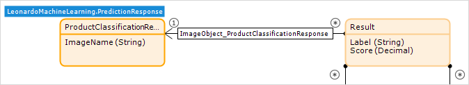

|Entity/Attribute|Leonardo Equivalent|Description|
|---|---|---|
|**ProductClassificationResponse**||One object for each image|
|ImageName|name|Name of the file provided for classification|
|**Result**||One object per classification inferred, sorted by probability|
|Label||Name of a classification inferred from the image|
|Score||Probability of the classification provided by label|

### 4.3 DetectFace

This implements the [**Inference Service for Face Detection (face-detection)**](https://api.sap.com/api/face_detection_api/resource) service of SAP Leonardo Machine Learning Foundation. It takes an image and detects faces in it, if any. It returns information declaring a boundary box per face. A description of the service can be found on the SAP site here: [Inference Service for Face Detection](https://help.sap.com/viewer/b04a8fe9c04745b98ad8652ccd5d636f/1.0/en-US/3c58688fc6b14c8faf80fa5e99d88e32.html). 

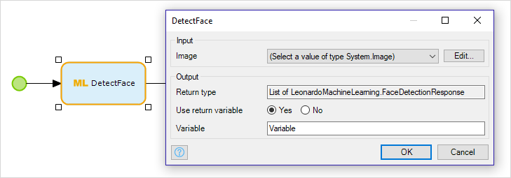

**Input**

The input is an image object which is a *System.Image* entity, or an entity which is based on the *System.Image* entity.

*Limitations*

The **DetectFace** action does not currently support a list of image objects, or images in an archive (.zip) file.

**Output**

The **DetectFace** action returns a list of objects of entity type *LeonardoMachineLearning.FaceDetectionResponse*. Note that this list will contain a single object.

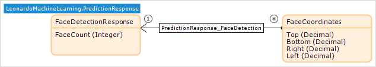

|Entity/Attribute|Leonardo Equivalent|Description|
|---|---|---|
|**FaceDetectionResponse**||One object for each image (currently only one)|
|FaceCount|numberOfFaces|Number of faces detected in the image|
|**FaceCoordinates**|faces|One object per face detected in the image|
|Top||topmost pixel y-coordinate|
|Bottom||bottommost pixel y-coordinate|
|Left||leftmost pixel y-coordinate|
|Right||rightmost pixel y-coordinate|

### 4.4 DetectTopic

This implements the [**Inference Service for Topic Detection (topic-detection)**](https://api.sap.com/api/topic_detection_api/resource) service of SAP Leonardo Machine Learning Foundation. It detects and ranks topics in the input documents. A description of the service can be found on the SAP site here: [Inference Service for Topic Detection](https://help.sap.com/viewer/f09b2311283b4f32a44e106729e11412/1.0/en-US/c90b3a5861f94adbba102164203d5a4b.html). At least two documents must be submitted.

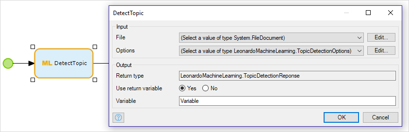

**Input**

There are two inputs to this action.

* File

    This is an object which is a *System.FileDocument* entity, or an entity which is based on the *System.FileDocument* entity. It must be an archive containing at least two text documents.

* Options

    This is an object of type *LeonardoMachineLearning.TopicDetectionOptions*. This contains the following attributes:

    Attribute|Description
    ---|---
    NumTopics|Total number of topics to be detected
    NumTopicsPerDoc|Number of most relevant topics to be listed per document 
    NumKeywordsPerTopic|Number of keywords to be listed per topic
    NumFeatures|Maximum number of keywords to be extracted from documents (optional)

    All the values for the options can be found in the API documentation on the SAP API Business Hub here: https://api.sap.com/api/topic_detection_api/resource. The parameters in the API have the same names as the attributes in the *TopicDetectionOptions* entity.

**Output**

The **DetectTopic** action returns an object of entity type *LeonardoMachineLearning.TopicDetectionResponse*.

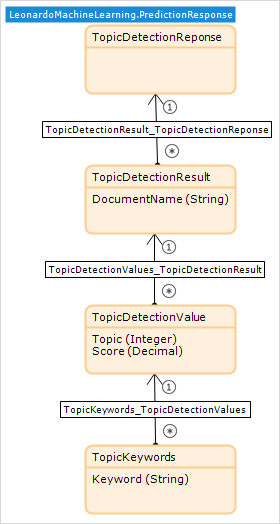

|Entity/Attribute|Leonardo Equivalent|Description|
|---|---|---|
|**TopicDetectionResponse**||The object returned by the action|
|**TopicDetectionResult**||One object per document provided for inference
|DocumentName|docName|Name of the file provided for inference|
|**TopicDetectionValue**|n/a (implicit in the order of the values)|One object per topic detected|
|Topic||A number identifying the topic inferred|
|Score||The 'distance' between the topic *vector* and that of the document|
|**TopicKeywords**|keywords|One object per keyword|
|Keyword||A keyword which, together with the other keywords, defines the topic|

### 4.5 ExtractImageFeature

This implements the [**Inference Service For Customizable Image Feature Extraction (feature-extraction)**](https://api.sap.com/api/img_feature_extraction_api/resource) service of SAP Leonardo Machine Learning Foundation. It takes an image and extracts feature vectors (measurable properties of the image such as edges or objects) for comparison, information retrieval, clustering, or further processing.

The values in the feature vector extracted from the image can be used as input to the ScoreSimilarity action. See section 4.7 [ScoreSimilarity](#score-similarity).

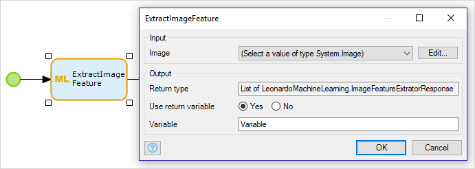

**Input**

An image object which is a *System.Image* entity, or an entity which is based on the *System.Image* entity.

*Limitations*

The **ExtractImageFeature** action does not currently support a list of image objects or images in an archive (.zip) file.

**ExtractImageFeature** uses only the default model for inferring vectors.

**Output**

The **ExtractImageFeature** action returns a list of objects of entity type *LeonardoMachineLearning.ImageFeatureExtratorResponse* [sic]. Note that this list will contain a single object.

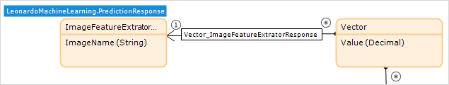

|Entity/Attribute|Leonardo Equivalent|Description|
|---|---|---|
|**ImageFeatureExtratorResponse**||One object for each image (currently only one)|
|ImageName|name|Name of the file provided for classification|
|**Vector**|featureVector|One object per feature vector|
|Value|item|Value assigned to each feature vector|

### 4.6 RecognizeOpticalCharacter (OCR)

This implements the [**Inference Service for Optical Character Recognition (OCR)**](https://api.sap.com/api/ocr_api/resource) service of SAP Leonardo Machine Learning Foundation. It takes one portable document file with the .pdf extension, or one image file in .jpeg, .jpe, or .png format as input. It returns the result in text or xml format.

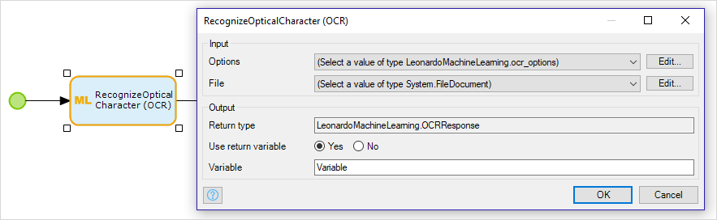

**Input**

There are two inputs to this action.

* Options

    This is an object of type *LeonardoMachineLearning.ocr_options*. This contains the following attributes:

    Attribute|Description|Default
    ---|---|---
    Lang|The language of the text (currently only a single language can be set)|en (English)
    OutputType|The output type of the result|txt 
    PageSegMode|The page segmentation mode|1 (automatic)
    ModelType|The type of the machine learning model for ocr|lstmStandard

    All the values for the options can be found in the API documentation on the SAP API Business Hub here: https://api.sap.com/api/ocr_api/resource?tag=OCR&path=post_ocr&method=post&opId=post_ocr. The parameters in the API have the same names as the attributes in the *ocr_options* entity.
    
* File

    This is an object which is a *System.FileDocument* entity, or an entity which is based on the *System.FileDocument* entity. For example, it could be an object based on *System.Image* which is a single image. It could also be an object containing a *.pdf* portable document format file.

*Limitations*

The **RecognizeOpticalCharacter (OCR)** *Lang* option only accepts a single language for recognition.

The *ocr_options* entity must be passed - the connector does not use the defaults if it is missing.

**Output**

The **RecognizeOpticalCharacter (OCR)** action returns an object of entity type *LeonardoMachineLearning.OCRResponse*.

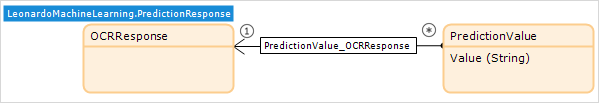

|Entity/Attribute|Leonardo Equivalent|Description|
|---|---|---|
|**OCRResponse**||The response object|
|**PredictionValue**|prediction|one or more objects depending on how the page has been segmented|
|Value||Text which has been recognized in the image, returned in the requested format|

### 4.7 ScoreSimilarity {#score-similarity}

This implements the [**Inference Service For Similarity Scoring (similarity-scoring)**](https://api.sap.com/api/similarity_scoring_api/resource) service of SAP Leonardo Machine Learning Foundation. It compares vectors using a similarity score based on the cosine similarity of the vectors. The vectors retrieved from the **ExtractImageFeature** microflow action or from the *Inference Service for Document Feature Extraction* SAP Leonardo Machine Learning Foundation service can be used as inputs to this service.

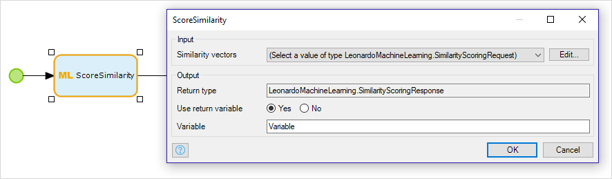

**Input**

An object of entity type *LeonardoMachineLearning.SimilarityScoringRequest*, or an entity which is based on the *LeonardoMachineLearning.SimilarityScoringRequest* entity.

|Attribute|Description|
|---|---|
|numSimilarVectors|The number of scores to return for each vector in the comparison|
|VectorSets|A string, in JSON format, containing the vectors to be compared|

For each vector in *VectorSets*, ScoreSimilarity will return the best *numSimilarVectors* comparisons.

**VectorSets** must be a string in JSON format which, in the simplest case, contains an array (called *0*) of vectors. Each vector contains an identifier and an array of values. See the example, below: [example](#scoresimilarity-example). It is also possible to compare two sets of vectors. More information is in the API documentation here: [Inference Service For Similarity Scoring](https://api.sap.com/api/similarity_scoring_api/resource).

*Limitations*

The vectors to be scored must be provided as a string in JSON format. The action does not accept files as input.

**Output**

The **ScoreSimilarity** action returns an object of entity type *LeonardoMachineLearning.SimilarityScoringResponse*.

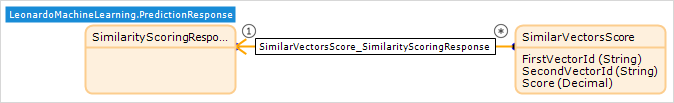

|Entity/Attribute|Leonardo Equivalent|Description|
|---|---|---|
|**SimilarityScoringResponse**||One object which is the parent for the scores|
|**SimilarVectorsScore**|similarVectors|One object per comparison|
|FirstVectorId|id|The id of the vector being compared|
|SecondVectorId|id|The id of the vector which is in the top *numSimilarVectors* matches with *FirstVectorId*|
|Score||A score between -1 and 1 indicating how similar the vectors are|

<a name="scoresimilarity-example"></a>**Example**

You have three vectors, *v0*, *v1*, and *v2*, containing the following values: [1.0, 2.0, 3.0, 4.0], [5.0, 6.0, 7.0, 8.0], and [1.0, 2.1, 3.1, 4.0]. In this case the JSON needs to be constructed as shown in the example, below.

```json
 {
 	"0": [{
 		"id": "v0",
 		"vector": [1.0, 2.0, 3.0, 4.0]
 	}, {
 		"id": "v1",
 		"vector": [5.0, 6.0, 7.0, 8.0]
 	}, {
 		"id": "v2",
 		"vector": [1.0, 2.1, 3.1, 4.0]
 	}]
 }
```

If *numSimilarVectors* is set to *1* then the action will return just the best similarity score for each vector, and the id of the vector which is most similar.

|Vector|Most Similar to|Score|
|---|---|---|
|v0|v2|0.9998|
|v1|v2|0.9705|
|v2|v0|0.9998|

### 4.8 Translate

This implements the [**Inference Service For Machine Translation (translation)**](https://api.sap.com/api/translation_api/resource) service of SAP Leonardo Machine Learning Foundation. It translates one or more strings from a source language to one or more target languages. The Inference Service for Machine Translation is powered by SAP Translation Hub and is trained on SAP-related content to provide accurate domain adaptation and terminology coverage. A description of the service can be found on the SAP site here: [Inference Service for Machine Translation](https://help.sap.com/viewer/f09b2311283b4f32a44e106729e11412/1.0/en-US/c730c916e6e947df9a634b33b66e5ee0.html). 

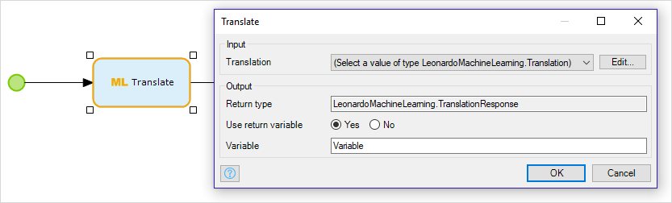

**Input**

An object of entity type *LeonardoMachineLearning.Translation*. This must be associated with a number of other entities, as described below.

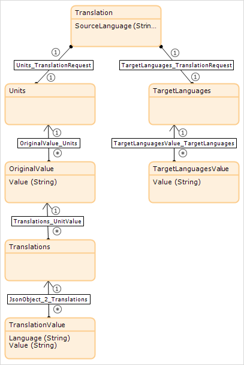

|Entity/Attribute|Description|
|---|---|
|**Translation**|One object which is associated with target languages and text to be translated, grouped into units|
|SourceLanguage|The language of the source text, identified by a two character string (e.g. 'en' for English)|
|**Units**|A way of grouping text to be translated|
|**Original Value**|One or more objects containing fragments of text to be translated|
|Value|A string to be translated|
|**Target Languages**|A way of grouping the target languages for the translation|
|**TargetLanguagesValue**|One or more objects containing a target language for the translation|
|Value|A target language for the translation, identified by a two character string (e.g. 'de' for German)|

For example, to translate the two texts *Hello* and *Goodbye* from English to both Spanish and German, you need to create objects as shown below:

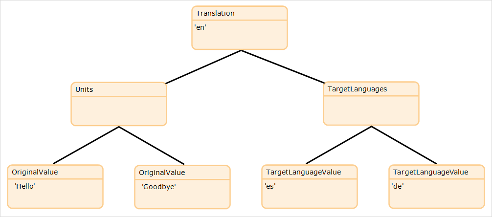

*Limitations*

There is no validation that there is a translation model for any requested language pair. The languages supported are documented here: [Inference Service for Machine Translation](https://help.sap.com/viewer/f09b2311283b4f32a44e106729e11412/1.0/en-US/c730c916e6e947df9a634b33b66e5ee0.html)

Passing the *key* value is not supported.

**Output**

The **Translate** action returns an object of entity type *LeonardoMachineLearning.TranslationResponse*.

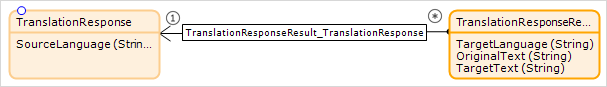

|Entity/Attribute|Leonardo Equivalent|Description|
|---|---|---|
|**TranslationResponse**||One object which is the parent for the translations|
|SourceLanguage||The code indicating the language of the original text|
|**TranslationResponseResult**|translations|One object per text/target language combination|
|TargetLanguage|language|The code indicating the target language of this translated text|
|OriginalText||The original text to be translated|
|TargetText|value|The text in the target language|

## 5 Binding SAP Leonardo Machine Learning Foundation Services to Your App

You can use the SAP Leonardo Machine Learning (ML) Foundation Connector to access the services on *SAP API Business Hub*. This is a *sandbox* where you can explore the services in an *"as-simple-as-possible deployment"*. However, to use the full abilities of the services, you need to bind a ML Foundation Service to your app running in SAP Cloud Platform. More information on the distinction is available in the SAP blog post [Production-ready integration of SAP Leonardo Machine Learning Foundation services with an SAP S/4HANA side-by-side extension built with the SAP S/4HANA Cloud SDK](https://blogs.sap.com/2018/07/29/production-ready-integration-of-sap-leonardo-machine-learning-foundation-services-with-an-sap-s4hana-side-by-side-extension-built-with-the-sap-s4hana-cloud-sdk/).

The following sections describe how to bind a ML Foundation Service to your app.

### 5.1 Adding ML Foundation Trial Entitlement

The ML Foundation Trial is not added automatically to your quota. Therefore, you need to add it manually.

1. Go to the SAP Cloud Platform Cockpit for your account.

2. Choose the **Entitlements** and choose the *ML Foundation Trial* entitlement.

3. Click the **Subaccount** where you want to use the ML Foundation Trial services (this will usually be the *trial* subaccount).

    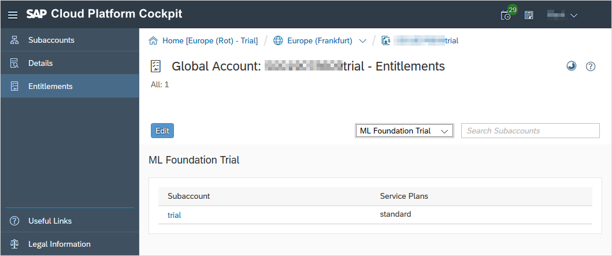

4. You will see your subaccount overview, and can see that ML Foundation Trial has been added.

### 5.2 Binding an Instance of a ML Foundation Service to Your App

1. Go to the **Space** where your app is deployed on SAP Cloud Platform.

2. Select **ml-foundation-trial-beta** from the **Service Marketplace**

    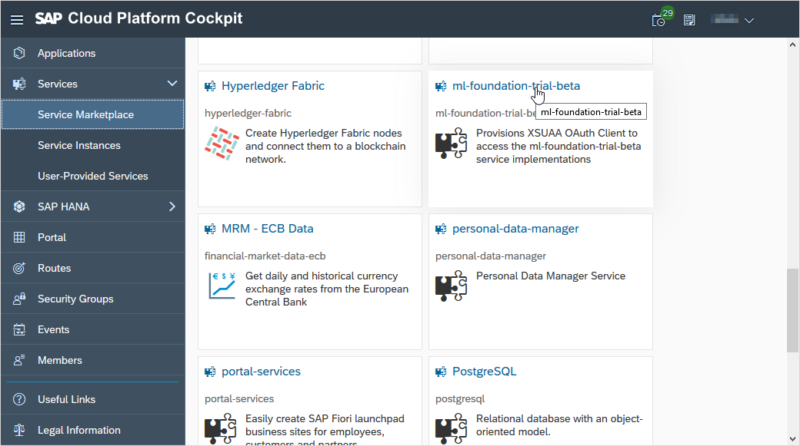

3. Go to **Instances** and click on **New Instance** to add an instance of the service.

4. Choose the desired **Service Plan** and click **Next**.

5. Add parameters, if required, and click **Next**. In most cases additional parameters are not required.

6. Choose your app from the dropdown list of **Application**s. In most cases you will not need to add any parameters.

7. Click **Next**.

8. Type an **Instance Name** for the instance and click **Finish**.

    

## 4 Related Content

* [SAP Leonardo Machine Learning Foundation - Functional Services](https://api.sap.com/package/SAPLeonardoMLFunctionalServices)
