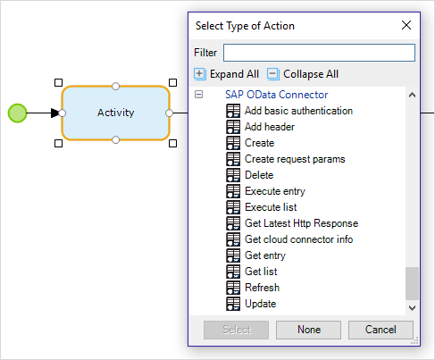
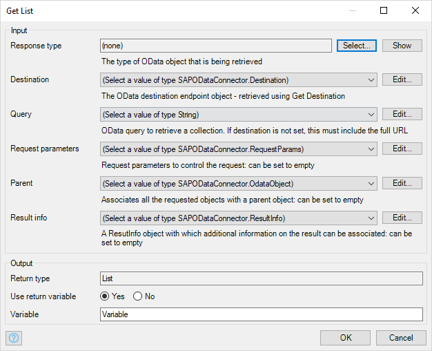
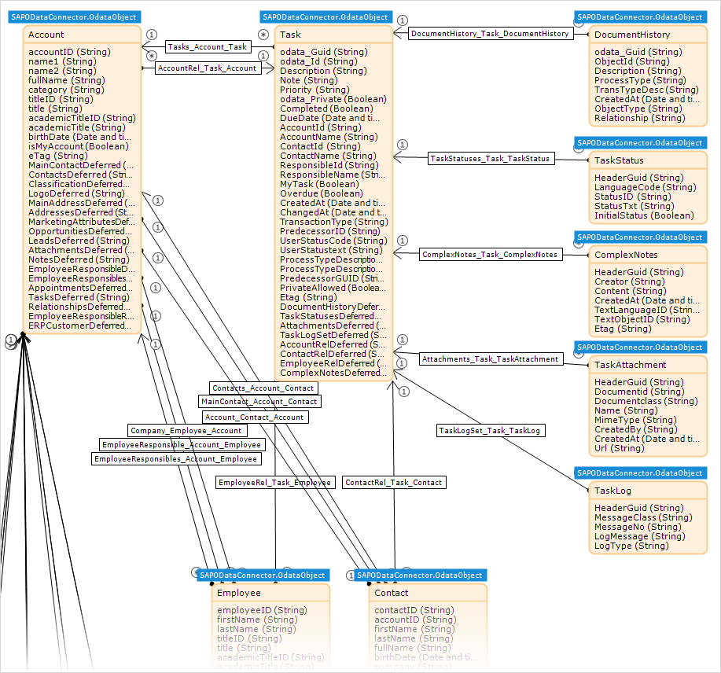
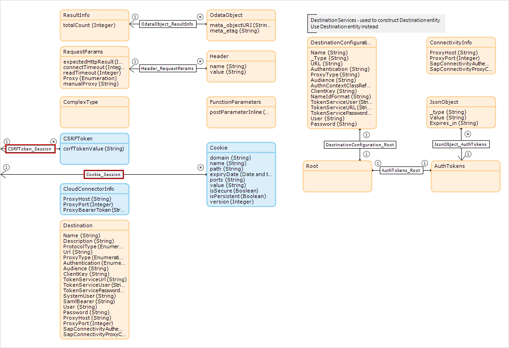
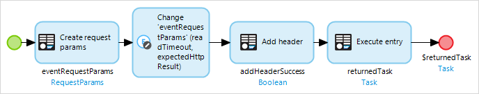

## 1 Introduction<a name="Introduction"></a>

This reference guide describes the actions and domain model of the SAP OData Connector module.

The SAP OData Connector is an OData connector written specifically to integrate with SAP back-end systems like SAP Business Suite (SAP ERP 6.0), SAP S/4HANA, SAP S/4HANA Cloud, and SAP SuccessFactors. The SAP OData Connector can be used for all SAP back-end systems that have OData enabled. For ECC, SAP Gateway will be used to expose the traditional BAPI interface as an OData service.

When running a Mendix application on SAP Cloud Platform, the SAP Cloud Connector will automatically be utilized to gain access to your SAP back-end system. For more information, see the [SAP Cloud Connector](sap-cloud-connector) documentation and the [SAP OData Connector](https://appstore.home.mendix.com/link/app/74525/Mendix/SAP-OData-Connector) in the Mendix App Store.


The SAP OData Connector can be used for example in combination with an SAP Data Model of an SAP Fiori Cloud app. For more details, see [SAP Data Models](sap-data-models). Alternatively, you can generate a data model from the metadata of your OData service, exposed from your SAP back-end system. For more details see [How to Use the SAP OData Model Creator](/howto/sap/use-sap-odata-model-creator).

If you are new to the SAP OData Connector, you can try it out by following our how-to: [How to Use the OData Connector](/howto/sap/use-sap-odata-connector). This reference assumes that you know the details of the SAP OData service you want to use.

## 2 Using the SAP OData Connector<a name="UsingtheSAPODataConnector"></a>

Once you have downloaded the SAP OData Connector from the App Store, it will be imported into your app. You will find it in the Project Explorer under project **{Project name}** > **App Store modules** > **SAPODataConnector**.

### 2.1 Microflow Actions

The SAP OData Connector module gives you access to additional actions which you can assign to your Microflow Activities. These give you access to the SAP services.



The use of each of these actions is described in section [3. Actions](#Actions).

### 2.2 Action Parameters

Each of these actions will ask for a number of parameters which will be categorized as either **Input** or **Output**. Here is an example of the parameters which are required for the **Get List** action.



These parameters are described in section [4. Connector Action Parameters](#ConnectorActionParameters).

### 2.3 Domain Models

This reference guide describes two sorts of domain model. You will mainly be working with the SAP Service Domain Model, a Mendix domain model which represents the data model of the SAP service. This is described first. There is also the SAP OData Connector Domain Model which is used by the SAP OData Connector itself.

For more information on domain models, see [Domain Model](/refguide/domain-model) in the Mendix Reference Guide.

#### 2.3.1 SAP Service Domain Model

Most of the actions of the SAP OData Connector make use of a domain model representing the SAP services data model. These models contain non-persistable Mendix entities which represent SAP Entity Types. There are three types of entity used for this: OdataObject, ComplexType, and FunctionParameters. The entities contain attributes which correspond to the SAP properties plus additional attributes which support the SAP OData Connector.

There are two ways to create a domain model to support your app:

* Download pre-built SAP Fiori Cloud data models from the Mendix App Store. These are available for frequently used SAP services and can be found in the App Store under Connectors > SAP. For more details, see [SAP Data Models](sap-data-models).
* Create a data model by inspecting the service metadata. The response from the service can be used in the [SAP OData Model Creator](https://sapodatamodelcreator.mendixcloud.com/) to generate a domain model which can be imported into your app. Instructions for doing this are in [How to Use the SAP OData Model Creator](/howto/sap/use-sap-odata-model-creator).

{}
In addition to the domain model, the OData Model Creator will also create two other items:

* A constant with the name of the service which has the value of the Service Root URL for the SAP service you are using
* An enumeration (**EntitySetNames**) containing a list of all the entities in the entity model
{}


The examples used in this guide are based on the **SAP My Tasks for Field Sales Representative (CRM)** data model. This can be obtained in the following ways:

* You can download it from the App Store [here](https://appstore.home.mendix.com/link/app/89942/). If you download it within the Desktop Modeler, it will be saved in Project Explorer under **Project {name}** > **App Store modules** > **CRM_TASK**.
* You can create it using the OData metadata XML for Customer Relationship Management Tasks, which can be found at [https://www.sapfioritrial.com/sap/opu/odata/sap/CRM_TASK/$metadata](https://www.sapfioritrial.com/sap/opu/odata/sap/CRM_TASK/$metadata). Save this file and then, using the instructions in [How to Use SAP OData Model Creator](/howto/sap/use-sap-odata-model-creator), import it into your app.
Afterwards make sure to inspect the created constant and its value.

Part of the data model for this sample data is:



This domain model generally works in the same way as a Mendix domain model, with entities, attributes, and associations. However, there are two additions to support the SAP OData Connector:

* Every object is based on an entity which is a specialization of the ComplexType, FunctionParameters, or OdataObject entity. The OdataObject entity adds a **meta_objectURI** string, which is the URI of the object and can be used in entity manipulation actions, and a
**meta_etag** string that identifies a state of the object. This is used by the SAP service when you try to change the data on the SAP service to check if it has been changed since it was retrieved by your app.
* Many objects have attributes which end in ...Deferred. These contain URIs which will return a list of objects of an entity type which is associated with the current object. For example: in the domain model above, the Task entity contains an attribute AttachmentsDeferred. This will contain a URI which can be used to return a list of TaskAttachments associated with the current Task object via the Attachments_Task_TaskAttachment association.

#### 2.3.2 SAP OData Connector Domain Model

In addition to the SAP Service Domain Model, which is used to mirror data held on SAP, there is a domain model which is used by the SAP OData Connector to control the connection between your Mendix app and SAP. This domain model describes the information in the connector's data in an abstract way. It is central to the architecture of the connector module. The domain model consists of entities and their relationships represented by associations.

Here is the domain model of the SAP OData Connector:



Each entity (see [Entities](/refguide/entities) in the Mendix Reference Guide) contains one or more attributes (see [Attributes](/refguide/attributes) in the Mendix Reference Guide):

* **ODataObject** – represents the generic OData object; all entities which can be manipulated directly in the SAP service domain model are specializations of this
  * **meta objectURI** – the address given by the SAP service to the OData object
  * **meta_etag** – the entity tag (ETag) for the object; this is used for optimistic concurrency control to check that an object has not been changed by an SAP service initiated by another user
* **ResultInfo** – holds information about the result of a query
  * **totalCount** – when a query is executed with $inlinecount=allpages the result returns the total record count for the given criteria; if a ResultInfo entity object is specified, this value will be stored in the totalCount attribute and can be used for paging
* **ComplexType** – represents the generic SAP service domain model entities which are of type Complex
* **FunctionParameters** – represents a wrapper for the parameter entities that need to be passed to OData functions
  * **postParameterInline** – a boolean which indicates whether the parameters should be posted inline or passed as the body of the POST request
* **RequestParams** – passes conditions to the SAP OData Connector actions which change the behavior of the action; pass _empty_ if you want to use the default behavior
  * **expectedHttpResult** – the expected HTTP result code; normally, an HTTP result code which is not expected will cause an exception; if a different code (between 200 and 400) is passed in this attribute, the action will treat this code as success; setting the expected HTTP response is useful in cases where OData services return codes that differ from the expected ones (for example, 204 "No Content" when no data is available instead of 200 "OK" with an empty result)
  * **connectTimeout** – limit, in seconds, before creating a connection times out (default 60 seconds)
  * **readTimeOut** – limit, in seconds, before reading from the connection times out (default 120 seconds)
  * **Proxy** – used internally
  * **manualProxy** – used internally
* **Header** – add a custom HTTP header that provides more information in an HTTP request
  * **Name** – the name of the header
  * **Value** – the value of the header
* **CloudConnector Info** – internal use only
* **Cookie** – the cookie is maintained internally and is valid for a Mendix session or in the microflow context of a startup microflow or scheduled event
* **CSRFToken** – the Cross-Site Request Forgery (CSFR) token is maintained internally and is used to prevent CSRF attacks; a CSFR token is maintained for a Mendix session and is also supported in the microflow context of a startup microflow or scheduled event

## 3 Actions<a name="Actions"></a>

This section describes all the actions of the SAP OData Connector. They are categorized as being either for [entity and attribute manipulation](#EntityManipulation) or [helper actions](#HelperActions).

Some inputs are necessary for the connector to work and these are marked **(required)**. Other inputs are not required, but in some cases this must be made explicit by setting them to _empty_.

A more detailed description of the parameters is in section [4. Connector Action Parameters](#ConnectorActionParameters).

### 3.1 Entity and Attribute Manipulation<a name="EntityManipulation"></a>

#### 3.1.1 Create

The Create operation creates a new entity object in the SAP database using the SAP service. The object is defined by an entity in the SAP service domain model which you have imported into your app.

{}
This Create is not the same as the Mendix **Create Object** action. The SAP Create will commit the object to the SAP database and it cannot be rolled back. If you decide later that you do not want this object you must delete it using the object key.
{}

* Input
  * Query (required) - A URL which points to the COLLECTIONNAME to which this object belongs. The COLLECTIONNAME identifies an entity set in the OData service. This tells the SAP service what sort of object you are creating
  * Odata object (required) - an object which is a specialization of the OdataObject entity and corresponds to the entity which is being created
  * Request Parameters - This is used to override the default behavior of the action when responding to conditions such as timeouts and HTTP responses. To keep the standard behavior, set it to _empty_
  * Use SAP cloud connector - **False** if you want to use a publicly accessible service, **True** if you need to access on-premises SAP services via the cloud connector
* Output
  * Return type - Boolean
  * Variable - the name which you would like to give to the boolean variable holding the value indicating the success or failure of the create action

For example, this connector can be used to create a task using the **SAP My Tasks for Field Sales Representative (CRM)** service. In this case the **Query** is

```javascript
@CRM_TASK.CRM_TASK + '/' + toString(CRM_TASK.EntitySetNames.Tasks)
```

**@CRM_TASK.CRM_TASK** is the constant in the SAP Service Data Model which identifies the Service Root for this SAP service.

**CRM_TASK.EntitySetNames.Tasks** is the name of the Tasks collection listed in the EntitySetNames enumeration of the SAP Service Data Model.

The **Odata object** is an object of entity type **Task**. This can be created, by using, for example, the **Create Object** action.

#### 3.1.2 Delete

The Delete operation deletes an existing entity object in the SAP database using the SAP service. The object is defined by an entity in the SAP service domain model which you have imported into your app.

* Input
  * Odata object (required) - The Mendix representation of the object which you wish to delete
  * Request Parameters - This is used to override the default behavior of the action when responding to conditions such as timeouts and HTTP responses. To keep the standard behavior, set it to _empty_
  * Use SAP cloud connector - **False** if you want to use a publicly accessible service, **True** if you need to access on-premises SAP services via the cloud connector
* Output
  * Return type - Boolean
  * Variable - the name which you would like to give to the boolean variable holding the value indicating the success or failure of the delete action

For example, this connector can delete a task using the **SAP My Tasks for Field Sales Representative (CRM)** service.

#### 3.1.3 Execute entry

The Open Data Protocol (OData) includes standard CRUD (Create, Retrieve, Update, and Delete) operations that map to the HTTP methods POST, GET, PUT/MERGE, and DELETE. These are supported in the SAP OData Connector as individual activity actions. In addition, SAP allows you to use additional custom operations (service operations) which cannot be mapped to the standard CRUD operations. These service operations are exposed through the OData service and are invoked by the HTTP methods GET or POST.

The service operations which are supported by the SAP service are listed in the enumeration FunctionNames which is imported as part of the SAP data model.


 The Execute entry action allows you to invoke these service operations on the SAP server. It returns an object from the SAP service. For more information, see the documentation for the SAP service you are using.

* Input
  * Url (required) - the URL of the service operation. This is generally SERVICEROOT/[function name]
  * Http method (required) - GET or POST: the method used to invoke the service operation. GET is usually used to retrieve data and POST is usually used to create data
  * Function parameters (required): Additional parameters which the service operation needs in order to retrieve, update, or create the correct data. The name of the relevant Function Parameters entity, imported into your app as part of the SAP service data model, will be [function name]Parameters. The attributes of this entity will indicate the parameters which are required by the service operation
  * Request Parameters - This is used to override the default behavior of the action when responding to conditions such as timeouts and HTTP responses. To keep the standard behavior, set it to _empty_
  * Response type (required) - the type of entity which represents the object which is returned
  * Use SAP cloud connector - **False** if you want to use a publicly accessible service, **True** if you need to access on-premises SAP services via the cloud connector
* Output
  * Return type - Object: an object which has the same type as the entity type which was passed as Response type
  * Variable - the name which you would like to give to the object which is returned by the SAP service operation

#### 3.1.4 Execute list

This performs the same action as the Execute entry action, but this is used where the expected result from the service operation is a list, rather than a single item.

* Input
  * Url (required) - the URL of the service operation
  * Http method (required) - GET or POST: the method used to invoke the service operation. GET is usually used to retrieve data and POST is usually used to create data
  * Function parameters (required): Additional parameters which the service operation needs in order to retrieve or create the correct data. The name of the relevant function parameters entity, imported into your app as part of the SAP service data model, will be [function name]Parameters. The attributes of this entity will indicate the parameters which are required by the service operation
  * Request Parameters - This is used to override the default behavior of the action when responding to conditions such as timeouts and HTTP responses. To keep the standard behavior, set it to _empty_
  * Response type (required) - the type of entity which represents the objects in the list which is returned
  * Use SAP cloud connector - **False** if you want to use a publicly accessible service, **True** if you need to access on-premises SAP services via the cloud connector
* Output
  * Return type - List
  * Variable - the name which you would like to give to the list of objects which is returned by the SAP service operation

#### 3.1.5 Get Entry

The Get Entry operation gets an existing single object from the SAP service. The object is defined by an entity in the SAP service domain model which you have imported into your app.

* Input
  * Url (required) - The URL of the object to be retrieved
  * Response type (required) - the type of entity which represents the object which is returned
  * Request Parameters - This is used to override the default behavior of the action in responding to conditions such as timeouts and HTTP responses. To keep the standard behavior, set it to _empty_
  * Use SAP cloud connector - **False** if you want to use a publicly accessible service, **True** if you need to access on-premises SAP services via the cloud connector
* Output
  * Return type - Object: an object which has the same type as the entity type which was passed as Response type
  * Variable - the name which you would like to give to the object which is returned by the SAP service

For example, this connector can get details of a task using the **SAP My Tasks for Field Sales Representative (CRM)** service. This can often be done by passing the meta_objectURI attribute of an object, in this case a Task, which you have already retrieved.

For a task with the reference **guid'00505697-47E6-1EE7-BED1-6C5662A87345'**, the URL would be set to:

```javascript
@CRM_TASK.CRM_TASK + '/' + toString(CRM_TASK.EntitySetNames.Tasks) + '(guid%2700505697-47E6-1EE7-BED1-6C5662A87345%27)'
```
This produces the GET request https://www.sapfioritrial.com/sap/opu/odata/sap/CRM_TASK/Tasks(guid'00505697-47E6-1EE7-BED1-6C5662A87345') and, if the task exists, returns an object with entity type Task containing all the data for the task.

#### 3.1.6 Get List

The Get List action gets a list of objects described by a type of entity in the domain model from the SAP service. This action uses filters (SQL queries) to control which objects are returned. The entity collection is described by an entity in the SAP service domain model which you have imported into your app.

* Input
  * Query (required) - the query which will return a list of objects from SAP. See section [4.1.1 Query](#Query) for more information
  * Response type (required) - the type of entity which represents the objects which are returned
  * Request Parameters - This is used to override the default behavior of the action when responding to conditions such as timeouts and HTTP responses. To keep the standard behavior, set it to _empty_
  * Parent - If the Get List action returns a list of objects which all have a single parent object (an object which is linked as one parent to many objects of Response type) then you can pass the parent object here and Get List will make the associations. Set this to _empty_ if it is not required
  * Result info - This is an object of type ResultInfo where the number of items in the list is returned. Note that the query should include $inlinecount=allpages in order to return the total number of items in the list. Set this to _empty_ if it is not required
  * Use SAP cloud connector - **False** if you want to use a publicly accessible service, **True** if you need to access on-premises SAP services via the cloud connector
* Output
  * Return type - List
  * Variable - the name which you would like to give to the list of objects which was returned from the query

For example, to return a list of my tasks, sorted in descending order of CreatedAt using the **SAP My Tasks for Field Sales Representative (CRM)** (CRM_TASK) service, you could enter the following **Query**:

```javascript
@CRM_TASK.CRM_TASK + '/' + toString(CRM_TASK.EntitySetNames.Tasks) + '?' + '$orderby=CreatedAt%20desc' + '&' + '$filter=MyTask%20eq%20true' + '&' + '$inlinecount=allpages'
```

The **Response Type** would be CRM_TASK.Task. **Request Parameters**, **Parent**, and **Result info** can be set to _empty_ **Use SAP cloud connector** should be set to **False**.

#### 3.1.7 Refresh

This action refreshes local data which is cached in objects within the Mendix domain model and may have become 'dirty' or in some other way is not the same as the data held by SAP.

* Input
  * Odata object (required) - The Mendix representation of the object containing the 'dirty' data which you wish to refresh by retrieving it from SAP using the SAP service
  * Request Parameters - This is used to override the default behavior of the action when responding to conditions such as timeouts and HTTP responses. To keep the standard behavior, set it to _empty_
  * Use SAP cloud connector - **False** if you want to use a publicly accessible service, **True** if you need to access on-premises SAP services via the cloud connector
* Output
  * Return type - Boolean
  * Variable - the name which you would like to give to the boolean variable which indicates the success or failure of the refresh action.

#### 3.1.8 Update

The Update operation changes the attributes of an existing entity object in the SAP database using the SAP service. The object is defined by an entity in the SAP service domain model which you have imported into your app.

* Input
  * Odata object (required) - The Mendix representation of the object containing the updated data which you wish to update on SAP using the SAP service
  * Request Parameters - This is used to override the default behavior of the action in responding to conditions such as timeouts and HTTP responses. To keep the standard behavior, set it to _empty_
  * Use SAP cloud connector - **False** if you want to use a publicly accessible service, **True** if you need to access on-premises SAP services via the cloud connector
* Output
  * Return type - Boolean
  * Variable - the name which you would like to give to the boolean variable indicating the success or failure of the update action

For example, this connector can update details of a task using the **SAP My Tasks for Field Sales Representative (CRM)** service.

### 3.2 Helper Actions<a name="HelperActions"></a>

#### 3.2.1 Add basic authentication

This action is a specialized version of the Add header action. It allows an authentication request to be made without having to manually encode the parameters as Base64. It associates a new Header entity object with an object of entity type RequestParams. This header will have a name of 'Authorization' and a value which is the encoding of the Username and Password passed to the action.

* Input
  * Request Parameters (required) - The request parameters are passed as an object of entity type RequestParams. This can be created by using the Create request params action
  * Username (required) - The user to be authenticated
  * Password (required) - The password for the user to be authenticated
* Output
  * Return type - Boolean
  * Variable - the name which you would like to give to the boolean variable indicating the success or failure of the authentication action

#### 3.2.2 Add header

One or more headers can be provided to the SAP OData Connector actions by adding them to RequestParameters. HTTP headers may be required to control the behavior of service operations that you invoke with Execute entry or Execute list.

When you need to pass additional HTTP headers in an SAP OData Connector action, you do not pass the headers directly as a single parameter. The headers are associated with a RequestParams object and it is this object which is used as a parameter to the action. This enables a variable number of headers to be passed easily to an action.

* Input
  * Request Parameters (required) - The request parameters are passed as an object of entity type RequestParams. This can be created by using the Create request params action
  * Name (required) - the name of the HTTP header field
  * Value (required) - the value of the HTTP header field
* Output
  * Return type - Boolean
  * Variable - the name which you would like to give to the boolean variable indicating the success or failure of the add header action

For example, a service operation may require your email address (me@here.com) to be passed in the HTTP header in the "From" HTTP header. In this case you would create a RequestParams object and use Add header to add a header with Name='From' and Value='me@here.com'.

#### 3.2.3 Create request params

This creates a RequestParams object which can be used to control the behavior of other SAP actions such as Get entry. It is also needed before you can create HTTP headers using Add header.

* Input - There are no inputs required for this connector
* Output
  * Return type - SAPODataConnector.RequestParams
  * Variable - the name which you would like to give to the RequestParams object which is returned by this action

#### 3.2.4 Get Latest Http Response

This action returns the HTTP Response to the last OData action that was performed. It is mainly used within exception handling to manage any errors which are returned to the microflow.

* Input - This action does not take any input parameters
* Output
  * Return type - System.HttpResponse
  * Variable - the name which you would like to give to the HttpResponse object which is returned by this action

For example, you could catch an exception on **Get List** and display an error message to the user.


## 4 Connector Action Parameters<a name="ConnectorActionParameters"></a>

This section describes in more detail each of the parameters which is used by one or more of the actions described in section [3. Actions](#Actions).

Every SAP Action will ask for a set of parameters. For example, **Get List**:


The parameters can be entered using the drop down, clicking the **Edit** or **Select...** buttons, or typing directly into a text field.

Within the edit box, you can type your parameter. As is standard in Mendix, certain characters (for example [@ $ .]) will trigger a pop-up window to help you select the right values. This can also be triggered using <kbd>Ctrl</kbd>+<kbd>Space</kbd>. Typing while this pop-up window is open will filter the list of possibilities. For example, you can type (the beginning of) _entitysetnames_ and the pop-up window will allow you to select the collection of entity set names which you want.


Press <kbd>Enter</kbd> to select the highlighted item.

### 4.1 Input Parameters

#### 4.1.1 Query<a name="Query"></a>

This is the OData query which identifies what data should be returned. This query formats an SQL query such as "SELECT * FROM EntitySet WHERE (foo) ORDER BY (bar) ..." into a OData GET request like "GET ~/EntitySet?$filter=foo&$orderby=bar...". It is the responsibility of the developer to ensure that the query is constructed correctly.

The format of the Query is:

```javascript
@SERVICEROOT + '/' + toString(COLLECTIONNAME) + '?' + 'QUERYPARAMETERS'
```

The Query edit box will help you by offering suggestions as described above.

**@SERVICEROOT** is a constant which is created in the SAP Service Data Model and has a value which is the URL of the SAP service.

**COLLECTIONNAME** can be found in the enumeration EntitySetNames which lists all the collections in the SAP Service Data Model.

**QUERYPARAMETERS** are the parameters of the OData query which identify which objects should be returned. Please note:

* The SAP service will define which attributes can be used to filter and sort the result list; the metadata for the service will contain a boolean indicating whether an attribute is **filterable** and/or **sortable**
* The **$expand=[entity]** parameter will return associated (child) entity objects as part of a single query instead of having to retrieve them via a second query; for example, **$expand=TaskStatus** added to a query on the **Tasks** collection will return a list of Tasks and all the TaskStatus objects associated with them

For example, to return a list of my tasks, sorted in descending order of CreatedAt from our **SAP My Tasks for Field Sales Representative (CRM)** (CRM_TASK) service, you could enter the following query:

```javascript
@CRM_TASK.CRM_TASK + '/' + toString(CRM_TASK.EntitySetNames.Tasks) + '?' + '$orderby=CreatedAt%20desc' + '&' + '$filter=MyTask%20eq%20true' + '&' + '$inlinecount=allpages'
```
{}
Note that the request has to be URL encoded so that, for example, spaces have to be encoded as %20. Mendix has the function urlEncode() which can do this for you.
{}

This is the equivalent of the SQL SELECT statement:

SELECT * FROM Tasks WHERE MyTask=true ORDER BY CreatedAt DESC

The $inlinecount=allpages clause asks OData to return a count of the number of objects returned in the list. This will be stored in SAPODataConnector.ResultInfo.totalCount.

You can find more information about OData queries in [OData Query Options](/refguide/odata-query-options).

#### 4.1.2 Response type

When an object is returned from an SAP service, your app needs to know to which entity type it should map the returned data. The Response type is passed so that the response from SAP can be validated. It contains the type of entity which represents the object which is returned by a query or selected via a URL. The Select... button will present you with a list of possible entities. This should match the COLLECTIONNAME that you used in the query or URL.

#### 4.1.3 Odata object

This is an object which is based on an entity type which is a specialization of the OdataObject entity in the SAPODataConnector domain model. These entities are the ones created in the domain models which you can download from the App Store or import via the SAP OData Model Creator. Objects which are not based on a specialization of the OdataObject entity cannot be used here.

#### 4.1.4 Url

This is the parameter used within an action when:

* A specific object on the SAP service is referenced

* A service operation is used to return an object

When you are referencing an object, the format of the URL is:

```javascript
@SERVICEROOT + '/' + toString(COLLECTIONNAME) + '/' + OBJECTINSTANCE
```

**@SERVICEROOT** is the constant in the SAP Service Data Model which identifies the Service Root for this SAP service.

**COLLECTIONNAME** is the name of a collection listed in the EntitySetNames enumeration of the SAP Service Data Model.

**OBJECTINSTANCE** is generally available as an attribute of an entity object.

Alternatively, you can obtain the entire URL from attributes of an object. For example, the **meta_objectURI** attribute of an object is the full URL to the instance of the object which is held by the SAP service.

When you are referencing a service operation, the URL is generally SERVICEROOT/[function name].

For example, the URL of task **guid'00505697-47E6-1EE7-BED1-6C5662A87345'** in the **SAP My Tasks for Field Sales Representative (CRM)** service would be:

```javascript
@CRM_TASK.CRM_TASK + '/' + toString(CRM_TASK.EntitySetNames.Tasks) + '(guid%2700505697-47E6-1EE7-BED1-6C5662A87345%27)'
```

This creates the URL `https://www.sapfioritrial.com/sap/opu/odata/sap/CRM_TASK/Tasks(guid'00505697-47E6-1EE7-BED1-6C5662A87345')`.

#### 4.1.5 Http method

This is the method used to obtain data from the SAP service using a service operation, when standard CRUD methods cannot be used. This is either **GET** or **PUT**.

#### 4.1.6 Function parameters

These are the parameters which are required when a service operation (function) is invoked by Execute list or Execute entry to obtain data from the SAP service when standard CRUD methods cannot be used. These parameters are defined by the SAP service operation.

The SAP data model will contain entities, specializations of the FunctionParameters entity, which contain the attributes required for each of the functions exposed by the SAP service. These entities will be called [function name]Parameters, where [function name] is the name of the exposed SAP service listed in the FunctionNames enumeration which is part of the SAP data model.

Before you pass the function parameters you will need to set the value of the **postParameterInline** attribute. Set it to:

* **true** - the parameters will be sent as part of the HTTP GET or POST instruction
* **false** - the parameters will be sent in the HTTP body after the HTTP headers

For example: in the CRM_TASK SAP service data model there is a function called TaskFollowUpTransTypes. This has an associated entity, TaskFollowUpTransTypesParameters, which is a specialization of the SAP OData Connector entity FunctionParameters. This function parameter entity indicates that you need to supply an odata_Guid and a TransactionType.


To use this function you will need to create an object of entity type TaskFollowUpTransTypesParameters with the correct values for odata_Guid, TransactionType, and postParameterInline using the Create object action. You can then use these parameters when you invoke the function using Execute list.

#### 4.1.8 Request parameters

These are parameters which are used within the SAP OData Connector action to override the default behavior of the action. This should be passed as an object of entity type RequestParams.

The parameters which can be changed are:

* Expected HTTP result - this is used to set the expected success code where this diverges from the specification. For example, the expected result from Create is 201 "created" but a service may have been configured to return 200 "OK"
* Connection Timeout - how long the action should wait before assuming that the connection has timed out (default 60 seconds)
* Read Timeout - how long the action should wait for a response to a request (default 120 seconds)
* Proxy - override the default proxy settings for this action

This is also the parameter which is passed when an SAP OData Connector action requires additional HTTP headers. The Header objects are attached to the RequestParams object via the Header_RequestParams association.

For example, you may be initiating a service operation using the Execute entry action. This service operation requires an additional HTTP header. You also want to set the timeout for receiving the data to 10 seconds, and treat a 204 No Content as a success. You can do this by:

* Creating a RequestParams object using the Create request params action. This will return an object of type RequestParams
* Use Change Object on your new object to set the attribute readTimeout to 10 and attribute expectedHttpResult to 204
* Use Add header to add the required HTTP header. This can be done repeatedly to add as many HTTP headers as are needed by the service operation being invoked by Execute entry.
* Invoke the service operation with Execute entry using the required URL, HTTP method, Function parameters, and the Request parameters and associated HTTP headers which you created above.



Request parameters can also be set to _empty_ if no headers are needed and the default action behavior is used.

#### 4.1.9 Parent

This is an object which should be associated as the parent of a list of objects returned from the Get List action.

Within the Mendix domain model representing an SAP service, there are associations set up between the entities. However, these associations are not set when you get data from an SAP service. The associations which exist within the SAP service are held as ...Deferred attributes within the entity object. When a list of objects is returned, you can set up an association to a parent object within the Mendix domain model. A parent object is an object of an entity type which is at the one end of a one-to-many association to  another entity type.

Set this to _empty_ if it is not required.

For example, Account is the parent entity of task via the Tasks_Account_Task association in the CRM_TASK domain model.


{}
There is no data content validation on the Parent parameter. This means you will not get an error if you:

* Link all the objects in a returned list to the wrong parent (if, for example, your query does not select on the correct parent object)
* Pass a parent object which has no association with the entity type of the returned list of objects
{}

For example, you want to retrieve all the Tasks which are associated with the 'My Account' account via the Tasks_Account_Task association. By passing the taskDeferred URL to the Get List action as the URL and passing the Account entity as Parent, the Get List action will set the Task_Account_Task association between all the Tasks retrieved and the Account.

#### 4.1.10 Result info

 This is an object of type ResultInfo where the number of items in the list is returned. It is used for the Get List action. Note that for a Get List the query should include $inlinecount=allpages in order to return the total number of items in the list.

Set this to _empty_ if it is not required.

#### 4.1.11 Use SAP cloud connector

This is a Boolean parameter which tells the SAP OData Connector where your SAP services are hosted. It should be set to:

* **False** if you want the action to use a publicly accessible service
* **True** if you wish to use the SAP Cloud Connector to access the service. This will be configured on your SAP Cloud Platform subaccount and enables you to connect to an SAP service elsewhere (for example a service which is run on-premises)

For more information, see the [SAP Cloud Connector](sap-cloud-connector).

#### 4.1.12 Username

This is a username used for creating an authorization HTTP header field.

#### 4.1.13 Password

This is the password associated with a username and is used for creating an authorization HTTP header field.

#### 4.1.14 Name

This is the name of an HTTP header field which is a component of the HTTP header which is part of an HTTP message. It is used to provide an operating parameter for an HTTP transaction.

#### 4.1.15 Value

This is the value of an HTTP header field which is a component of the HTTP header which is part of an HTTP message. It is used to provide an operating parameter for an HTTP transaction.

### 4.2 Output Parameters

#### 4.2.1 Return type

This is the type of data which will be returned from the action. There are three types of data:

* boolean - indicating the success or failure of the action
* object - an object of an entity type which is either in the SAP service domain model, or in the SAP OData Connector domain model
* list - a list of objects of the same type, defined by an entity type in the SAP service domain model

#### 4.2.2 Variable

This is the name that you give the result of your Activity. This can be used later in the Microflow to drive logic or to return data. Mendix will suggest a name for you, but you can change it if you want to.

## 5 Related Content

* [Attributes](/refguide/attributes)
* [Data Types](/refguide/data-types)
* [Domain Model](/refguide/domain-model)
* [Entities](/refguide/entities)
* [How to Use App Store Content in the Modeler](/community/app-store/use-app-store-content-in-the-modeler)
* [How to Use the SAP OData Connector](/howto/sap/use-sap-odata-connector)
* [How to Use the SAP OData Model Creator](/howto/sap/use-sap-odata-model-creator)
* [OData metadata XML for CRM Task](https://www.sapfioritrial.com/sap/opu/odata/sap/CRM_TASK/$metadata)
* [SAP Cloud Connector](sap-cloud-connector)
* [SAP Help Portal](https://help.sap.com)
* [SAP My Tasks for Field Sales Representative (CRM) data model](https://appstore.home.mendix.com/link/app/89942/)
* [SAP OData Connector](https://appstore.home.mendix.com/link/app/74525/Mendix/SAP-OData-Connector)
* [SAP OData Model Creator](https://sapodatamodelcreator.mendixcloud.com/)
* [SAP Data Models](sap-data-models)
* [OData Query Options](/refguide/odata-query-options)
