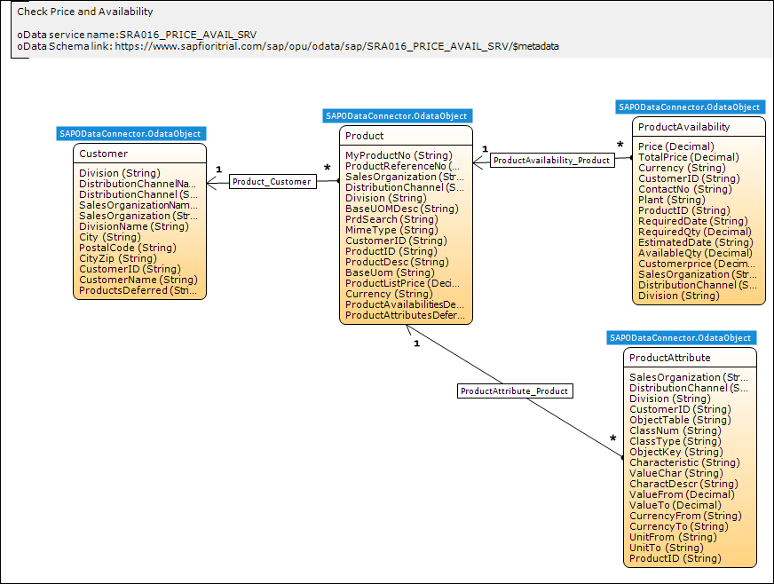

## 1 Introduction

To accelerate the consumption of the SAP Business Suite services, Mendix provides the full set of Business Suite for SAP Fiori Cloud apps as modules in the Mendix App Store.

These modules can be used in combintation with the SAP OData Connector to consume the SAP services.

In Mendix, each **SAP Service** module contains all the entities and attributes used in the apps of the service of the **SAP Business Suite** category.

For example, if you need a CRM app, it is recommended to use a **Field Sales Representative** service like **My Tasks**. The **My Tasks** > **SAP Service** module contains all the entities of the selected service. By using the **SAP Service** module with the **SAP OData Connector** module, you can retrieve those CRM entities from the SAP back-end system in your Mendix app.

##  2 Domain Model

Each Mendix SAP Service module has a domain model that describes the information in the module's data in an abstract way. This is central to the architecture of the module. The domain model consists of entities and their relations represented by associations. For more information, see [Domain Model](../domain-model) in the Mendix Reference Guide.

Each entity has a list of attributes. The properties of an entity and an attribute are described below.

### 2.1 Entities

An entity represents a class of real-world objects, such as customers, invoices, work items, etc. An instance of an entity is called an object. For example, the object representing the person "Bob Marley" could be an instance of the entity "Person". For more information, see [Entities](../entities) in the Mendix Reference Guide.

The SAP Service modules have specific entities, depending on the line of business. An HR line of business has entities like "employee," "request," and "paycheck." A sales line of business has entities like "products," "availability," and "price."

### 2.2 Attributes

Attributes are characteristics that describe and/or identify an entity. For example, a "customer" entity typically has attributes for the name of the customer, an e-mail address, and other personal information. For more information, see [Attributes](../attributes) in the Mendix Reference Guide.

## 3 Related Content

* [SAP OData Connector](sap-odata-connector)
