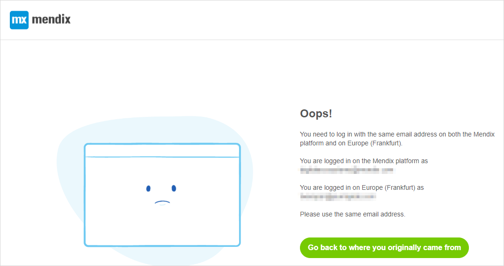
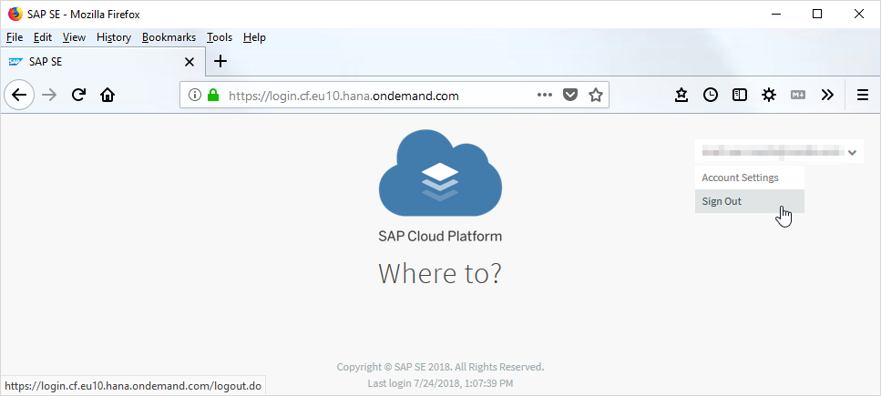

## 1 Introduction

Mendix has Single Sign-On for SAP users (*for some SAP regions*). This means that you are authenticated to Mendix using SAP credentials.

One implication of this is that you must use the same username (email address) for both SAP and Mendix.

## 2 Logging on to Mendix Using SSO

## 3 Creating and Deploying Apps Using SSO

This section presents example user scenarios that can be referenced when using these features.

## 4 Resolving "Go back to where you originally came from" Error

This error happens when working with SAP environments from within the Mendix Developer Portal. As described on the error page, it occurs when you are logged in on the Mendix platform under one email address, but logged in to the SAP region in which you are working under a different email address.

There are three possible solutions, depending on why the email addresses are different.

### 4.1 Mendix email address is correct, but SAP email address is incorrect.

In this case you cannot resolve the issue from within Mendix. You will continue to get the error each time you try to link your accounts.

To resolve this problem, you must sign out of the SAP region so that you can then enter the correct credentials. The sign out is based on the region you are using and has the format `https://login.cf.{region}.hana.ondemand.com/`. For example:

* https://login.cf.eu10.hana.ondemand.com/ for Europe
* https://login.cf.us10.hana.ondemand.com/ for US-East

Select the down arrow next to your username, and this will give the option to **Sign Out**.

## 5 Related Content

{Do not enter anything here, this will be generated by Mendix.}
