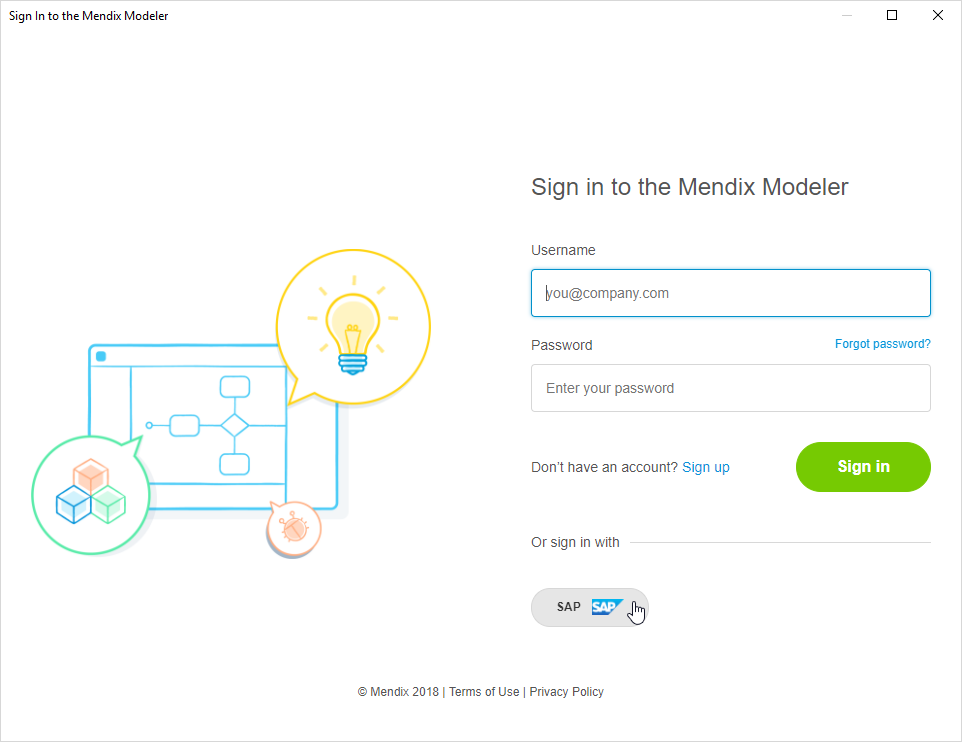
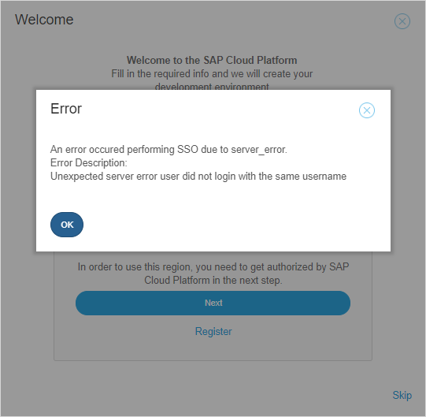

## 1 Introduction

Mendix has Single Sign-On for SAP users (*for some SAP regions*). This means that you are authenticated to Mendix using SAP credentials.

One implication of this is that you must use the same username (email address) for both SAP and Mendix.

## 2 Logging on to Mendix Using SSO

When you log on to the Mendix Desktop Modeler, you have the option to use SAP authentication or Mendix authentication.

{}

For SAP authentication, your SAP and Mendix usernames must be the same.

Your password can be different in your Mendix credentials and your SAP credentials

{}

### 2.1 Logging in Using Mendix Credentials

You can enter your **Email Address** and Mendix **Password** and click **Sign in**. This will authenticate you with the credentials held by Mendix.

### 2.2 Logging in Using SAP Credentials

You can click **SAP** to ask to use your SAP credentials. These are region based, so you will be asked to select a region:

Select the region and you will be asked for your **SAP credentials**.

Enter the correct credentials and you will be signed in to the Desktop Modeler.

## 3 Creating and Deploying Apps Using SSO

When you create an SAP app or a new SAP Cloud Platform environment, you may be asked to sign in to SAP.

This is triggered if you do not already have an active session in the SAP region you have selected.

First you select a region:

If you need to enter your credentials you will be asked for them:

Enter the correct credentials and you will be signed in to continue the creation of your SAP Cloud Platform environment.

## 4 Resolving "Go back to where you originally came from" Error

This error happens when working with SAP environments from within the Mendix Developer Portal. As described on the error page, it occurs when you are logged in on the Mendix platform under one email address, but logged in to the SAP region in which you are working under a different email address.

When you click **Go back to where you originally came from**, you will see a second error message which you will have to clear by clicking **OK**.

There are three possible solutions, depending on why the email addresses are different. Some of these can be changed within Mendix itself, but you may also need to make changes directly on the SAP site.

### 4.1 Mendix email address is correct, but SAP email address is incorrect

In this case you cannot resolve the issue from within Mendix. You will continue to get the error each time you try to link your accounts.

To resolve this problem, you must sign out of the SAP region so that you can then enter the correct credentials. The sign out page is based on the region you are using and has the format

`https://login.cf.{region}.hana.ondemand.com/`. 

For example:

* https://login.cf.eu10.hana.ondemand.com/ for Europe (Frankfurt)
* https://login.cf.us10.hana.ondemand.com/ for US-East (VA)

Choose the URL for the correct region.

Select the down arrow next to your username, and this will give the option to **Sign Out**.

Click **Sign Out** and you can then return to Mendix and login again with an account which has the same email address as the one you use for Mendix.

### 4.2. You are using the wrong region

You may get this error if you have chosen the wrong region to deploy your app. Check that you have selected the right region. You can be logged in to several SAP regions and if you use different email addresses for these then this error can occur.

### 4.3 You are using the wrong Mendix account

If you have more than one account with Mendix, check that you have created your app using the correct Mendix account.

If you are using the wrong Mendix account, you will have to log out of Mendix and log in again with the correct account. You will then have to create the app again. Alternatively, you can be invited to join the app as another team member.

{}

You cannot solve this problem by changing your email address on Mendix. This **does not** change your Mendix username.

{}

## 5 Related Content

* [SAP Cloud Platform](/developerportal/deploy/sap-cloud-platform)
