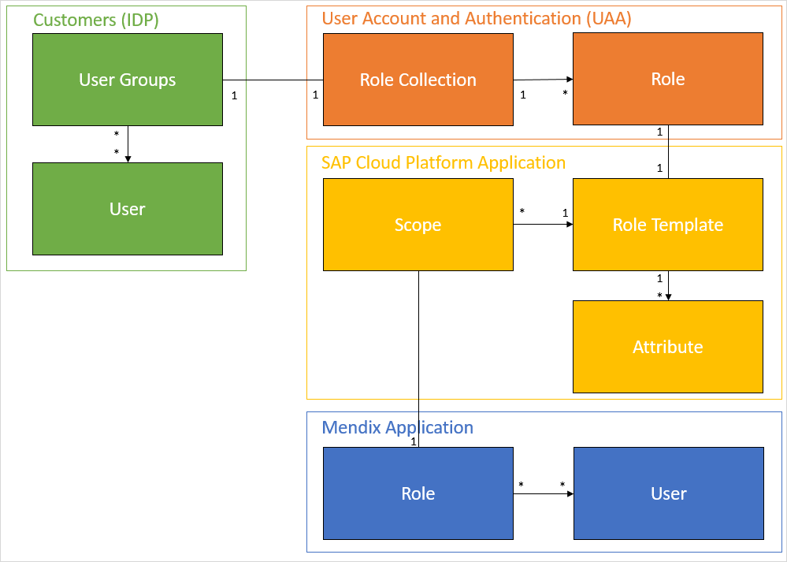
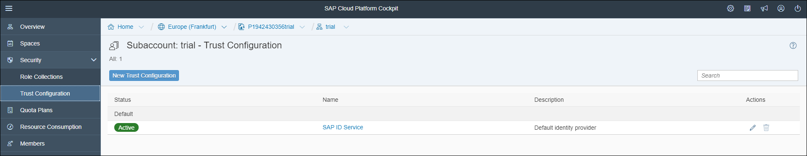

## 1 Introduction

XSUAA is a service provided by the SAP Cloud Platform that will bind to the Mendix application as soon as the application is deployed within the SAP Cloud Platform using the deployment features in the Mendix Developer Portal.

Out of the box, the SAP Cloud Platform has the SAP external identify provider (IDP) configured as the default IDP. It is possible to use your own (corporate) IDP as an alternative so that you can automatically give access to all the employees of your organization.

## 2 Setup

In this diagram, the relationship is shown between groups, roles, and users in relation to the Mendix application and the IDP:

A Mendix application is role-based by default. When deploying a Mendix app to the SAP Cloud Platform using the the deployment features in the Mendix Developer Portal, the SAP Cloud Platform application configuration is automatically created (identified in the yellow section of the diagram above). This configuration reflects the roles that are defined in the Mendix app (identified in the blue section of the diagram).

To assign users from the IDP to these roles generated by the model, the account admin needs to add the mapping between the IDP user groups and the role templates (identified in the orange section of the diagram).

## 3 Working

When XSUAA is enabled on the SAP Cloud Platform and the SAP XSUAA Connector is part of the Mendix application (for details on this connector, see [How to Set Up the SAP XSUAA Connector](/howto/sap/use-sap-xsuaa-connector)), an IDP user automatically becomes a Mendix application user. They will be assigned to the roles in the Mendix application based on the scopes they have received from the XSUAA service. The scopes are defined by the mapping between the role templates and the role collections.

## 4 Related Content

* [How to Set Up the SAP XSUAA Connector](/howto/sap/use-sap-xsuaa-connector)
