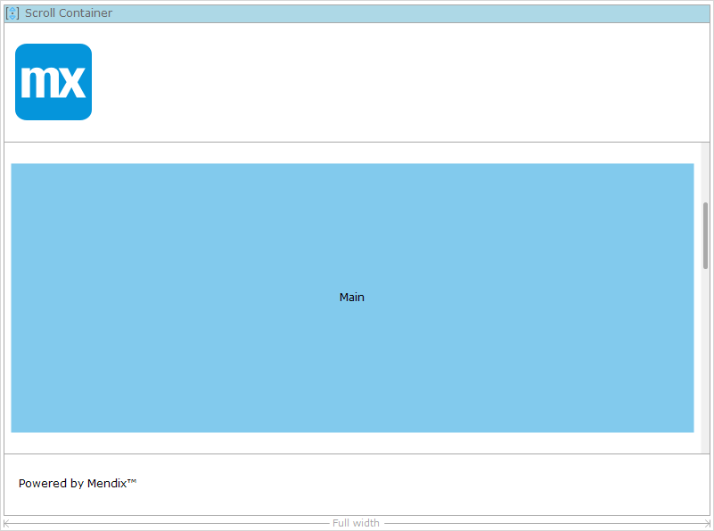

## 1 Introduction

A scroll container is used to divide the layout in regions (for details on regions, see [Scroll Container Region](scroll-container-region)) such as the header, sidebar, or footer. A scroll container must be the only top-level widget. Apart from that, a scroll container can only be placed directly in another scroll container.

Scroll containers may be placed on navigation layouts as well as on pages.

The scroll container decisions the layout in three parts: a header containing a logo, a content part with a placeholder and a footer.

## 2 Properties

An example of scroll container properties is represented in the image below:

Scroll container properties consist of the following sections:

* [Common](#common)
* Design Properties
* [General](#general)

### 2.1 Common Section {#common}

{}

### 2.2 General Properties {#general}

#### 2.2.1 Layout Mode

This property determines in which mode the scroll container operates.

| Value | Description |
| --- | --- |
| Headline | The top and bottom regions extend the entire width of the container and the remaining regions are placed in the middle. |
| Sidebar | The side panels extend the full height of the container. |

_Default value:_ Headline

{}Not supported on native mobile pages.{}

#### 2.2.2 Scroll Behavior

This property determines what happens when the content of a region does not fit in the region.

| Value | Description |
| --- | --- |
| Per region | Every region will show its own scroll bar in case its content does not fit. |
| Full widget | The scroll container will grow to fit its contents and will leave scrolling to its parent. |

_Default value:_ Per region

{}Not supported on native mobile pages.{}

#### 2.2.3 Width {#width}

By default the scroll container will extend the full width of its parent widget. It can also be given a specific width, which can be defined either in pixels or percentage of its parent widget.

_Default value:_ Full width

{}Not supported on native mobile pages.{}

#### 2.2.4 Width Value

This property is displayed only when the [**Width**](#width) property is set to *Pixels* or *Percentage*. This property determines the width of the scroll container, either in pixels or a percentage.

#### 2.2.5 Alignment 

This property is displayed only when the [**Width**](#width) property is set to *Pixels* or *Percentage*. The scroll container can be aligned to the left, to the right, or in the middle of its parent widget.

_Default value:_ Center

### 2.3 Regions Section

{}Regions are not supported on native mobile pages.{}

Defines the content area of a scroll container. For more information see the [Scroll Container Region](#scroll-container-region) section.

#### 2.3.1 Enable Top

Determines whether the scroll container should contain a top region.

#### 2.3.2 Enable Bottom

Determines whether the scroll container should contain a bottom region.

#### 2.3.3 Enable Left

Determines whether the scroll container should contain a left region.

#### 2.3.4 Enable Right

Determines whether the scroll container should contain a right region.

## 3 Scroll Container Region

A scroll container region is part of a scroll container, and defines a content area.

### 3.1 Scroll Container Region Specific Properties

#### 3.1.1 Width (only for left and right region)

Whether the width value of the region is defined in pixels or as a percentage of its parent's width.

#### 3.1.2 Width Value (only for left and right region)

The width of the region, either in pixels or a percentage, depending on the value of the width property.

#### 3.1.3 Height (only for top and bottom region)

Whether the height value of the region is defined in pixels or as a percentage of its parent's height.

#### 3.1.4 Height Value (only for top and bottom region)

The height of the region, either in pixels or a percentage, depending on the value of the height property.

## 4 Read More

* [Page](page)
* [Container Widgets](container-widgets)
* [Properties Common for Widgets](common-widget-properties)