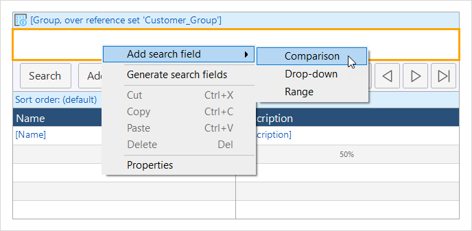

## 1 Introduction

The search bar contains search fields that allow the end-user to quickly find the information they need in a [data grid](data-grid) or [template grid](template-grid).

To add a search field to the search bar, right-click within the search bar in your data grid and choose **Add search field** > [Type of the search field](#search-field-type). 

## 2 Search Field Types {#search-field-type}

There are three different types of search fields that can be used for different kinds of information:

* **Comparison** – search results are filtered by comparing them to the given search term. If the search value matches the attribute value, this object will be a part of the search result. Possible attribute types: AutoNumber, Date and Time, Integer, Long, String, Decimal 
* **Drop-down** – will apply a filter based on whether the search term falls between the values of two selected attributes. Possible attribute types: AutoNumber, Date and Time, Integer, Long, Decimal 
* **Range** –  search results are filtered by comparing them to the given search term. If the search value matches the attribute value, this object will be a part of the search result. Possible attribute types: Boolean, Enumerations, Associations 

{}

You cannot change the type of a search field, you will need to delete it and then add a new one of a different type.

{}

## 3 Search Field Properties {#search-field-properties}

Properties depend on the type of the search field. 

### 3.1 Common Section {#common}

{}

### 3.2 General Section

#### 3.2.1 Attribute (Path)

This property is available for **Comparison** and **Drop-down** search fields. 

Many input widgets (like text boxes and drop-down widgets) can be connected to the following:

* An attribute of the entity of the data view that contains the widget; in this case, the widget is connected to an attribute
* An attribute of an entity associated with the data view entity by following one or more associations of the reference type through the domain model; in this case, the widget is connected to an attribute path

In the first case, we say the widget is connected to an attribute, and in the second case it is connected to an attribute path.

{}

In Mendix 8.0, an input widget connected to an attribute path must be read-only. Studio Pro will check this for you.

In Mendix 8.1 and above, you can edit attributes presented in input widgets over a path.

{}

#### 3.2.2 Comparison

This property is available for **Comparison** and **Drop-down** search fields. 

The value entered by the end user (or the default value in the case of hidden and read-only search fields) is compared to the value of the attribute of each of the objects in the grid. If the match succeeds, the object will be part of the search result. There are different ways in which the attribute value and the entered value can be compared. In the third column below you see the type of search field for which the comparison operator is allowed.

| Value            | Description                                                  | Search field types                      |
| ---------------- | ------------------------------------------------------------ | --------------------------------------- |
| Contains         | Does the attribute value contain the entered value?          | Text (attribute must be of type String) |
| Starts with      | Does the attribute value start with the entered value?       | Text (attribute must be of type String) |
| Greater          | Is the attribute value greater than the entered value?       | Text, Date                              |
| Greater or equal | Is the attribute value greater than or equal to the entered value? | Text, Date                              |
| Equal            | Is the attribute value the same as the entered value?        | Text, Date, Drop-down                   |
| Not equal        | Is the attribute value not the same as the entered value?    | Text, Date, Drop-down                   |
| Smaller or equal | Is the attribute value smaller than or equal to the entered value? | Text, Date                              |
| Smaller          | Is the attribute value smaller than the entered value?       | Text, Date                              |

_Default value:_ Equal

{}

For **Drop-down** search fields:  there is no limit on the number of drop-down selection options, thus a selected attribute can have an unlimited amount of unique values. However, having thousands of options which must be retrieved from the server will slow page loading considerably on older browsers. Initially hiding the search bar which contains the drop-down search field can improve page loading performance on first load. 

{}

##### 3.2.2.1 Date comparisons and the influence of the default value

It is possible to search on date attributes using equality. What happens with the time component belonging to the date is dependent on the default value of the comparison search field.

| Default value         | Search query                                                 |      | Result example (input: August 4, 2100)                       |
| --------------------- | ------------------------------------------------------------ | ---- | ------------------------------------------------------------ |
| None                  | Search field is empty. Represents a 24 hour date range starting at midnight of the specified date. |      | Search between August 4, 0:00 - August 5, 0:00               |
| [%CurrentDateTime%]   | Search field shows the current date. Represents a 24 hour date range starting at the _current time_. |      | Search between August 4, <current time> and August 5, <current time> |
| [%BeginOfCurrentDay%] | Search field shows the current date. Represents a 24 hour date range starting at midnight of the specified date. |      | Search between August 4, 0:00 - August 5, 0:00               |

#### 3.3 Allow Multi-Select

This property is available for **Drop-down** search fields. 

If this property is set to 'Yes', the resulting drop-down allows you to select multiple values instead of just one. When searching all records match for which the corresponding attribute is equal to one of the selected values. For example, you can search for all orders with status 'Submitted' or 'In progress'.

#### 3.4 XPath Constraint

This property is available for **Drop-down** search fields. 

If the 'drop-down' search field is connected to an attribute of an associated entity (as opposed to the grid entity itself) the XPath constraint can be used to limit objects shown in the drop-down.

{}

Let us say you have a grid showing bicycles. In the domain model the bicycle has an association to the shops where you can buy those bicycles. You can add a search field to the grid allowing the end-user to select a shop by name. The XPath can then be used to limit the shops to those that are in a given country.
`[MyWebshop.Bicycle_Shop/MyWebshop.Shop/Country='Netherlands']`

{}

#### 3.5 Sort Order

This property is available for **Drop-down** search fields. 

The sort order specifies the order in which the items in the drop-down search field are shown. You can sort on multiple attributes in both directions (ascending and descending). If no sort order is specified, the drop-down search field sorts on the displayed attribute.

_Default value:_ No sort order

#### 3.6 Lower Bound

This property is available for **Range** search fields. 

This attribute (path) determines the lower bound of the range.

#### 3.7 Lower Bound Operator

This property is available for **Range** search fields. 

The lower bound operator determines whether the comparison with the lower bound is inclusive (>=) or not (>). It can be either 'Greater' or 'Greater or equal'.

*Default value*: Greater.

#### 3.8 Upper Bound

This property is available for **Range** search fields. 

This attribute (path) determines the upper bound of the range.

#### 3.9 Upper Bound Operator

This property is available for **Range** search fields. 

The upper bound operator determines whether the comparison with the upper bound is inclusive (<=) or not (<). It can be either 'Smaller' or 'Smaller or equal'.

*Default value*: Smaller

## 4 Read More

* [Data Grid](data-grid)
* [Template Grid](template-grid)