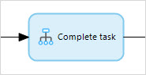
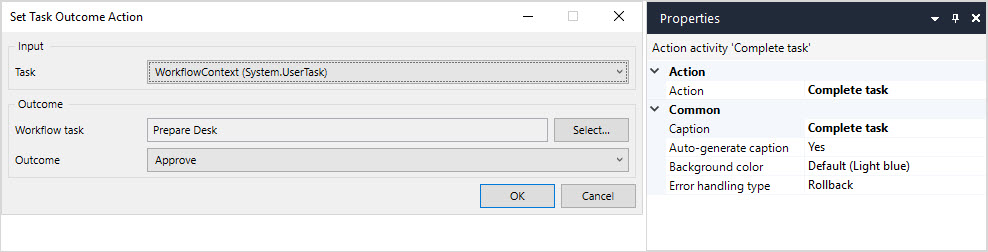

{}
This activity can only be used in **Microflows**.
{}

## 1 Introduction

The **Set task outcome** activity can be used to define which outcome the [user task](user-task) should follow. 

## 2 Properties

There are two sets of properties for this activity, those in the dialog box on the left, and those in the properties pane on the right:

The **Set task outcome** properties pane consists of the following sections:

* [Action](#action)
* [Common](#common)

## 3 Action Section {#action}

The **Action** section of the properties pane shows the action associated with this activity.

You can open a dialog box to configure this action by clicking the ellipsis (**…**) next to the action.

You can also open the dialog box by double-clicking the activity in the microflow or right-clicking the activity and selecting **Properties**.

### 3.1 Task

The user task entity available from the microflow parameters.

### 3.2 Workflow Task

The user task for which you want to set an outcome. 

### 3.3 Outcome

Gives you a list of available outcomes for the selected user task. The user task will follow the selected outcome.

## 4 Common Section {#common}

{}