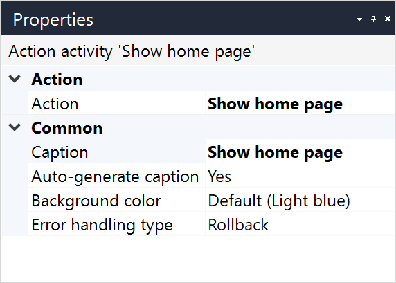

{}
This activity can only be used in **Microflows**.
{}

{}
This action is ignored and does not work when a microflow is called from an offline, native, or hybrid app. For more information, see the [Microflows](offline-first#microflows) section of the *Offline-First Reference Guide*.
{}

## 1 Introduction

The **Show home page** activity opens the home page for an end-user. For example, you can navigate your user to the home page when they are not logged in. 

This activity shows the same page that is displayed to the end-user after they log in, meaning it shows the home page defined for the current user role. For more information on role-based home pages, see [Navigation](navigation).

## 2 Properties

The **Show home page** activity properties consists of the following sections:

* [Action](#action)

* [Common](#common)

    

## 3 Action Section {#action}

The **Action** section of the properties pane shows the action associated with this activity.

## 4 Common Section {#common}

{}

## 5 Read More

* [Show Page](show-page)
* [Activities](activities)

