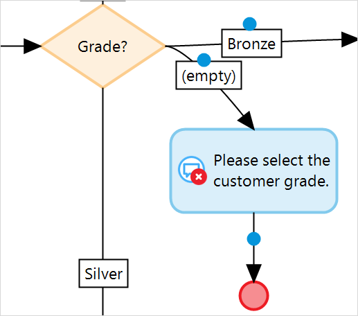
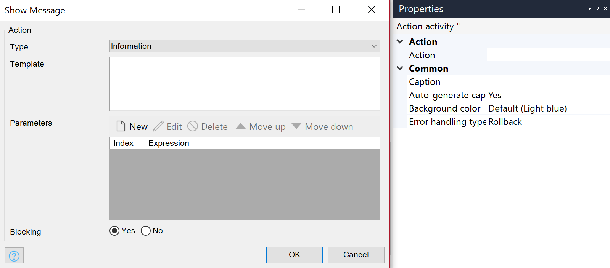

{}
This activity can be used in both **Microflows** and **Nanoflows**.
{}

{}
This action is ignored and does not work when a microflow is called from an offline, native, or hybrid app. For more information, see the [Microflows](offline-first#microflows) section of the *Offline-First Reference Guide*.
{}

## 1 Introduction

The **Show message** activity shows a blocking or non-blocking message to an end-user. For example, if the end-user did not select the customer grade in a form, you can show an error message telling them to select a grade to proceed:

{}

{}

## 2 Properties

There are two sets of properties for this activity, those in the dialog box on the left, and those in the properties pane on the right:

The **Show message** properties pane consists of the following sections:

* [Action](#action)
* [Common](#common)

## 3 Action Section {#action}

The **Action** section of the properties pane shows the action associated with this activity.

You can open a dialog box to configure this action by clicking the ellipsis (**…**) next to the action.

You can also open the dialog box by double-clicking the activity in the microflow or right-clicking the activity and selecting **Properties**.

### 3.1 Type

**Type** defines the color scheme and icon of the message.

There are three message options:

* Information *(default)* 
* Warning
* Error 

### 3.2 Template

**Template** defines the text of the message. The template can contain parameters that are written as a number between braces, e.g. {1}. The first parameter has number 1, the second 2, etc.

### 3.3 Parameters

Parameters are attributes, the value of which will be displayed. Parameters need to be entered using [expressions](expressions) resulting in a string.

With parameters you can customize your message with data specific to the situation. For example, the message "An e-mail has been sent to customer {1}." with parameter `$customer/FullName` will show the full name of the customer who an e-mail has been sent to.

### 3.4 Blocking

The **Blocking** property defines whether the message shown to the end-user is blocking or not. A non-blocking message lets users continue their work in the app with the pop-up window open, while a blocking message does not let the user continue work until the pop-up window is closed.

| Option | Description |
| --- | --- |
| Yes *(default)* | The message appears in a pop-up in the center of the screen and does not let the user continue work until the pop-up window is closed. |
| No | The message appears in a pop-up in the center of the screen but does not block the rest of the screen, allowing the end-user to continue their work with the pop-up open. |

## 4 Common Section {#common}

{}

## 5 Read More

* [Activities](activities)