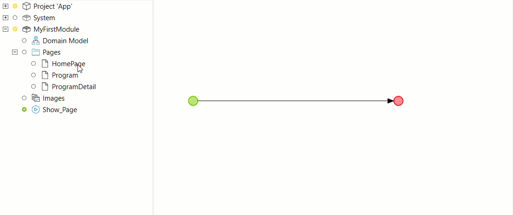

{}
This activity can be used in both **Microflows** and **Nanoflows**.
{}

{}
This action is ignored and does not work when a microflow is called from an offline native or hybrid app. For more information, see the [Microflows](offline-first#microflows) section of the *Offline-First Reference Guide*.
{}

## 1 Introduction

With this action you can show a page to the end-user.

Note that you can also drag a page from the **Project Explorer** into your microflow directly:

## 2 Input Properties

{}
See [Common Properties](microflow-element-common-properties) for properties that all microflow activities share (for example, caption). This page only describes the properties specific to the action.
{}

### 2.1 Object to pass

Object that will be passed to the opened page. This object will be used by [data views](data-view) with a page parameter data source.

## 3 Action Properties

### 3.1 Page

The [page](page) to show to the end-user. If the Object to pass is specified, the page must contain a data view connected to the same entity as the passed object (or its generalization).

{}

You can generate a new page to show by clicking 'Select...' and then 'New'. If you have selected an Object to pass Studio Pro will automatically generate a data view to edit that object.

{}

### 3.2 Page Title

By default the title of the page is determined by the page title property of the page. You can replace this title with a custom title if necessary.

{}

This feature allows you to re-use the same page for the New and Edit buttons of a data grid. By simply setting the titles to, for example, 'New customer' and 'Edit customer', you can save yourself the trouble of duplicating the rest of the page.

{}
