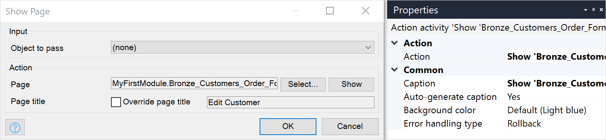

{}
This activity can be used in both **Microflows** and **Nanoflows**.
{}

{}
This action is ignored and does not work when a microflow is called from an offline native or hybrid app. For more information, see the [Microflows](offline-first#microflows) section of the *Offline-First Reference Guide*.
{}

## 1 Introduction

With this activity, you can show a selected page to an end-user.

You can directly drag a page from the **Project Explorer** into your microflow:

## 2 Properties

There are two sets of properties for this activity, those in the dialog box on the left, and those in the properties pane on the right:

The cast object properties pane consists of the following sections:

* [Action](#action)
* [Common](#common)
* [Input](#input)

## 3 Action {#action}

The **Action** section of the properties pane shows the action associated with this activity.

You can open a dialog box to configure this action by clicking the ellipsis (**…**) next to the action.

You can also open the dialog box by double-clicking the activity in the microflow or right-clicking the activity and selecting **Properties**.

### 3.1 Input Section

{}
See [Common Properties](microflow-element-common-properties) for properties that all microflow activities share (for example, caption). This page only describes the properties specific to the action.
{}

#### 3.1.1 Object to Pass {#object-to-pass}

Object that will be passed to the opened page. This object will be used by [data views](data-view) with a page parameter data source.

### 3.2 Action Section

#### 3.2.1 Page

The [page](page) that is displayed to an end-user. If the [Object to pass](#object-to-pass) is specified, the page must contain a data view connected to the same entity as the passed object (or its generalization).

{}

You can generate a new page to show by clicking 'Select...' and then 'New'. If you have selected an Object to pass Studio Pro will automatically generate a data view to edit that object.

{}

#### 3.2.2 Page Title

By default the title of the page is determined by the page title property of the page. You can replace this title with a custom title if necessary.

{}

This feature allows you to re-use the same page for the **New** and [Edit]() buttons of a data grid. By simply setting the titles to, for example, *New Customer* and *Edit Customer*, you can save yourself the trouble of duplicating pages.

{}

## 4 Common Section{#common}

{}

