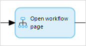
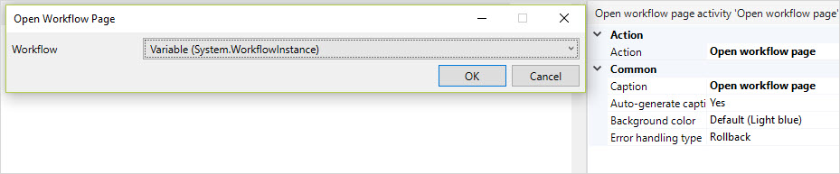

{}
This activity can only be used in **Microflows**.
{}

## 1 Introduction

The **Show workflow admin page** activity can be used to open a workflow overview page. 

## 2 Properties

An example of create object properties is represented in the image below:

There are two sets of properties for this activity, those in the dialog box on the left, and those in the properties pane on the right.

The **Show workflow admin page** properties pane consists of the following sections:

* [Action](#action)
* [Common](#common)

## 3 Action Section {#action}

The **Action** section of the properties pane shows the action associated with this activity.

You can open a dialog box to configure this action by clicking the ellipsis (**…**) next to the action.

You can also open the dialog box by double-clicking the activity in the microflow or right-clicking the activity and selecting **Properties**.

### 3.1 Workflow Object

A workflow object of which the page you would like to show.

## 4 Common Section {#common}

{}