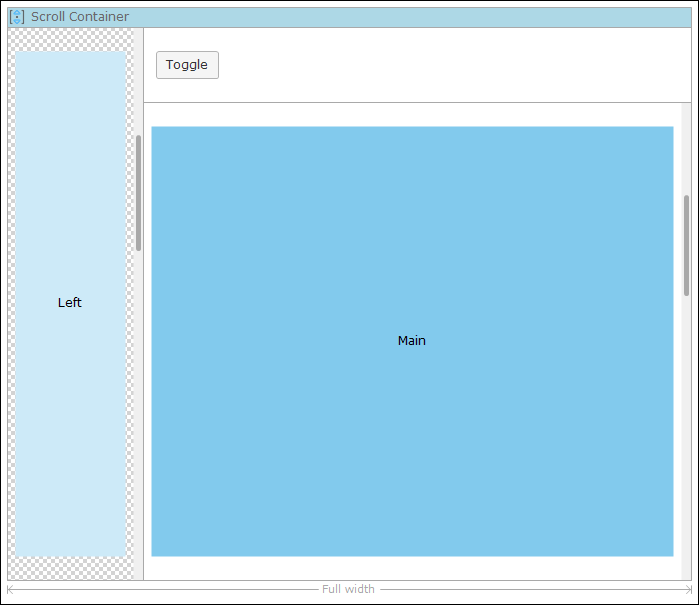

The sidebar toggle is a button that when pressed will make a region of a [scroll container](scroll-container) appear or disappear. This makes it possible to create sidebars, for instance a menu on a mobile phone that is hidden by default and can be shown by clicking the button. See the picture for an example layout that used the sidebar toggle. 

## Button properties

{}

{}

{}

{}

## Common properties

{}

{}

{}

{}

## General properties

### Region

Choose the region that should be collapsed/expanded by clicking this button.

| Region | Effect |
| --- | --- |
| Left | The left region of the layout container will be toggled. |
| Right | The right region of the layout container will be toggled. |

{}

The sidebar toggle is right-to-left-aware (RTL) which means that in RTL languages the sidebar will slide in from the right if you choose 'Left'.}

{}

_Default value:_ Left

### Mode

Determines how the region will be toggled.

| Mode | Effect |
| --- | --- |
| Push content aside | The sidebar moves the rest of the content off-screen (only available mode in Mendix 5.17 and older). |
| Slide over content | The sidebar moves over the content. |
| Shrink content | The content shrinks to make space for the sidebar. |

### Initially open

Only applicable if the mode is "Shrink content".

## Visibility properties

{}

{}
