# Introduction
Teamcenter is a virtual gateway to your company’s product information connecting all who need to collaborate with product and process knowledge. Teamcenter enables you to digitally manage your product and manufacturing data in the context of the product life cycle.

Teamcenter Connector for Mendix enables Mendix developers to access product data from Teamcenter or create and modify product data in Teamcenter.

This documentation provides guidance on using Teamcenter Connector for Mendix. It assumes that you are  familiar with Mendix concepts, processes, and terminology for application development.

# Prerequisites
To use Teamcenter Connector for Mendix, you need the following:

* [Mendix Modeler](https://www.mendix.com/tag/mendix-modeler/)
* An appropriate Teamcenter license

# Teamcenter Connector for Mendix domain model

The domain model is a data model that describes the information in your application domain in an abstract way. It is central to the architecture of your application. The domain model consists of [entities](https://docs.mendix.com/refguide/entities) and their relations represented by [associations](https://docs.mendix.com/refguide/associations).

To see the Teamcenter Connector domain model:

1. In Mendix Modeler, open your project containing Teamcenter Connector.
1. In the left navigation pane, go to **Domain Model** in the **TcConnector** folder.

# Download Teamcenter Connector for Mendix

Teamcenter Connector for Mendix is available on [Mendix App Store](https://appstore.mendix.com/). To add the connector to your project:

1. In Mendix Modeler, create a new project.
1. Click  on the menu bar to open Mendix App Store.
1. Search for Teamcenter Connector for Mendix and click the link.
1. On the Teamcenter Connector for Mendix page, click **Download**.
1. In the Import Module dialog box, click **Import**.

The connector is imported in your project in the **App Store Modules** folder.
 
# Connect to Teamcenter

Teamcenter Connector for Mendix comes with a sample application. To get started and validate your setup, you can run the sample application and connect to your Teamcenter environment.

1. In Mendix Modeler, open your project containing Teamcenter Connector.
1. Run the sample application.
1. Click  in the left-hand navigation pane.
1. In the Environment Configuration panel, specify the required fields and click **Save**.

    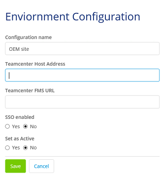

# Log on to Teamcenter through Teamcenter Connector

## Single sign on (SSO)

## Non-SSO

# Process for calling Teamcenter services using Teamcenter Connector

# Using Teamcenter services available with Teamcenter Connector

## Supported services

## Steps to use Teamcenter services in your application

1. Check if the required Mendix entity representing the Teamcenter business object type is available in the Teamcenter Connector domain model. If it is not available, create the required entity in a separate module as a sub-type of an existing entity or a specialized entity.

    * For example, if you want to create an entity for the *ChangeNoticeRevision* business object, you can create it as a sub-type of the *ItemRevision* entity. The *ChangeNoticeRevision* entity will be a specialized entity based on the *ItemRevision* entity.

    * Also, if the required domain entity model is available but the required properties are not available, create a sub-type of the entity in a new module and then add the required properties to the new entity. Siemens recommends that you always create new entities and not make any changes to the entities that come with Teamcenter Connector.

1. Design a microflow as per your business logic.

1. Drag a service from the Teamcenter section of the toolbox into the microflow.

1. If you have an input action in the microflow, check if the input entity type (specified in the *Create.input* parameter) needs to be specialized so that properties specific to the business object can be sent as the input. If you have created a specialized input entity type, ensure that the specialized entity is added in the *Create.input* parameter.

1.  Run your application.

## Example 1: Create a change notice revision in Teamcenter

1. Create a module that represents the change management domain. Skip this step if the module exists.

    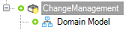
 
1. Define the domain model.
Create **ChangeNotice** and **ChangeNoticeRevision** entities based on the **TcConnector.Item** and **TcConnector.ItemRevision** entities. Skip this step if the entities exist.

    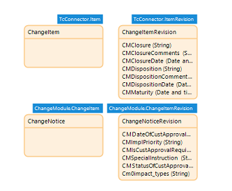
 
1. Plan your microflow and decide what services you want to use. Available Teamcenter services are listed in the **Teamcenter Connector -> Published -> Java Actions** folder.

1. Specify the activities in your microflow, and select the appropriate Teamcenter action (service). For example, you can use the **Create Object** service to create a change notice.

    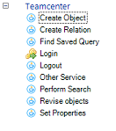
 
1. If your microflow uses a Teamcenter service in an input activity, check if the required Create input parameters are specified. In the following example, we have used the default **TcConnector.CreateInput** parameter.

    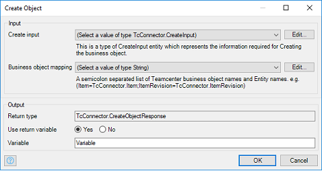
 
1. In the previous step, we used an existing input parameter. If you need specific properties to be sent as an input, you must specialize the entity. For example, to send properties specific to Change Notice and Change Notice Revision, you must specialize the **CreateInput** entity as follows:

   * In your Change Management module, create **CNCreateInput** and **CNCompoundCreateInput** entities deriving from the **ItemCreateInput** and **ItemRevisionCompoundCreateInput** entities available with Teamcenter Connector.

       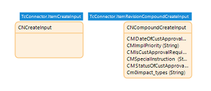

    * Add instances of the **CNCreateInput** and **CNCompoundCreateInput** entities as inputs to the **Create Object** service.

        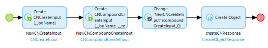
 
1. Specify the business object mapping, that is the mapping between an entity and the corresponding Teamcenter business object, in the input activity. For example, **ChangeNotice** is represented by the **ChangeManagement.ChangeNotice** entity and **ChangeNoticeRevision** is represented by the **ChangeManagement.ChangeNoticeRevision** entity. Thus, the mapping can be specified as
`ChangeNotice=ChangeManagement.ChangeNotice;ChangeNoticeRevision= ChangeManagement.ChangeNoticeRevision`.

1. Retrieve the created objects using the **TcConnector.created_objects** association on the **TcConnector.CreateObjectResponse** output object. For example, retrieve **ChangeManagement.ChangeNotice** and **ChangeManagement.ChangeNoticeRevision** as follows:

    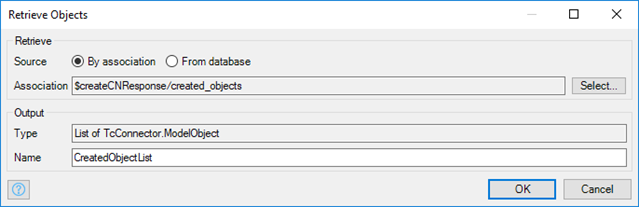

    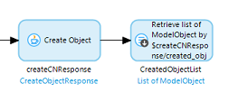
 
1. Retrieve partial errors using the **TcConnector.ResponseData** and **TcConnector.ErrorStack** associations.

    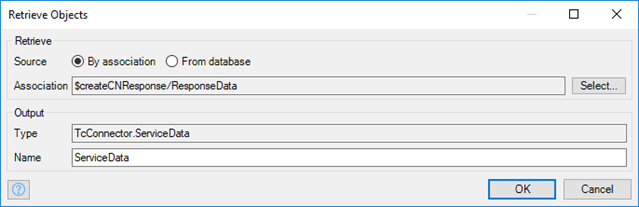

    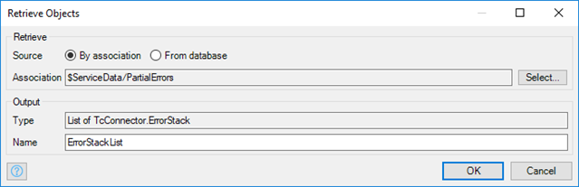

    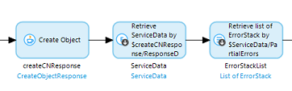

## Example 2: Search for change objects in Teamcenter based on object properties

# Using any Teamcenter service through Teamcenter Connector

## Create a service request

## Make a service call to Teamcenter with a service request

## Process response from a Teamcenter service

## Helper functions to process response from a Teamcenter service

# How to extend the Teamcenter Connector domain model to work with any Teamcenter object

# Sample application

# How to get support
