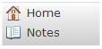

The simple menu bar widget shows a configured menu in the form of a horizontal or vertical bar with images and captions. Items cannot have subitems; the menu structure can only have one level. The [menu items](menu-item) points to either the page or the microflow that will opened or started when the item is clicked.

{}

{}{}

{}

## Common Properties

{}

{}

{}

## General Properties

{}

### Orientation

This property determines how the simple menu bar is laid out.

| Orientation | Description |
| --- | --- |
| Horizontal | The menu items are next to each other and the images are above the captions. |
| Vertical | The menu items are underneath each other and the images are next to the captions. |

_Default value:_ Horizontal
