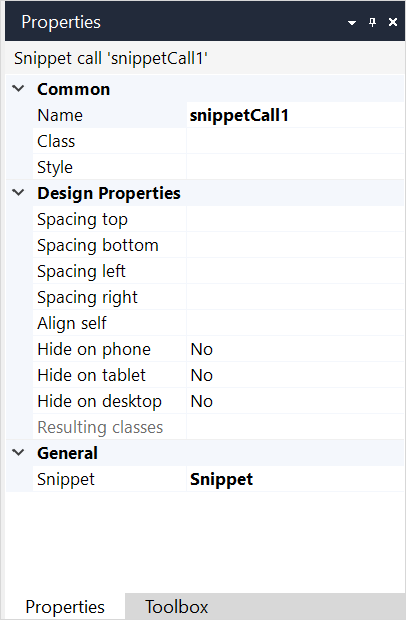

## 1 Introduction

The **Snippet call** widget allows you to use a [snippet](snippet) on a [page](page), a [layout](layout), or another snippet.

## 2 Properties

An example of snippet call properties is represented in the image below:

{}
{}

Label properties consist of the following sections:

* [Common](#common)
* Design Properties
* [General](#general)

### 2.1 Common Properties {#common}

{}

### 2.2 General Section {#general}

This section contains the **Snippet** property, it shows the name of an actual snippet that will be displayed here.

## 3 Read More

* [Page](page)
* [Common Widgets](common-widgets)
* [Properties Common for Widgets](common-widget-properties)