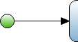

A start event defines the location where the flow will start from. A flow can only start from one location. Therefore, a flow can only contain one start event.

{}

When you want to start your flow with an activity, you link a start event, using a sequence flow with the activity.

{}
