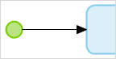

## 1 Introduction
A start event defines a starting point of a microflow or a nanoflow and is represented by a green circle. A flow can contain only one start event.

Link a start event and an activity you would like to start the microflow from with a [sequence flow](sequence-flow).

## 2 Read More

* [End Event](end-event)
* [Sequence Flow](sequence-flow)