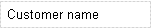

## 1 Introduction

A static label shows a line of static text. You can use it to place custom text inside a data view, template grid or table.

{}

A label with text 'Customer name'.

{}

If you want to insert the current page number or the total page count in your document, you can use a token inside a static label (and only in a static label).

Before version 2.5.4, spaces were automatically inserted on either side of the token. This is no longer the case.

{}
Static label content `Page [%pageNumber%] of [%totalPageCount%]` will print page 2 of 4.
{}

## 2 Common Properties

{}

## 3 Appearance Properties

### 3.1 Caption

This is the value that will be displayed in the document.

### 3.2 Style

For details, see [Style](style).
