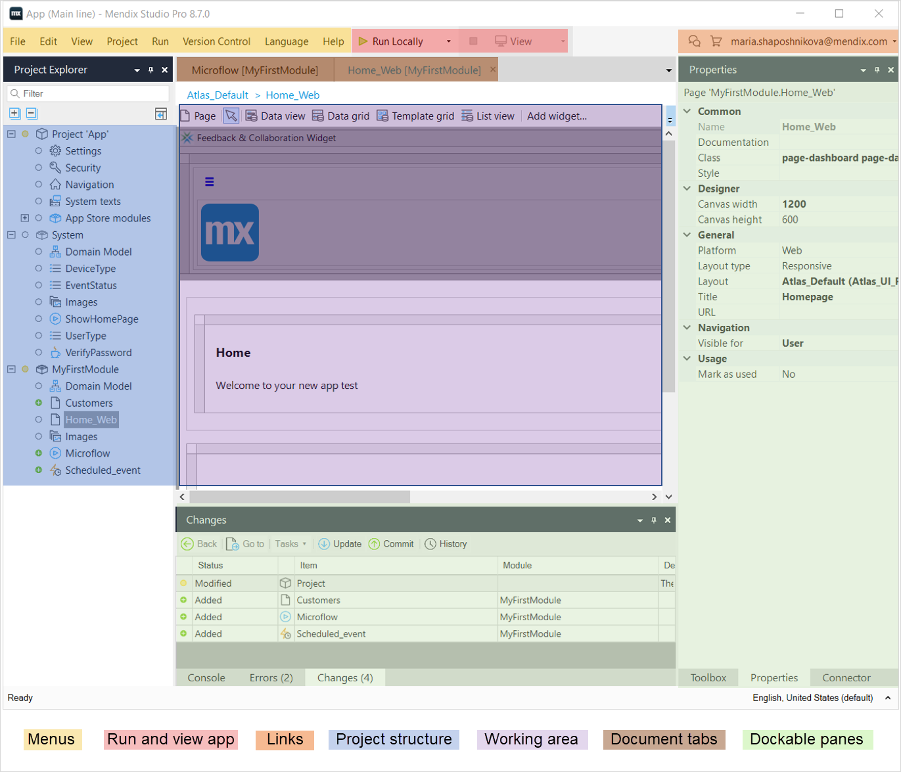

## 1 Introduction

Mendix Studio Pro is a tool for creating, viewing, and editing your Mendix applications. A Mendix app is called a [project](project) in Studio Pro.  

One Studio Pro instance can have only one project open at a time, but you can open two Studio Pro instances when necessary.

{}
When Studio Pro is open, press <kbd>F1</kbd> to quickly jump to documentation.
{}

This document describes the user interface of Mendix Studio Pro:

## 2 Top Bar

The Studio Pro top bar contains the following items:

* [Menus](#menus) 
* [Buttons to run and view your app](#run-and-view)
* [Links to the Developer Portal and App Store](#links) 

### 2.1 Menus {#menus}

In the Studio Pro top bar, you can see several menus, such as [Edit](edit-menu), [View](view-menu), and [Version Control](version-control-menu). Each menu contains menu items that allow you to perform various actions, for example, to [create a deployment package](create-deployment-package-dialog), set [preferences](preferences-dialog), or view the [Errors](errors-pane) pane. 

For more information on menus, see [Menus](menus). 

### 2.2 Run & View App {#run-and-view}

You can deploy your app by clicking the **Run** or **Run locally** buttons. To view your deployed app, click the **View** button. 

For more information on deployment in Mendix, see [Deployment](/developerportal/deploy).

For more information on deploying your app and versioning it, see  the [Versioning a Project Deployed to the Cloud](using-version-control-in-studio-pro#versioning-project) section in *Using Version Control in Studio Pro*. 

### 2.3 Links to Developer Portal & App Store {#links}

You can find links to the [Developer Portal](/developerportal/index) and [App Store](/appstore/index) in the top-right corner of Studio Pro.

Your account is displayed next to these buttons if you are signed in. Click the account name to navigate to your apps, the Developer Portal, your profile, or to sign out. 

## 3 Project Structure

A project consists of individual files (*documents*) and settings that are grouped in folders and [modules](modules). The complete structure of your project can be viewed in the [Project Explorer](project-explorer). 

## 4 Working Area

A working area is a current document tab that you work in. The working area and its settings differs depending on an editor (for example, pages, microflows, domain model editors) and type of the document.  

### 4.1 Document Tabs {#documents}

The documents you view and edit are shown in tabs. 

{}

This section describes documents in the working area, not panes that you can open and position around the working area. For more information on behavior of panes, see the [Layout of Panes](view-menu#layout-of-panes) section in *View Menu*.

{}

You can have a number of tabs open, just like in a modern web browser. They can be closed, reordered, and shown side by side. The video below shows examples of how to interact with a tab:

<video controls width="608" height="456" src="attachments/studio-pro-overview/document-tabs.mp4">VIDEO</video>

Each document has its own save state, history, and future, so undo and redo actions are unlimited.

## 5 Dockable Panes

Dockable panes can be positioned around the working area and contain various elements and settings. For example, you can view list of errors, configure properties of a specific document or an element, view toolbox. Panes are opened via [Menus](menus).

## 6 Status Bar

At the bottom of the Studio Pro main window pane is a status bar.

On the left is the current status of Studio Pro.

On the right is the currently selected language. If you have set up multiple languages in your app you can change the currently selected language by clicking here. For more information see [Language Menu](translatable-texts).

## 7 Shortcut Keys

### 7.1 General Shortcut Keys

In the main window pane, <kbd>Ctrl</kbd> + <kbd>Tab</kbd> can be used to navigate between all open documents. Other shortcut keys that can be used in the main window pane can be found next to their relevant menu item in  [Menus](menus).

In most dialog boxes for editing properties, the following shortcut keys can be used:

| Key | Description |
| --- | --- |
| <kbd>Ctrl</kbd> + <kbd>Enter</kbd> | Confirms all changes and closes the dialog box. Works as if the **OK** button was clicked. This is especially useful if the focus is on a multi-line text box; otherwise, pressing <kbd>Enter</kbd> will have the same effect. |
| <kbd>Esc</kbd> | Cancels all changes and closes the dialog box. Works as if the **Cancel** button was clicked. |
| <kbd>Ctrl</kbd> + Mouse scroll wheel | Zooms in or out. This works in all editors. |
| <kbd>Shift</kbd> + Mouse scroll wheel | Scrolls left or right. Works as if you were using the horizontal scroll bars. |

In most edit grids (such as the list of attributes in the entity properties), the following shortcut keys can be used:

| Key | Description |
| --- | --- |
| <kbd>Ctrl</kbd> + <kbd>N</kbd> | Creates a new item. |
| <kbd>Enter</kbd> | Edits the currently selected item. |
| <kbd>Delete</kbd> | Deletes the currently selected item(s). |

### 7.2 Domain Model Editor Shortcut Keys

The following shortcut keys are available in the domain model editor:

| Key | Description |
| --- | --- |
| <kbd>F2</kbd> | Edits the name of the selected element. |
| <kbd>Ctrl</kbd> + <kbd>A</kbd> | Selects all entities. |
| <kbd>Esc</kbd> | Clears selection. |

### 7.3 Page Editor Shortcut Keys

The following shortcut keys are available in the page editor:

| Key | Description |
| --- | --- |
| Arrow keys | Moves the selection box to the widget or element in the direction of the arrow key. For example, if currently a label is selected and you press the right arrow key, the text box to the right of it becomes selected. |
| <kbd>Ctrl</kbd> + arrow keys | Moves the currently selected item up/down or left/right. This works on table columns and rows, tab pages, grid and data view buttons, search fields, etc. |
| <kbd>Enter</kbd> | Edits the properties of the currently selected object in a dialog box. |
| <kbd>F2</kbd> | Edits the caption of a label or button inline on the page. You can also just start typing a letter or a digit and the caption will be replaced by what you type. |

### 7.4 Microflow Editor Shortcut Keys

The following shortcut keys are available in the microflow editor:

| Key | Description |
| --- | --- |
| Arrow keys | Moves the selection box to the activity or element in the direction of the arrow key. For example, if currently a show page activity is selected and you press the right arrow key, the end event to the right of it becomes selected. |
| <kbd>Ctrl</kbd> + arrow keys | Moves the currently selected item up/down or left/right. |
| <kbd>Enter</kbd> | Edits the properties of the currently selected object in a dialog box. |
| <kbd>F2</kbd> | Edits the name of the return value of the currently selected activity. This shortcut will not function on activities that do not return a result. |
| <kbd>Home</kbd> | Highlights and focus on the start event of the current microflow. |
| <kbd>End</kbd> | Highlights and focus on an end event in the current microflow. If there are multiple end events, clicking **End** multiple times will toggle between the different events. |
| <kbd>Shift</kbd> when resizing an activity | When resizing the entity, by holding <kbd>Shift</kbd> , the microflow component will stay centered at its current position and will expand equally in all directions. |
| <kbd>Ctrl</kbd> when selecting multiple activities | When pressing the <kbd>Ctrl</kbd>, you can select additional microflow components. Clicking a selected component while holding <kbd>Ctrl</kbd> will deselect it. |

### 7.5 Microflow Debugger Shortcut Keys {#debugger-shortcuts}

The following shortcut keys are available for the the microflow debugger:

| Key | Description |
| --- | --- |
| <kbd>Alt</kbd> + <kbd>F5</kbd> | *Step into* – moves the debugger into the sub-microflow or loop.  |
| <kbd>Alt</kbd> + <kbd>F6</kbd> | *Step over* – moves the debugger to the next step in the same microflow. |
| <kbd>Alt</kbd> + <kbd>F7</kbd> | *Step out* – instructs the debugger to leave the sub-microflow or loop.  |
| <kbd>Alt</kbd> + <kbd>F8</kbd> | *Continue* – instructs the debugger to continue until it reaches another breakpoint. |

### 7.6 Language Shortcut Keys

The following shortcut keys control the currently selected language:

| Key | Description |
| --- | --- |
| <kbd>Ctrl</kbd> + <kbd>L</kbd> | Choose the next language in the list of languages chosen in **Language Settings…**. |
| <kbd>Ctrl</kbd> + <kbd>Shift</kbd> + <kbd>L</kbd> | Choose the previous language in the list of languages chosen in **Language Settings…**. |

## 8 Read More

* [Project Explorer](project-explorer)
* [Menus](menus)

  
