## 1 Introduction  {#intro}

When working on an app, Studio Pro performs consistency checks. This may result in warnings. Warnings identify issues that are not critical, but point to something that might be a problem. These warnings are shown in the **Errors** pane.

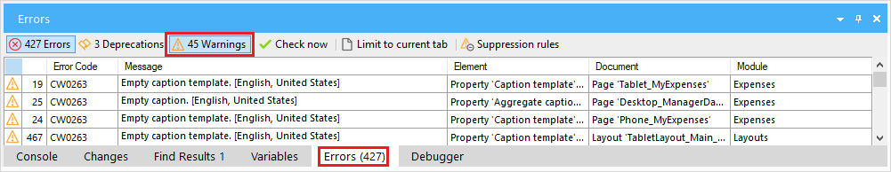

While warnings can be valuable, there are some situations where you might want to disable them. For example:

* You made a deliberate choice in your project that leads to a warning, and you know this will not lead to problems.
* You are using an App Store module that contains warnings and you don't want to change the App Store module.
* The number of warnings is so large that the warning tab is not usable anymore, and you want to temporariliy disable some of them.

With **Suppression rules** it is possible to disable warnings in a number of ways.

## 2 Suppressing a warning {#suppress-warning}

When you right-click a warning in the Error pane, you see the menu `Suppress this warning` with a number of options. You can suppress a warning for a document, for a module, or for the entire project. It is also possible to suppress warnings for all App Store modules.

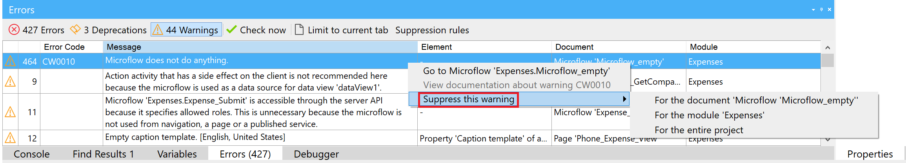

### 2.1 Suppress a warning for a specific document

If you right-click the warning, and select `Suppress this warning > For the document '...'` this warning will only be suppressed for that specific document. If the warning happens in another location, it will still be displayed for that location.

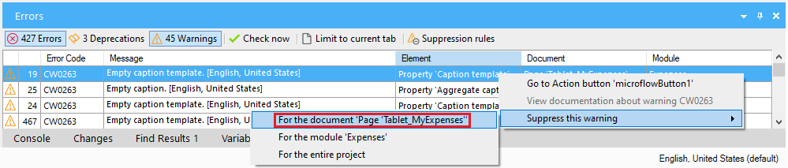

### 2.2 Suppress a warning for a specific module

If you right-click the warning, and select `Suppress this warning > For the module '...'` this warning will be suppressed for the whole module. If the same warning happens in another module, it will still be displayed for that module.

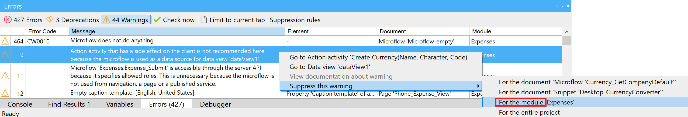

### 2.3 Suppress a warning for the entire project

If you right-click the warning, and select `Suppress this warning > For the entire project` this warning will be suppressed everywhere in the project. 

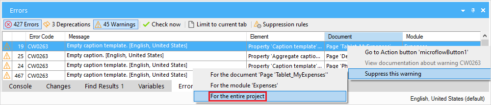

After you select the menu, a confirmation appears:

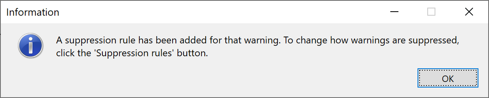

The list of warnings will be updated in the error pane.

To modify or undo the suppression of the warnings, see section [4 Editing the suppression rules](#editing-rules).

### 2.4 Suppress App Store warnings

It is possible to suppress App Store warnings by clicking the `Suppression rules` button in the Errors pane.

The `Manage Suppression Rules` window appears.

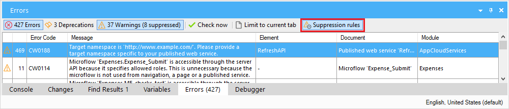

To suppress App Store warnings, check the box in front of `Suppress warnings from App Store modules`

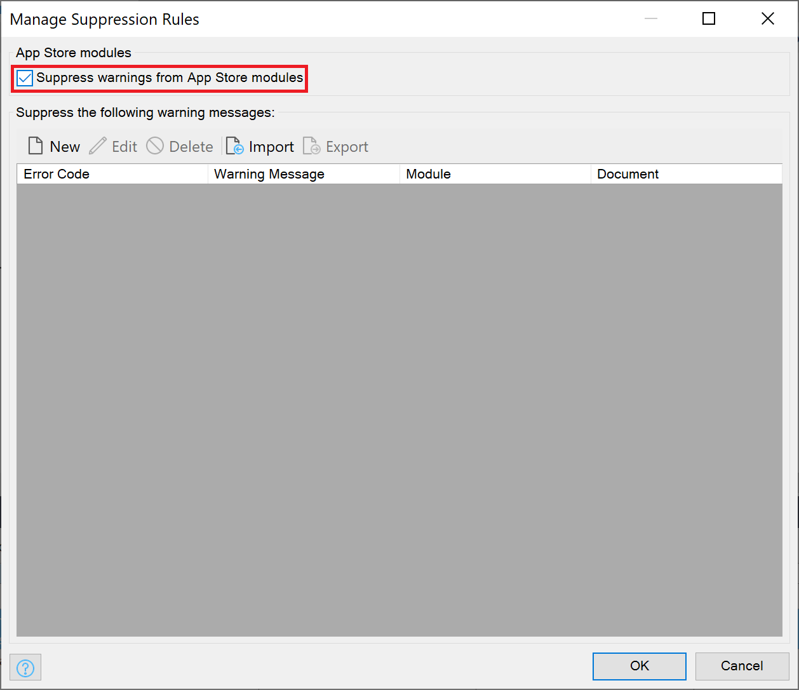

Select the `OK` button to apply the new settings.

Note: there are some limitations to suppressing specific warnings. See section [5 Limitations](#limitations) for more details.

## 3 How do the Suppression Rules work? {#suppression-rules-behavior}

Suppression rules are for one user and for one app. The warnings that you suppress are by default not shared between users or projects, so the visibility of warnings will not be changed for other Mendix developers working on the same app. 

Suppression rules are stored locally in the project directory, in a file called `project-settings.user.json`. When committing your changes to Team Server, Studio Pro will ignore this file. 

It is possible to export and import suppression rules manually.

### 3.1 Exporting your suppression rules {#export}

To start exporting your suppression rules, first click the `Suppression rules` button in the Errors pane.

The `Manage Suppression Rules` screen appears, showing the current rules.

Click the `Export` button.

A file dialog appears. Browse to the folder where you wish to export the rules.

By default the file name is `<your app name>.suppressions.json`. 

Click the `Save` button to save the exported rules.

A confirmation window appears:

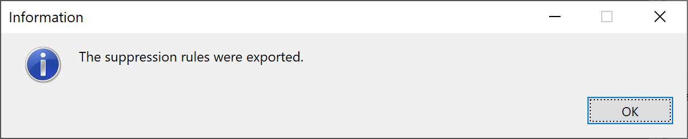

Click OK to dismiss the confirmation.

Click OK again to dismiss the `Manage Suppression Rules` window. 

Later, another user can import that file, to use the same suppression rules.

### 3.2 Importing suppression rules {#import}

To start importing suppression rules, first click the `Suppression rules` button in the Errors pane.

The `Manage Suppression Rules` screen appears, showing the current rules.

Click the `Import` button.

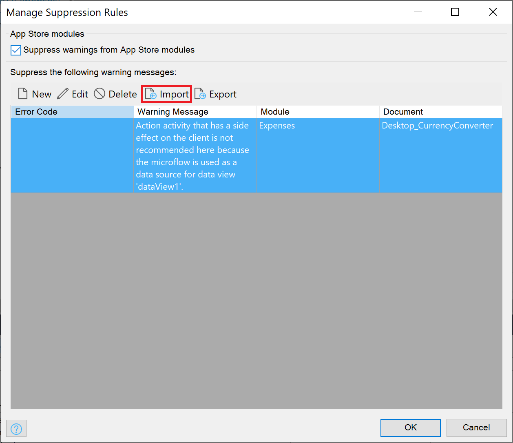

A file dialog appears. Browse to the folder which contains the file that you with wish to import.

Note: The file extension that you are importing must be `.suppressions.json`.

Click `Open` to select the file.

A confirmation window appears:

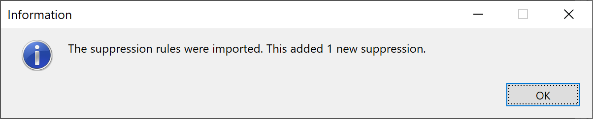

Click OK to dismiss the confirmation.

Click OK again to dismiss the `Manage Suppression Rules` window. 

The list of warnings updates, using the imported warnings.

## 4 Editing the suppression rules {#editing-rules}

Click the `Suppression rules` button in the Errors pane.

The `Manage Suppression Rules` window appears, showing the current rules.

xxx

## 5 Limitations {#limitations}

Studio Pro identifies specific warnings by an error code, but not all warnings have an error code yet. If an error code is available, your suppression rule will automatically target that error code.  If no error code is available, Studio Pro tries to match the warning textually, by the warning message. 

That means that if you are suppressing the warning `Variable 'Price' is never used` and if that warning does not have an error code, Studio Pro will suppress all warnings that contain the literal text `Variable 'Price' is never used`. If you then later change the variable name from `Price` to `DiscountPrice`, your suppression rule will no longer textually match with that warning, and the warning will be visible again. A workaround for this is, is to edit the suppression rule, so that the variable name is ommitted: in this case, the literal text can be shortened to `is never used.`. For instructions on how to edit a rule, see section [4 Editing the suppression rules](#editing-rules).

Similarly, when you create a suppression rule that targets a message with only the word `Microflow`, then this suppression rule may suppress multiple warnings.

In the future we hope to improve the behavior, by adding more error codes to warnings so that it is easier to target specific warnings.

## 6 Read More {#read-more}

* [Errors Pane](errors-pane)
* [Consistency Errors](consistency-errors)
