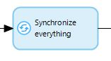
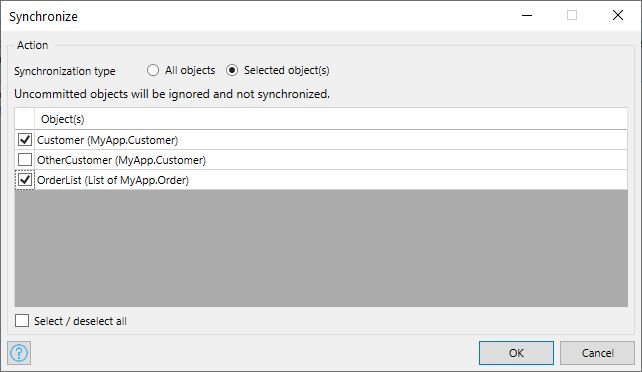

{}
This activity can only be used in **Nanoflows** that run in an offline-first app (a native or offline PWA app).
{}

## 1 Introduction

The **Synchronize** activity can be used to synchronize your data between your device and the server.  The action has three modes, which are described below.

## 2 Synchronization Modes

### 2.1 All Objects

{}

{}

The **All objects** mode synchronizes the entire local database. The server database is updated with the changes from the local database. The local database is updated with the latest data from the server, including the file contents.

The behavior of this mode can be configured through [synchronization configuration](offline-first#customizable-synchronization).

### 2.2 Unsynchronized Objects {#unsynchronized-objects}

{}

{}

With the **Unsychronized objects** mode, all objects with changes committed to the offline database are synchronized.
Information about objects deleted since the last synchronization is also sent to the server.
The synchronization is bi-directional, meaning both the server database and the local database are updated for these objects. 

For more information, see the [Synchronization Behavior](#synchronization-behavior) section below.

### 2.3 Selected Objects {#selected-objects}

{}

{}

The **Selected object(s)** mode synchronizes objects partially, based on a selection:

{}

{}

With this mode, only the selected objects or lists are synchronized.
The synchronization is bi-directional, meaning both the server database and the local database are updated for the selected objects.
Deleted objects cannot be synchronized using selective synchronization.

For more information, see the [Synchronization Behavior](#synchronization-behavior) section below.

## 3 Synchronization Behavior {#synchronization-behavior}

This section describes the behavior for the [Unsynchronized objects](#unsynchronized-objects) and [Selected object(s)](#selected-objects) modes.

{}
The settings in [synchronization configuration](offline-first#customizable-synchronization) are not applied for the **Unsychronized objects** and **Selected object(s)** modes.
{}

In the **Selected object(s)** mode, if the set of objects selected for synchronization contains any objects that have not been committed yet, those objects will be skipped and thus not synchronized.

If the selected object has local changes, the following steps are performed:

1. The server database is updated with the changes from local database.
2. The local database is updated from the server database. This is useful in case the selected object has calculated attributes or has been modified in a before/after event handler microflow.

If the selected object originated from the server (not created on the device), and no longer exists on the server (or is inaccessible due to the access rules), the local changes are not applied and the object is removed from the local database. In this case the value of the variable in the nanoflow for that object becomes `empty`. The server stores the discarded changes in the `System.SynchronizationFailure` entity to prevent data loss.

If the set of objects selected for synchronization contains objects without local changes, synchronization updates the local copy from the server database. If there is an object that has been deleted from the server or is no longer accessible due to access rules, that object will be removed from the local database too.

## 4 Properties

The **Synchronize** activity properties consists of the following sections:

* [Action](#action)
* [Common](#common)

{}{}

## 5 Action Section {#action}

The **Action** section of the properties pane shows the action associated with this activity.

## 6 Common Section {#common}

{}

## 7 Limitations {#limitations}

Running multiple synchronization processes at the same time is not supported, regardless of the synchronization mode.

If you try to trigger another synchronization process while the synchronization is in progress, the following error message will be shown: "Performing simultaneous synchronizations is not supported. Please try again after the current synchronization is completed."

Such an error can be handled in the nanoflow from which the synchronization attempt was triggered using [error handlers](/refguide/error-event#errorhandlers).

## 8 Read More

* [Activities](activities)
* [Offline-first](offline-first)
