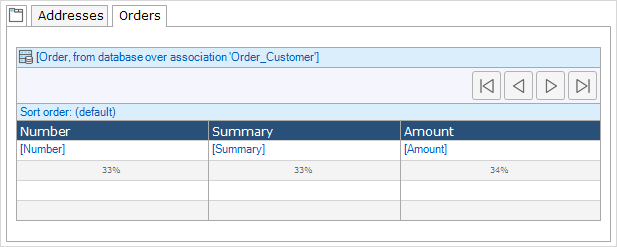

Tab containers are used to show information categorized into multiple tab pages. This can be very useful if the amount of information that has to be displayed is larger than the amount of space on the screen.

{}

A tab control with two tab pages (Address, Orders).

{}

## Components

### Tab pages

A tab control contains one or more tab pages, into which you can again place other widgets. For example, a tab page can contain a grid of orders.

See [Tab page](tab-page).

## Common properties

{}

{}

{}

{}

## Visibility properties

{}

{}
