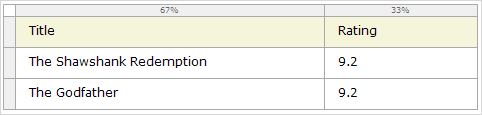
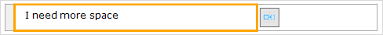

Tables can be used to lend structure to a page. They contain a number of [rows](table-row) and columns, the intersection of which is called a [cell](table-cell). Each cell can contain widgets.

{}

An example of how you can create a structured page with a table.

{}

Cells can be merged horizontally and vertically to allow for asymmetric lay-outs. To merge cells the cell you wish to merge to must be empty. A merge can then be initiated either in a cell's context menu or by clicking the merge button that will automatically appear if you select an eligible cell.

{}

The merge button

{}

Tables can be selected by clicking the white square in the top-left corner.

Tables allow for a number of keyboard interactions. Examples include navigating between rows and columns with the cursor keys and copy(ctrl+c)/pasting(ctrl+v) rows and cells.

## Common properties

{}

{}

{}

## General properties

{}

## Visibility properties

{}

{}
