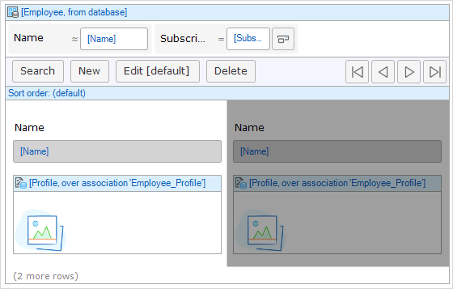
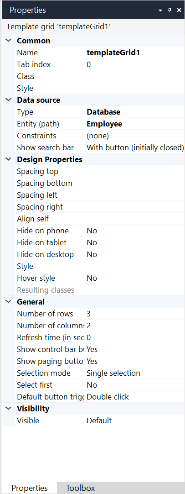

{}The template grid widget is not supported on native mobile pages.{}

## 1 Introduction

A template grid shows a list of objects in a tile view. For example, a template grid can show a list of employees with their profile pictures. Using controls provided by the template grid you can browse, search, and manipulate those objects:

The template grid has a lot in common with a [data grid](data-grid). The main difference is that the objects are shown in templates instead of rows.

## 2 Components

### 2.1 Control Bar

For more information, see [Control Bar](control-bar).

### 2.2 Search Bar

**Search Bar** is only available for **Database** and **XPath** [data sources](#data-source). For more information on a search bar and its settings, see [Search Bar](search-bar).

### 2.3 Sort Bar

**Sort Bar** is only available for **Database** and **XPath** [data sources](#data-source). For more information on a sort bar and its settings, see [Sort Bar](sort-bar).

## 3 Properties

An example of template grid properties is represented in the image below:

{}
{}

Template grid properties consist of the following sections:

* [Common](#common)
* [Data source](#data-source)
* Design Properties
* [General](#general)
* [Visibility](#visibility)

### 3.1 Common Section {#common}

{}

### 3.2 Data Source Properties {#data-source}

The data source determines which objects will be shown in the template grid. For general information about data sources, see [Data Sources](data-sources).

#### 3.2.1 Type

The list view supports the following types of data sources: 

* [Database source](database-source) – objects are retrieved directly form the database
* [XPath source](xpath-source) – objects are retrieved directly form the database
* [Microflow source](microflow-source) – calculates the list of objects by executing a microflow
* [Association source](association-source) – follows an association to get to objects

The database and XPath sources retrieve objects from the database and supports searching and sorting. 

### 3.3 General Section {#general}

#### 3.3.1 Show Control Bar {#show-control-bar}

This property indicates whether the control bar will be visible in the end-user interface. The control bar also includes the paging buttons.

{}

Even if the control bar is invisible there can still be a default button that is triggered by (double) clicking a row. See the property 'Default button trigger' and [grid buttons](control-bar) for more information.

{}

Default: *True*

#### 3.3.2 Show Paging Buttons {#show-paging-buttons}

{}
This property is not available since Mendix 8.13. Use [Show Paging Bar](#show-paging-bar) property instead.
{}

This property indicates with the buttons to page through the information in the grid are visible. Only hide these buttons if you are sure that there will never be more objects than the number of rows of the grid. Note that hiding the control bar also hides the paging buttons.

Default: *True*

#### 3.3.3 Show Paging Bar {#show-paging-bar}

{}
This property is introduced in Mendix 8.13. It replaces [Show Paging Buttons](#show-paging-buttons) property.
{}

With this property you can change the way paging bar is shown.

| Value | Description |
| --- | --- |
| Yes (with total count) *(default)* | Paging bar is shown including "go to last page" button and total count of objects. |
| Yes (without total count)          | Paging bar is shown, except "got to last page" button. Also total count of objects is not shown, page numbers are shown instead. |
| No                                 | Paging buttons are not shown. |

{}
Hiding the control bar also hides the paging buttons. See [Show Control Bar](#show-control-bar) property.
{}

Default: *Yes (with total count)*

#### 3.3.4 Number of Rows {#number-of-rows}

With this property you can change the number of rows of templates that will be shown on one page.

Default: *3*

#### 3.3.5 Number of Columns {#number-of-columns}

With this property you can change the number of templates that will be shown next to each other in one row.

Default: *2*

#### 3.3.6 Style Template {#style-template}

The style template property allows you to choose from three different styling of the template grid. These stylings depend on your theme package.

#### 3.3.7 Selection Mode {#selection-mode}

The selection mode determines whether and how the user can select items in the grid.

| Value | Description |
| --- | --- |
| No selection | The user cannot select items. |
| Single selection  *(default)* | The user can select a single item by clicking on it. Clicking another item will make that item the selection. |
| Single selection and maintain | The user can select one item at a time by clicking on it. Users cannot deselect an item. By default the first item will be selected and removing a selected item will autoselect a subsequent item. |
| Multi-selection | The user can select multiple items by clicking the first one and holding the 'Ctrl' key while clicking on other items. Simply clicking an item will deselect all items and make the clicked item the selection. |
| Simple multi-selection | The user can select multiple items by simply clicking on them. |

#### 3.3.8 Select First {#select-first}

This property indicates whether the first item will be selected initially. This is especially useful if there is a data view listening to this grid.

Default: *False*

#### 3.3.9 Default Button Trigger {#default-button-trigger}

The default button can be triggered by a single or a double click a row.

| Value | Description |
| --- | --- |
| Single click | A single click triggers the default button. This cannot be used in combination with allowing the user to select rows. |
| Double click *(default)* | A double click triggers the default button. |

#### 3.3.10 Refresh Time (in Seconds) {#refresh-time}

If the refresh time is non-zero, the template grid will refresh its contents every given number of seconds. For example, a task list could be refreshed every minute so that you know when new tasks arrive. By default the refresh time is zero and this means that the grid will not automatically refresh itself.

Default: *0*

### 3.4 Visibility Section {#visibility}

{}

## 4 Performing Specific Actions

To perform actions on a template grid, select it on a page and right-click it. The list of possible actions opens. While some actions from this list, such as **Select data source**, **Edit condition for visible**, are a quick way to set the properties, the following actions are specific actions that you can perform:

* **Go to entity** – opens a domain model and highlights an an entity that is used as the data source 
* **Go to data source** **microflow **– this action is only displayed when a microflow is set as the data source and opens this microflow 

## 5 Read More

* [Page](page)
* [Data Widgets](data-widgets)
* [Data Sources](data-sources)
* [Properties Common in the Page Editor](common-widget-properties)