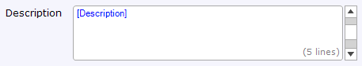

A text area can be used to display and/or edit a long text value that can be split over several lines.

{}

This text area allows the end-user to set the description of the product.

{}

A text area must be placed in a data view or template grid and connected to an attribute of type String. The connected attribute is shown in blue and between brackets inside the text area.

## General Properties

### Grow Automatically

This property defines whether the text area grows automatically depending on the amount of text in it.

_Default value:_ No

### Number of Lines

The number of lines determine how many lines the text area shows at the same time. If the text in the text area contains more lines you will have to use a scrollbar to see it all. This property is only shown if Grow automatically is set to No.

_Default value:_ 5

### Counter Message

This is the text displayed when typing in the text area. This text has 2 placeholders. The first placeholder shows the number of characters already typed and the second placeholder shows the maximum number of characters.

{}

You've used {1} characters of the {2} characters that are allowed.

{}

### Text Too Long Message

This is the text displayed when the number of typed characters is higher than the maximum allowed number of characters.

### Maximum Length

This property indicates the maximum number of characters that can be typed in this text box.

| Value | Description |
| --- | --- |
| Attribute length | The maximum number of characters is the same as the maximum length of the connected attribute. |
| Unlimited | The maximum number of characters is unlimited. |
| Custom | The maximum number of characters is set by the user. |

_Default value: Attribute length_

### Placeholder Text

The placeholder text is shown when no text has been entered yet. It can be used to give a hint to the user what kind of text should be entered.

## Validation Properties

{}

## Data Source Properties

{}

{}

## Editability Properties

{}

{}

{}

## Visibility Properties

{}

{}

## Events Properties

{}

{}

{}

## Common Properties

{}

{}

{}

{}

## Related Content

*   [Data view](data-view)
*   [Attributes](attributes)
