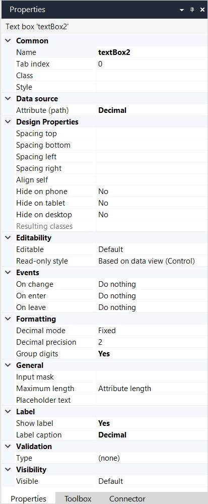

## 1 Introduction

A text box is used to display and, optionally, allow the end-user to edit the value of an attribute from an object in a textual form. It can be used to display attributes of the following [data types](data-types):

* Autonumber
* Decimal
* Hashed string
* Integer
* Long
* String

A text box must be placed in a [data widget](data-widgets) and displays an attribute of the object(s) retrieved by that widget. The name of the attribute to be displayed is shown inside the text box, between square brackets, and colored blue.

For example, the following text box allows the end-user to see, and set, the **Name** of a customer.

## 2 Properties

An example of text box properties is represented in the image below:

{}
{}

Text box properties consist of the following sections:

* [Accessibility](#accessibility)
* [Common](#common)
* [Data source](#data-source)
* [Design Properties](#design-properties)
* [Editability](#editability)
* [Events](#events)
* [Formatting](#formatting)
* [General](#general)
* [Label](#label)
* [Validation](#validation)
* [Visibility](#visibility)

### 2.1 Accessibility Section{#accessibility}

#### 2.1.1 Autocomplete 

The autocomplete property specifies if a text box should have autocomplete enabled. The autocomplete attribute also improves the browser's ability to pre-populate fields with user-preferred values. For more information on how this helps you comply with accessibility guidelines, see the [Web Content Accessibility Guidelines (WCAG) 2.1](https://www.w3.org/TR/WCAG21/#input-purposes)

### 2.2 Common Section{#common}

{}

### 2.3 Data Source Section{#data-source}

{}

### 2.4 Design Properties Section{#design-properties}

{} 

### 2.5 Editability Section{#editability}

{}

### 2.6 Events Section{#events}

#### 2.6.1 On Change Event{#on-change}

The on change event property specifies an action that will be executed when the value has been changed and gets submitted. A value will be submitted when pressing the <kbd>Enter</kbd> key or leaving the widget, either by using the <kbd>Tab</kbd> key or by clicking another widget.

{}

#### 2.6.2 On Enter Event

The on enter event property specifies an action that will be executed when the widget is entered, either by using the <kbd>Tab</kbd> key or by clicking it with the mouse.

{}

#### 2.6.3 On Leave Event

The on leave event property specifies an action that will be executed when leaving the widget, either by using the <kbd>Tab</kbd> key or by clicking another widget.

This differs from the [On change](#on-change) property in that the event will always be triggered, even if the value has not been changed.

{}

#### 2.6.4 On Enter Key Press Event

The on enter key press event property specifies an action that will be executed when the focus is inside the widget  and the <kbd>Enter</kbd> key is pressed. In a web application the widget will keep focus after the action gets executed.

{}

#### 2.6.5 On Input Event

The on input event property specifies an action that will be executed when the input (specifically the visible characters) of the text box changes. By configuring the additional action delay property which appears when selecting an action, you can regulate the amount of action executions. When an input change occurs during the delay time of a previous input change, the execution of the action with the previous change will be dismissed.

{}

### 2.7 Formatting Section{#formatting}

The formatting section applies only to the way that numeric attributes are displayed. These are attributes of the following data types:

* Decimal
* Integer
* Long

{}

### 2.8 General Section{#general}

#### 2.8.1 Show as Password

Attributes of the data type `String` or `Hashed string` can have their value hidden. This can be used for passwords, for example, to prevent bystanders from seeing them.

| Value | Description |
| --- | --- |
| False *(default)*| Normal text box |
| True | Typed characters are not shown to the end-user , instead an asterisk is shown for every typed character |

#### 2.8.2 Input Mask

{}Input masks are not supported on native mobile pages.

Input masks are designed for string data types. Be cautious when using them with numeric or hashed string data types.
{}

The input mask limits what the end-user can enter in the text box, following the rules below:

| Character | Allows Input of |
| ----- | ----- |
| `9` | any digit |
| `Z` | any letter |
| `U` | an upper-case letter |
| `L` | a lower-case letter |
| `*` | a letter *or* a digit |

Other characters will be taken literally.

For example, the input mask `99-LLL-9999` matches `24-apr-2008`.

#### 2.8.3 Maximum Length

This property specifies the maximum number of characters that can be typed in this text box.

| Value | Description |
| --- | --- |
| Attribute length *(default)* | The maximum number of characters is the same as the maximum length of the connected attribute |
| Unlimited | The maximum number of characters is unlimited |
| Custom | The maximum number of characters is specified in the widget properties |

#### 2.8.4 Placeholder Text

The placeholder text is shown when no text has been entered yet, or when a displayed attribute is empty.

It can be used, for example, to give a hint to the end-user what kind of text should be entered.

### 2.9 Label Section{#label}

{}

### 2.10 Validation Section{#validation}

{}

### 2.11 Visibility Section{#visibility}

{}

## 3 Read More

* [Data Types](data-types)  
* [Data View](data-view)
* [Attributes](attributes)
