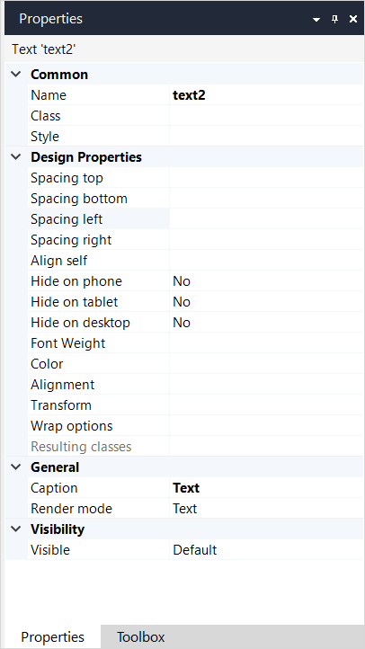

## 1 Introduction

The text widget displays a text which can contain attributes if necessary. Every attribute is replaced with the value of this attribute. For example, you can show a greeting message to a user by placing a text widget in a [data view](data-view).

If you start typing in any empty container, Studio Pro will automatically generate a text widget to display your text.

## 2 Properties

An example of text properties is represented in the image below:

{}
{}

Text properties consist of the following sections:

* [Common](#common)
* Design Properties
* [General](#general)
* [Visibility](#visibility)

### 2.1 Common Section

{}

### 2.2 General Section {#general}

#### 2.2.1 Text Template

Text template defines the text that will be shown. The template can contain attributes that are written as a number between braces, e.g. {1}. The first attribute has number 1, the second – 2, etc. To use attributes the widget must be placed in a context of an entity, e.g. inside a [data view](data-view) or a [list view](list-view).

#### 2.2.2 Parameters

For each parameter in the template you define an attribute of the context entity or a referred entity of which the value will be inserted at the position of the parameter.

#### 2.2.3 Render Mode

The render mode determines how the text will be shown in the web browser.

| Value     | Description |
| --------- | ----------- |
| Text      | The text will be rendered inline with the previous/next texts on a page (`` tag in HTML) |
| Paragraph | The text will be rendered as a separate paragraph (`
` tag in HTML) |
| Heading 1 | The text will be rendered as a large heading (`<h1>` tag in HTML) |
| ...       | ... |
| Heading 6 | The text will be rendered as a small heading (`<h6>` tag in HTML) |

_Default value:_ Text

### 2.4 Visibility Section {#visibility}

{}

## 3 Read More

