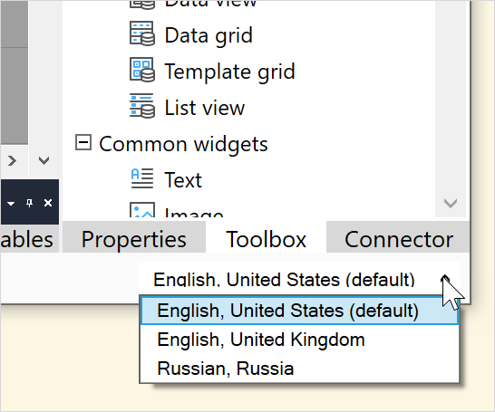

## 1 Introduction

All texts that are presented to the end-user can be translated to different languages. Examples include [labels](label), the captions of [buttons](button-widgets) and [data grid](data-grid) columns, [menu items](menu#menu-item) and [messages](show-message) that are sent from a [microflow](microflows).

The **File** menu allows you to manage documents and projects, for example, to create a new project or save changes:

{}
{}

## 2 Menu Items Overview

The **File** menu items are described in the table below:

| Menu Item | Description | Shortcut Key |
| --- | --- | --- |
| **Current Language** | Choose the current language from one of the languages set up in **Language Settings…**. | *None* |
| **Select Previous Language** | Choose the previous language in the list of languages chosen in **Language Settings…**. | <kbd>Ctrl</kbd> + <kbd>Shift</kbd> + <kbd>L</kbd> |
| **Select Next Language** | Choose the next language in the list of languages chosen in **Language Settings…**. | <kbd>Ctrl</kbd> + <kbd>L</kbd> |
| [Language Settings…](language-settings) | Choose which languages are supported by the app and configure date and time settings. | *None* |
| [Batch Replace…](batch-replace) | Change all occurrences of chosen translatable texts in the current language where they are identical. | *None* |
| [Batch Translate…](batch-translate) | Add and edit translations from a selected source language to a selected target language | *None* |
| [Language Operations…](language-operations) | Manipulate (for example, copy) translations between languages. | *None* |

You can see the currently selected language in the bottom right of the screen. If more than one language has been chosen in **Language Settings…**, you can choose these from the arrow next to the language indication.

## 3 Read More

There is a worked example of adding a translation in [How to Translate Your App Content](/howto/collaboration-requirements-management/translate-your-app-content)

## OLD INTRO - USE AS REQUIRED

Studio Pro makes it easy to translate your application into another language. You can add a language in the [Project Settings](project-settings) and then switch to that language by selecting it in the [Language](menus#language) menu, by using the drop-down in the lower-right corner of Studio Pro's main window, or with the <kbd>Ctrl</kbd>+<kbd>L</kbd> keyboard shortcut, which cycles through the languages of your app.

For texts that have not been translated yet, the text in the default language is shown between angle brackets. For example, a caption can be shown as `<Name>`. This means that the caption has not been translated yet and was `Name` in the default language. By simply typing the text in the currently selected language (for example, `Naam` in Dutch), the caption will be translated.

{}
To ease the translation if you have a lot of texts, a **Batch Translate** feature can be found in the [Language](menus#language) menu. By using this feature you can quickly translate all occurrences of a word to a word in another language. It is even possible to export all texts to Excel and later import the translations again.
{}

If a text has not been translated when you run the application the text in the default language will be used. In this way, you can translate parts of the application and see the results immediately.
