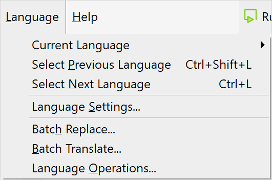

## 1 Introduction

Mendix is designed so that it is easy to present the same information to users who have different language requirements. To support this, all texts that are presented to the end-user can be translated to different languages.

These *translatable texts* include the following:

* [button](button-widgets) captions
* [data grid](data-grid) columns
* [labels](label)
* [menu items](menu#menu-item)
* [messages](show-message) that are sent from a [microflow](microflows)
* [text](text)

## 2 Working in the Currently Selected Language{#selected-language}

You can see the language you are currently working in at the bottom right of the screen.

When you have multiple languages set up in your app, you can choose a language to work in by doing one of the following:

* selecting it from the **Language > Current Language** menu
* using the drop-down in the lower-right corner of Studio Pro's main window
* using the <kbd>Ctrl</kbd>+<kbd>L</kbd> or <kbd>Ctrl</kbd>+<kbd>Shift</kbd>+<kbd>L</kbd> keyboard shortcut combinations, which cycle through the configured languages

When working in a language which is not the default, you can identify texts that have not been translated yet. These show the text in the default language between angle brackets. For example, `<Name>`. You can replace the text with the appropriate translation, and it will be replaced for the currently selected language.

If you edit your app to add new widgets while not in the default language, any new translatable texts for those widgets will be added to the current language. The text in the default language will either be left blank or will have the placeholder text for the widget.

All untranslated texts will be displayed in the default language when you run the application.

{}
If there is no text in the default language, the end-user will see `[no translation]`. If you want the text to be blank, set the default language text to be a space rather than empty.
{}

## 3 The Language Menu

The **Language** menu allows you to manage additional languages and translations for your app. This includes features to help you to translate a text in all places where it appears with a single change instead of having to change each occurrence individually:

{}
{}

### 3.1 Menu Items Overview

The **File** menu items are described in the table below:

| Menu Item | Description | Shortcut Key |
| --- | --- | --- |
| **Current Language** | Choose the current language from one of the languages set up in **Language Settings…**. | *None* |
| **Select Previous Language** | Choose the previous language in the list of languages chosen in **Language Settings…**. | <kbd>Ctrl</kbd> + <kbd>Shift</kbd> + <kbd>L</kbd> |
| **Select Next Language** | Choose the next language in the list of languages chosen in **Language Settings…**. | <kbd>Ctrl</kbd> + <kbd>L</kbd> |
| [Language Settings…](language-settings) | Choose which languages are supported by the app and configure date and time settings. | *None* |
| [Batch Replace…](batch-replace) | Change all occurrences of chosen translatable texts in the current language where they are identical. | *None* |
| [Batch Translate…](batch-translate) | Add and edit translations from a selected source language to a selected target language | *None* |
| [Language Operations…](language-operations) | Manipulate (for example, copy) translations between languages. | *None* |

## 4 Setting the End-User's Language

**XXXXXXXXXXXXXXXXXXXXXXXXXXXXXXXXXXXXX**

## 5 Read More

There is a worked example of adding a translation in [How to Translate Your App Content](/howto/collaboration-requirements-management/translate-your-app-content)

See also [How To Use Translatable Validation Messages](/howto/logic-business-rules/translatable-validation-messages) for information on translating validation messages.