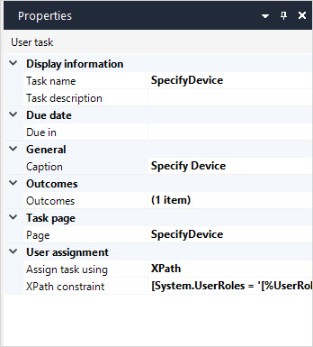

## 1 Introduction

User task allows you to assign a workflow task to a certain user. 

For example, you can add filters and assign a task to a user in the IT department. When the workflow reaches this user task, the task will appear in their inbox:

## 2 Properties

An example of user task properties is represented in the image below:

User task properties consist of the following sections:

* [Display information](#display-info)
* [Due date](#due-date)
* [General](#general)
* [Outcomes](#outcomes)
* [Task page](#task-page)
* [User assignment](user-assignment)

### 2.1 Display Information Section {#display-info}

#### 2.1.1 Task Name

**Task name** is displayed in the running app. The **Task name** can contain parameters that are written between braces, e.g. {1}.

For more information on using parameters, see the [Parameters](#parameters) section below.

#### 2.1.2 Task Description

**Task Description** is a description of the workflow displayed in the running app. The description can contain parameters that are written between braces, e.g. {1}.

#### 2.1.3 Parameters

Parameters are attributes the value of which will be displayed. To view **Parameters**, click the ellipsis icon next to the **Task name** or **Task description** in properties depending on where you would like to display these parameters. 

Parameters have the following settings:

* **Index** – an identification number of a parameter
* **Expression** – an XPath expression that will be displayed

##### 2.1.3.1 Adding New Parameters

To add a parameter to the **Task name** or the **Task description**, do the following:

1. Click the ellipsis icon next to the **Task  name** or the **Task description**.

2. In the **Edit task name/description** dialog box > **Parameters** section, click the **New** button. 

3. In the **Template Parameter (String)** dialog box, specify the expression, and confirm your choice:

    

    {}Make sure that the attribute you use in the expression is of the string type.{}

4. In the **Template** setting, write the text you would like to display and type **Index** of the parameter you would like to include. For example, you can add a template for the **Task description** specifying the name of the workflow and what the workflow due date is :

     

##### 2.1.3.2 Performing Other Actions on Parameters

In addition to adding new parameters, you can perform the following actions on parameters:

* **Delete** – to delete a parameter click **Delete** or press <kbd>Delete</kbd> on your keyboard
* **Edit** – double-click a parameter to edit it or click **Edit**
* **Move up** – to move a parameter up in the list of parameters and also to change its index, click **Move up**
* **Move down** – to move a parameter down in the list of parameters and also to change its index, click **Move down**

### 2.2 Due Date Section {#due-date}

**Due in** allows you to set a deadline for the user task and keep track of it. However, this is not an automatic reminder but rather a deadline you reference when keeping track of the user task. 

### 2.3 General Section {#general}

**Caption** defines a title of the user task. 

### 2.4 Outcomes Section {#outcomes}

The outcomes property allows you to create new outcomes for the user task. These outcomes can be referred to by other elements, such as a button. For example, you have a process when you need to approve or reject a request. One button on a [task page](#task-page) can refer to the **Approve** outcome of the user task, while another one can use the **Reject** outcome. 

### 2.5 Task Page Section {#task-page}

**Task page** is an overview page where the allowed roles can track the progress of the use tasks and view its details, such as its comments or attachments. When you create a page, you can use a user task-specific page templates. 

### 2.6 User Assignment Section {#user-assignment}

#### 2.6.1 Assign User Task Using {#assign-user-task}

**Assign user task using** allows you to manage what users will the task be assigned to. You can filter users using XPath or implement a more complicated logic and add several checks using a microflow. 

Possible options of this property are described in the table below:

| Option    | Description                                                  |
| --------- | ------------------------------------------------------------ |
| XPath     | Allows you to filters users who should be assigned the user task. For example, you can assign a certain task only to users with the Manager user role. |
| Microflow | Allows you to assign the user task to certain users. Using microflow you can check, for example, which users have the right to approve user tasks and are currently not on vacation and assign the task only to users who passed the check. |

#### 2.6.2 XPath Constraint

Specifies the expression used to assign the user task. This option is displayed only when the [Assign user task using](#assign-user-task) is set to **XPath**.   

#### 2.6.3 Microflow

Specifies the microflow used to assign the user task. This option is displayed only when the [Assign user task using](#assign-user-task) is set to **Microflow**.   

## 3 Read More

* [Workflows](workflows)