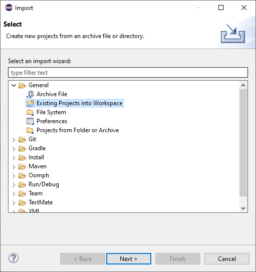

## 1 Introduction

You can use Eclipse to write and debug Java actions in your Mendix app. When the Mendix model is deployed, an Eclipse project file, classpath file, and launch configuration are generated.

## 2 Setting Up Eclipse

In Mendix, all text is saved in UTF-8 encoding. To make sure your source code is also saved in UTF-8, do the following:

1.  Select **Window > Preferences**.
2.  Select **Workspace** in the new menu window.
3.  Select **UTF-8**:

	

You should also have a Java Development Kit (JDK) installed and selected.

Make sure to add a JDK and select it as the default in Eclipse.

## 3 Adding a Mendix App

To add a Mendix app to Eclipse, do the following:

1.  Select **File > Import**.
2.  Open the **General** folder, select **Existing Projects into Workspace** and select **Next >**:

	

3.  Use the option **Select root directory**, browse to your Mendix app folder and select **Finish**:

	

## 4 Launching a Mendix App

To launch the app, do the following:

1.  Select **Run > Run configurations...** or **Run > Debug configurations...**, depending on how you would like to start the application. 
2.  Select **Java application** and a launch configuration—generated by Mendix Studio Pro—will appear.
3.  Select **Run** (or **Debug**) to start the application:

	

After you have launched the application, the **M2EE Admin Console** will appear. This is the same console as you would normally see in Mendix Studio Pro, if you would run the application from there. You can stop your application by closing the console.

