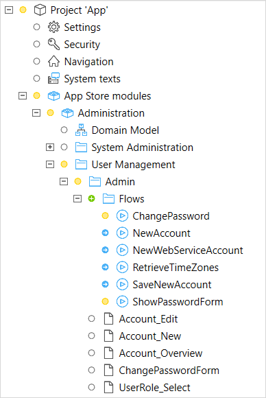
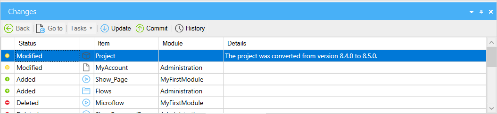
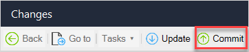
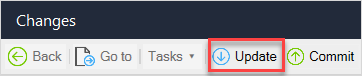
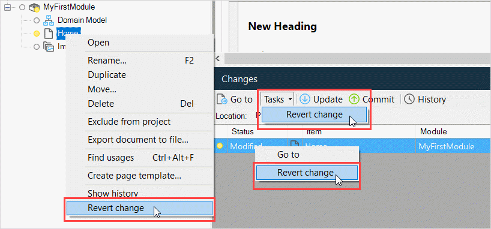
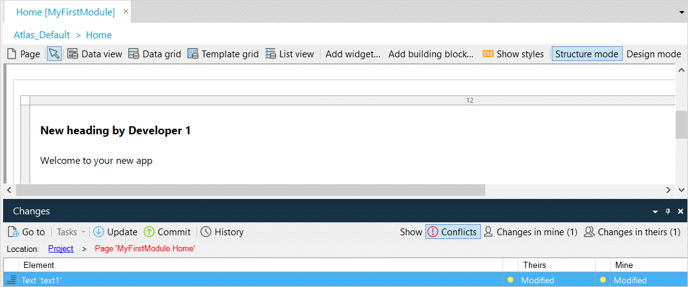
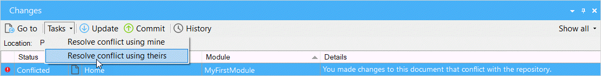
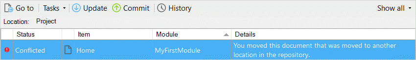
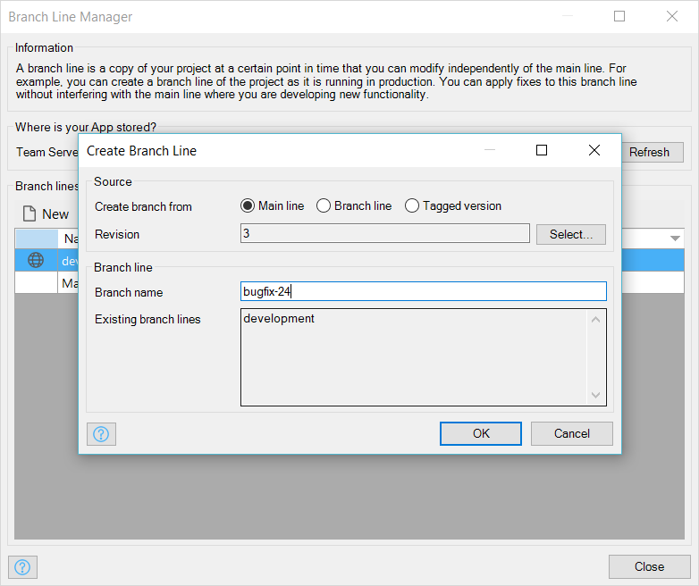

## 1 Introduction

This reference guide describes how to use version control in Mendix Studio Pro. The theory behind how version control works in Mendix, and a definition of the concepts can be found in [Version Contol](version-control).

## 2 Starting a Project with Version Control

To start a new project with version control do the following:

1. Choose **New Project...** in Studio Pro.
2. In the **App Settings** dialog, set **Enable online services** to *Yes*. This option creates a Team Server repository and a Developer Portal project.
3. Change the **Project directory**, or leave the default suggested by Studio Pro.
4. Click **Create app**.

The app is created on the Team Server, and a working copy is created in the **Project directory**. This is opened in Studio Pro so that you can start working immediately.

## 3 Joining a Project

If there is already a Team Server enabled project, you can be invited to join it (see [App Team](/developerportal/collaborate/team)).

Once you are a team member, providing you have been given a role with sufficient rights, you can work on the app by doing the following:

1. Choose **Open project...** in Studio Pro.
2. Select *Mendix Team Server* as for **Where is your App stored?**.
3. Choose your app from the **Team Server App** drop-down.
4. Change the **Project directory**, or leave the default suggested by Studio Pro.
5. Click **Create app**.

The project will be downloaded from the Team Server and opened in Studio Pro.

## 4 Day-to-Day Development

Let us say you have a working copy of a project on disk. You make changes to the app and save them. Saved changes are not immediately visible to others. The documents, folders, and modules which have been changed can be identified by looking at the **status**.

When you are happy with a set of changes, you **commit** them to the repository. Others can then choose to update and retrieve those changes.

You can **update** your working copy with changes committed by others.

You can also see a **history** of all the changes which have been committed, no matter who committed them.

### 4.1 Status

The status of your project is a summary of all the changes in your working copy when compared with the original. Studio Pro shows the status both in the project explorer and in the **Changes** dock.

The project explorer shows an icon in front of items (documents, folders, and modules) that are changed in some way. The different icons indicate the different kinds of changes which have been made.

| Icon | Meaning |
| --- | --- |
|  | Nothing happened to this item. It is unchanged with the respect to the original. |
|  | You modified this item (as in, document, folder or module). |
|  | You added this item. |
|  | You moved this item to another position in the project tree. |
|  | You deleted this item. |
|  | You and somebody else made conflicting changes to this item. For more information, see the [Dealing With Conflicts](#conflicts) section below. |

{}
There is only room for one icon and if a document is both modified and moved it is shown as modified.
{}

For example, say that the microflow *ChangePassword* has been modified. Also a new folder called 'Flows' was added and all microflows were moved inside this folder. In the screenshot you can see that the folders and modules containing changes are depicted with a yellow icon, and the microflows which have been moved have a blue icon. This helps you to quickly see where in the project the changes are.

You can see the same information in the **Changes** dock. In this case there is an entry for each *change* to an item. If a document is both modified and moved there are *two* lines for that document. The dock also shows items that were deleted, something the project explorer cannot do.

{}
When you successfully commit your project, this becomes the new original and all the change information is removed from the project explorer and the changes dock.
{}

### 4.2 Committing

Sending changes to the repository is called *committing*. The idea is that you commit small, consistent pieces of work to the repository. We recommend you commit your changes often. Preferably, the versions in the repository are always error-free, Studio Pro will warn against committing while there are errors in your project.

To commit your changes, click the **Commit** button in the **Changes** dock, or choose the **Project > Commit...** menu item.

In general, it is a good idea to commit after implementing one feature or fixing one bug. By committing often, your work is integrated with the work of others regularly. The benefits of committing often include:

* if any conflicts arise the changes are still fresh in your mind
* revisions are easier to understand
* if you ever need to revert something, you can revert a small chunk of work

Committing results in a new revision in the repository. You can add the following information in Studio Pro when you perform a commit, and this will be attached to the newly created revision:

* A textual message. This should be a summary of the changes you made
* A list of Developer Portal stories that relate to the commit. A small commit will probably relate to one story. Studio Pro shows stories that are in the current Sprint and do not have a status of *Done*. Adding the story to the commit will not change the state of the Developer Portal story. Setting the status to 'Done' must be done manually and depends on your *definition of done*.

Studio Pro also attaches some information automatically:

*   The person who committed (the *author*)
*   The date and time of the commit
*   The list of changed documents, folders, and modules along with the type of the change (for example *modify* or *add*)
*   The version of Studio Pro that was used to commit

If you also changed Java source code, added widgets or made other changes that affect files other than the project file you will see a **Changes on disk** tab page that shows you what disk changes you are about to commit.

Committing is only allowed if your working copy is up to date with the repository. If someone else committed a change since the last time you updated, you will have to update first. This is because the revision you create with the commit should incorporate both your changes and the changes by the other person. Updating will combine the latest changes in the repository with your changes. After reviewing the result, and fixing any conflicts, you can commit again.

### 4.3 Updating

Updating retrieves the latest changes from the repository. You need to do this to incorporate any changes made by others that are not yet in your working copy before you can commit your changes to the repository. It is advisable to frequently update so that the number of changes you retrieve is small.

To update the working copy of your app, click the **Update** button in the **Changes** dock, or choose the **Project > Update** menu item.

Changes you receive from the repository when updating are combined with the changes you have made to your working copy (if any). Afterwards, your working copy will contain both your changes and the changes you received. As part of the update, the original of your working copy is updated as well.

For example, if the last time you updated you received all changes up to and including revision 40, this means that the original for your working copy is revision 40. Since you started making changes to your working copy, other people on your team have made another four commits (41, 42, 43 and 44). If you now update, you will receive those changes and 44 will be the new *original* to which your changes are compared.

Usually, combining your changes with the latest revision from the repository will be done automatically. For example, one person may add a page while you are changing a microflow. If the changes are too close, however, a conflict can arise. For example, if one of your team has changed the properties of the same data view which you have also changed. You will have to resolve such conflicts before you can commit. See the  [Dealing With Conflicts](#conflicts) section, below, for information on how to do this.

If your team is committing often you will have to update often. Frequent updating has the benefit that you receive fewer changes with each update, so integrating those changes with your work is easier.

### 4.4 History {#history}

The *history* of the project is a list of all revisions that have been committed. To view the history of the project, click the **History** button in the **Changes** dock, or choose the **Version Control** > **History** menu item.

The revisions are shown in reverse chronological order (newest is at top of list). The history dialog shows you revision number, date, time, author and message of each revision.

Select a revision to see additional details such as related Developer Portal stories, changed documents, Studio Pro version and changes on disk. Icons summarize the kinds of changes that happened in the project.

## 5 Reverting Changes

Changes that have not yet been committed can be reverted. Say, for example, that you have made a lot of changes to a page and you are not happy with the result. You can revert the page to the original: that is, the state of the page before you started making changes.

Deletes of documents, folders, and modules can also be reverted. This will bring them back into the project. Note that you will get back the latest version you have *committed*. For example, if you commit, make some changes to a microflow, and then delete the microflow, reverting the delete will give you the microflow without the changes that you made.

You can revert changes in the **Changes** dock, or from the right-click menu on the document you want to revert.

## 6 Dealing With Conflicts {#conflicts}

If you update your app and the changes cannot be merged automatically you will receive a message telling you there are conflicts. A conflict arises when two changes cannot be combined.

There are two different sorts of conflict:

* Document conflicts
* Project conflicts

### 6.1 Resolving a Document Conflict

Two changes in the same *document* that are really close to each other can cause a document conflict. For example, two people both change the properties of the same element on the page. The document will be marked as conflicted in the **Changes** dock. Conflicts have to be resolved before you can commit again.

Double-click a document to see which elements have conflicts. You can also see all the changes which have been made by you, and all the changes which were made by other people.

For each *document* you can decide whether to accept the conflicted elements which are **mine** and discard the changes to those by the other person, or to accept the conflicted elements which are **theirs**, if their changes are more relevant. 

This decision applies to all the conflicts in the document; you cannot choose your version for some conflicted changes but their changes for others. Non-conflicting changes will be merged as normal.

Ensure you are viewing changes for the whole project in the **Changes** dock, select the document which is conflicted, and use the required option from the **Tasks** drop-down.

For example, if you deleted a data view in a page and another person changes something inside that data view, you may choose to discard the changes of the other by clicking 'Use mine'.

Resolving a conflict will make the conflict go away but the document may, of course, still be marked as changed if there are changes to commit.

## 6.2 Resolving a Project Conflict

Project conflicts are conflicts are conflicts at the level of the project. There are two cause for project conflicts:

1.  One person deletes a document and the other makes a change inside that document.
2.  Both people move a document but to different places in the project tree.

The involved document is marked as conflicted and you can see the reason in the details column of the **Changes** dock.

{}
If a whole folder (or module) was *deleted* and another person changes a document inside that folder, the folder/module is restored and also marked as conflicted. This way you know that the intention was to delete that folder but it has been restored to show you the context of the changed document.
{}

You can resolve a project conflict by choosing **Tasks > Use mine** or by deleting the involved documents or folders.

## 7 Using Branches

A repository can contain a number of development lines. Each development line offers independent development from the other development lines. In the simple case there is just one development line called the main line (called 'trunk' in subversion). All development then happens inside that one line.

It is often convenient to have more than one development line. For example, one development line for fixing bugs in the currently deployed version of your project and another line where you develop new functionality. If you then find a bug in the deployed version you can fix it in the corresponding development line irrespective of the state of the development line where new functionality is developed. See [Version Control](version-control) for more information about branches.

### 7.1 When to Use a Branch

#### 7.1.1 Patching a Deployed Application

If you want to add some functionality to a deployed application or you want to fix a bug in it, you can do so without interfering with other development.

1. Determine the version of the deployed application. This information is in the Developer Portal. Alternatively, you can find the version in the *metadata.json* file in the **model** subfolder of your deployment package (mda) archive. For example, `"ModelVersion": "1.0.0.16"`
2. Choose **Version Control > Manage Branch Lines...** and create a branch based on the tag with the that version number as its name.

    

3. Add the functionality or fix the bug in this newly created branch.
4. Testing that things work as intended.
5. Create a new deployment archive with a higher version number (increase patch or minor version).

{}
We advise you to merge the fixed maintenance branch into the main line quickly, if required. If the merge is too complicated to be made automatically, because the main line has changed too much, you will know how to apply the fix by hand to the main line as the changes will still be fresh in your mind.

Of course, not all maintenance fixes need to be merged to the main line. Sometimes, it is a fix of something that was completely redesigned or eliminated in the main line. In this case, merging is unnecessary.
{}

#### 7.1.2 Developing a New Feature Independently

Another reason for creating a branch is to develop a big new feature without interfering with other development. This gives you the freedom to commit a half-implemented feature, possibly even with errors, while other people can still commit and update on the main line. Without using a branch line, you would have to constantly make sure that your project is error free and does not break other parts of the system.

Firstly, select **Version Control > Manage Branch Lines...** and create a branch from a revision of the main line.

Now work on the branch until the feature is done and commit the completed work.

When you want to merge the whole branch back to the main line to integrate the feature there. Do the following:

1. Open the main line.
2. Choose **Version Control > Merge changes here**.
3. Choose **Merge feature branch**.

    

4. Select the branch and click **Merge**.
5. Resolve any conflicts and errors.
6. Commit the new feature to the main line.

You can delete the branch after merging it back, if you want.

### 7.2 Working with Branches in Studio Pro

#### 7.2.1 Branching

Development lines other than the main line are called branch lines. Our advice would be to develop new features in the *main line* and to use *branch lines* for fixing bugs in versions that have been deployed. This is the scenario Studio Pro makes easy but other scenarios for more complex projects are supported as well.

You can create branch lines from the Branch Line Manager which you can find at **Version Control > Manage Branch Lines...**.

#### 7.2.2 Merging

If you have multiple development lines, you sometimes want to port changes from one development line to another. For example, the fix that you made in a branch line for the production version should also be applied to the new 2.0 version you are developing in the main line. You can, of course, do this by hand but Studio Pro can also help you by merging changes from one development line to another.

Merging is always done while you have a working copy open. The merge will result in extra local changes in that working copy. It is advisable to commit local changes first before merging extra changes into a working copy. Otherwise, the uncommitted local changes and the changes caused by the merge will be combined and it is very hard to untangle them if you are unhappy with the merge. Studio Pro will warn you if you have uncommitted changes.

Select **Version Control > Merge Changes Here**, then select the appropriate type of merge (for example, **Port fix**).

You can merge a single revision or a whole range of revisions from one development line to another. If a branch line represents a big new feature that you want to integrate completely into the main line, you can merge all the revisions of the branch.

#### 7.2.3 Reverse Merging

Reverting changes works for changes that have not been committed yet. Changes that have been committed can never be deleted. However, you can apply the changes 'in reverse' and commit that. This feature is called 'Reverse merging' in Studio Pro.

Choose **Version Control > Reverse Merge Changes...**

After a reverse merge the project will look like the changes never happened; if you 'reverse merge' the adding of a page, the page will be deleted locally. Just like when you are doing a normal merge, conflicts can arise. In the example, if later commits change the added page, the reverse merge will result in a conflict. After resolving any problems, you can commit the results to the repository.

#### 7.2.4 Replacing the Main Line with a Branch Line

There are two methods for fully replacing your main line with a branch line.

The first method is to merge the entire branch line into the main line, essentially replacing the main line contents with the branch line contents). This works as long as the branch line is up to date with the main line (to avoid conflicts. To do this, follow these steps:

1. Select **Version Control > Merge Changes Here** > **Merge feature branch**.
2. Select the branch to merge into the main line.

The second method should be used if the first method is not possible for some reason and you want to "overwrite" the main line with your branch line. For this method, you must follow these steps:

1. Check out both the main line and the branch line locally.
2. Overwrite all the files in the main line project directory with those of the branch line (except for the *.svn* directory).
3. Commit your changes using Studio Pro. 
4. Reopen the main line project in Studio Pro only after overwriting the files.

## 8 Versioning a Project Deployed to the Cloud

### 8.1 Deploying Locally

While developing you can deploy and run your app on your local machine by using the menu item **Run > Run Locally**. This allows you to test the app as it currently is stored on your local machine.

### 8.2 Deploying Your Working Copy

When you deploy to the cloud, you can choose to use the version of the app stored on your local machine, the *working copy* and deploy that to the default environment. If you are using the [Mendix Cloud](/developerportal/deploy/mendix-cloud-deploy), or other partner cloud (SAP Cloud Platform, for example), choose the menu item **Run > Run** to commit the version of the app stored on your local machine and deploy that to the default environment.

### 8.3 Choosing a Specific Development Line and Revision

It is also possible to choose a specific development line and revision to deploy to the default environment, or to create a package from.

In this case, Studio Pro will create a fresh checkout of the chosen revision. This means that any team member can always recreate this version of the deployment package. In other words, Studio Pro does *not* rely on your local files for creating a versioned deployment package.

{}
You can only create a versioned deployment package of changes that have been committed. If you have local changes that you want to deploy in a versioned deployment package, commit them first.
{}

When it creates the package, Studio Pro will also create a tag representing this version of your project. If you want to make modifications to this version later, independently of other development which has taken place, you can create a branch based on this tag. The name of the tag is a version number that you choose.

#### 8.3.1 Deploying a Specific Version to a Mendix Licensed Cloud Node

If you are using the Mendix Cloud you can choose **Project > Deploy to Licensed Cloud Node** to deploy a specific version.

#### 8.3.2 Creating a Deployment Package from a Specific Version

If you are using a different hosting environment, you create a deployment package using the menu item **Project > Create Deployment Package...**.

## 9 Working Outside Studio Pro

Studio Pro takes care of some file management automatically. If you add or remove custom widgets they are automatically added or removed from version control, too. Some files and directories (e.g. deployment and releases directories) are automatically ignored so that they are not committed to version control.

We advise you to always commit and update inside Studio Pro because in this way useful metadata is added to your revisions. Studio Pro has ways to recover from external updates or merges but it is best to not depend on that.

### 9.1 TortoiseSVN & Subclipse {#tortoisesvn-subclipse}

If you are doing more advanced changes to files, like adding Java actions or resources to your project, you will have to install TortoiseSVN on your computer and perform some operations yourself. You can download it for free at [https://tortoisesvn.net/](https://tortoisesvn.net/).

{}
Mendix Studio Pro uses the Subversion 1.9 working copy. Previous versions of the Mendix Desktop Modeler used a Subversion 1.7 working copy. These working copy versions **are not compatible**.

Always use the version of TortoiseSVN which matches your app model. If you open a local model from Mendix version 7.x or 6.x with the latest version of TortoiseSVN **you will no longer be able to open it in Mendix**.
{}

Also, if you are developing Java actions using Eclipse, we advise you to install Subclipse to help you with version control of Java files. You can download Subclipse from the Eclipse Marketplace inside Eclipse or from [http://subclipse.tigris.org/](http://subclipse.tigris.org/).

### 9.2 Adding Files & Directories

If you add files or directories or delete files using Windows Explorer, Studio Pro automatically adds or deletes these from version control, too.

Make sure you use the SVN export feature of TortoiseSVN if you are copying a directory that is already under version control into your project.

### 9.3 Deleting Files & Directories

If you delete a file from your project, Studio Pro will automatically also delete it from the Team Server.

If you want to delete a whole directory, you will have to use the delete command of TortoiseSVN. You can execute this command by right-clicking the directory and choosing 'TortoiseSVN > Delete'.

### 9.4 Branching & Deploying

If you perform branching outside of Studio Pro, you will not be able to immediately deploy to Mendix Cloud. That is because Studio Pro adds metadata about the Mendix version of your app project to each revision when you commit or create a branch, which is needed by the Mendix Cloud deployment. Branching outside of Studio Pro means that metadata is missing from your branch, thus your app cannot successfully be deployed.

To fix this, make a small commit on your branch in Studio Pro (for example, changing a documentation field). Studio Pro will then add the metadata that Mendix Cloud deployment requires, and you will be able to deploy your app.

## 10 Read More

* [Advanced Branching and Merging Strategies](https://www.mendix.com/blog/advanced-branching-merging-strategies-part-1-2/)

