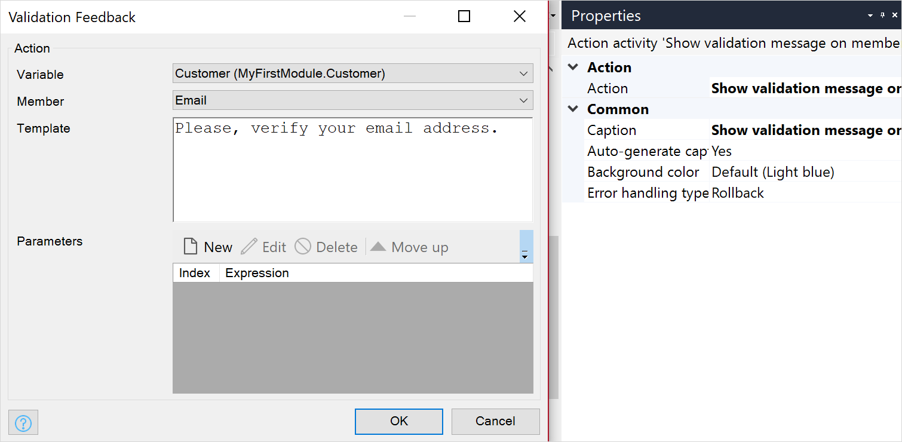

{}
This activity can be used in both **Microflows** and **Nanoflows**.
{}

{}
This action is ignored and does not work when a microflow is called from an offline, native, or hybrid app. For more information, see the [Microflows](offline-first#microflows) section of the *Offline-First Reference Guide*.
{}

## 1 Introduction

The **Validation feedback** activity does a validation check, and if this check fails, it shows a red message to the end-user below the widget that displays the attribute or association which failed the validation. For example, if the customer did not verify their email, a message will be displayed that the customer should verify it before they can log in:

## 2 Properties

There are two sets of properties for this activity, those in the dialog box on the left, and those in the properties pane on the right:

The **Validation feedback** properties pane consists of the following sections:

* [Action](#action)
* [Common](#common)

## 3 Action Section {#action}

The **Action** section of the properties pane shows the action associated with this activity.

You can open a dialog box to configure this action by clicking the ellipsis (**…**) next to the action.

You can also open the dialog box by double-clicking the activity in the microflow or right-clicking the activity and selecting **Properties**.

### 3.1 Object

**Object** defines which object will be validated.

### 3.2 Member

**Member** defines for which attribute or association the message will be shown. In you have a [reference selector](reference-selector) or [reference set selector](reference-set-selector), you should select the association that is edited with these widgets.

### 3.3 Template

**Template** is the message that will be shown to the end-user. The template can contain parameters that are written as a number between braces, e.g. {1}. The first parameter has number 1, the second 2, etc.

{}

Nanoflows do not support text templates in validation feedback. Only a static message text can be provided.

{}

### 3.4 Parameters

Parameters are attributes the value of which will be displayed. Parameters need to be entered using [expressions](expressions) resulting in a string.

## 4 Common Section {#common}

{}

## 5 Read More

* [Activities](activities)