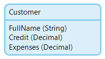

Validation rules are conditions that should be satisfied before an object is committed. If a condition defined by a validation rule is not satisfied when the object is committed, the server generates a validation error. If the object was committed using a form, this results in a validation message. When committing an object in a microflow, this results in an error that can be handled using custom error handling. In all other cases, a validation error results in a Java exception being thrown.

{}

For entity 'Customer' the name and credit need to be filled in at all times, and the expenses cannot be higher than the credit. This is visualized in the domain model editor as follows:

{}{}

Only persistable entities can define validation rules as they say something about database integrity. Therefore, validation rules are disabled for non-persistable entities.

{}

## General Properties

### Attribute

This property defines the attribute to which the validation rule applies. An entity can specify validation rules for its own attributes, or for attributes of one of its generalizations.

### Error message

This property defines the message that is displayed to the end user when the attribute value does not satisfy the condition defined by the validation rule.

## Rule Properties

### Rule

The rule defines which condition an attribute should satisfy.

| Option | Description |
| --- | --- |
| Required | The attribute needs to have a value. It cannot be empty. |
| Unique | The attribute should have a value that is unique compared to the values of this attribute in all other objects of the same same entity. |
| Equals | The attribute value needs to be equal to a specified value or equal to the value of another attribute of the same object. |
| Range | The attribute value needs to be in a range between specified values or between the values of other attributes of the same object. |
| Regular expression | The attribute needs to match a [regular expression](regular-expressions). |
| Maximum length | The attribute may have no more than the specified number of characters. |

_Default value:_ Required

{}

Date values should be entered in [ISO 8601](http://en.wikipedia.org/wiki/ISO_8601) format, for example 2015-07-26.

{}

## Rule Order

Validation rules can be ordered in the modeler. The order of the rules determines the order of execution. If multiple rules are violated, their error messages will be concatenated (in the defined order) and shown in the page. Although the order can be set for all the validation rules in the entity, only the order per attribute will have an impact as all validation rules are executed for all attributes.

The `uniqueness` validations do not comply to the defined order. This validation requires a database query and is executed only when the complete object satisfies to all the other validation rules.
