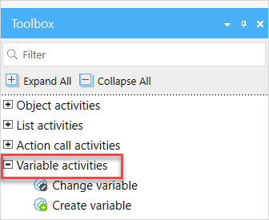

## 1 Introduction

A *variable* is a temporary storage for data. Variables are used to store information and refer to it when needed. For this purpose variables should have a unique name.
In a microflow or nanoflow you can add a variable, assign a value to it and then use it in activities or events. You can then change this value later if necessary. 

The activities described in this document are in the **Variable Activities** section of the **Toolbox**:

The following are the variable activities you can use in your microflow or nanoflow:

* [Create Variable](create-variable) – allows you to create a new variable and assign a value to it
* [Change Variable](change-variable) – allows you to change the value of an existing variable 