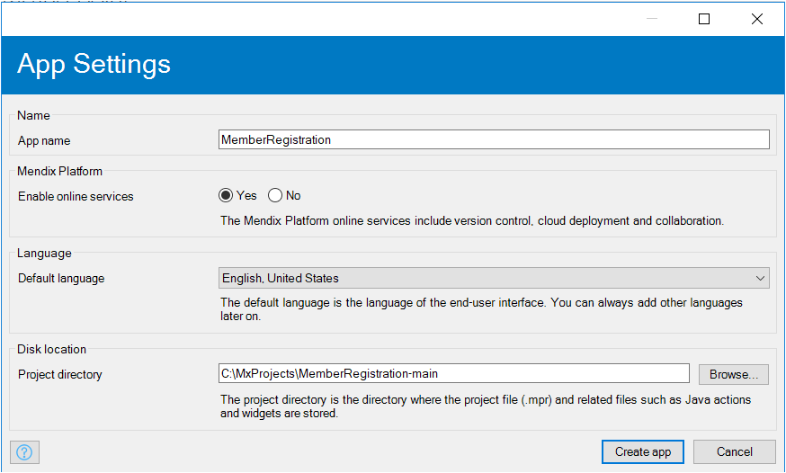
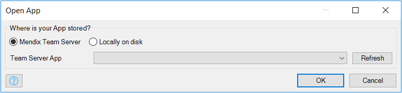
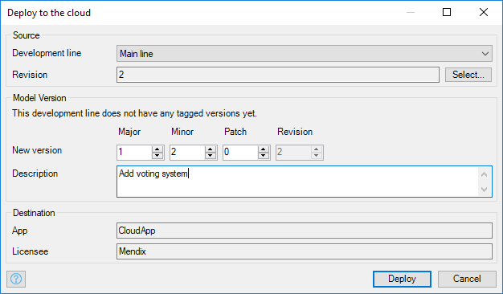
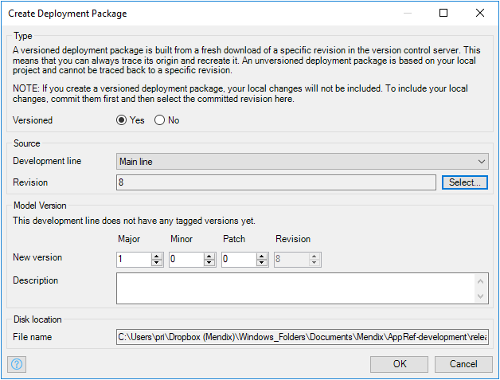
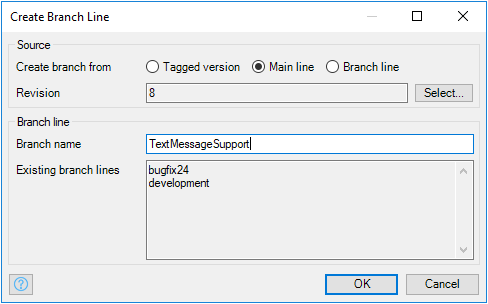
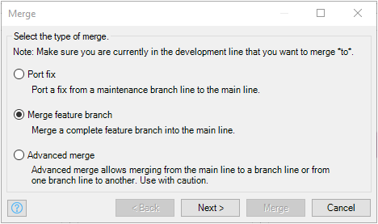

This page describes some common scenarios of working in the Modeler with version control.

## Starting A Project

To start a new project with version control you simply choose 'New Project' in the Modeler and make sure that the Team Server option is enabled. Creating such a project creates a Team Server repository and a sprintr™ project. Also a working copy is created and opened so that you can immediately start working.

## Joining A Project

If someone else has already created a Team Server enabled project you can join it by choosing 'Open Project' in the Modeler. Select the desired Team Server project and the development line you are interested in. The project will be downloaded from the Team Server and opened.

{}

If you already have a sprintr™ project that was created by hand, you can enable the Team Server for that project in sprintr™ by adding the Team Server plugin.

{}

## Day-to-day Development

Let us say you have a working copy of a project on disk; you can now start making changes as you would normally do. Saved changes are not immediately visible to others like they were with the multi-developer databases in 2.x. Only when you are happy with a set of changes, you commit them to the repository. Others can then choose to update and retrieve those changes.

{}

We recommend you commit your changes often. In general, you can commit after implementing one feature or fixing one bug. By committing often your work is integrated with the work of others regularly and if any conflicts come up the changes are still fresh in your mind and that of your colleagues. Committing often also helps you to commit small sets of changes. This makes the revisions easier to understand and if you ever need to revert something you can revert a small amount of work instead of a day's worth.

{}

If you are about to commit and others have committed changes in the meantime, you first have to retrieve those changes by updating. Updating will combine the changes made by others with your changes. Oftentimes the changes can be combined with no problem. If, however, the changes are too close to each other a conflict may arise.

{}

If everyone is committig often you will automatically have to update often. Before you can send your changes to the repository you will have to incorporate changes made by others that are not yet in your working copy. Updating often has the benefit that you receive fewer changes than if you wait a day and integrating those changes with your work is easier to do.

{}

## Reverting Changes

Changes that have not been committed yet can be reverted. Let us see you made a lot of changes to a form and you are not happy with the result. You can then revert the form to the original, that is, the state of the form before you started making changes.

Deletes of documents, folders and modules can also be reverted which will bring them back into the project. Note that you will get back the latest committed version. If you commit, make some changes to a microflow and then delete the microflow, reverting the delete will give you the microflow without the changes.

## Resolving A Document Conflict

Two changes in the same document that are really close to each other can cause a document conflict. For example, two people both changing properties of the same data view in a form. The document will be marked as conflicted in the 'Changes' tab. Conflicts have to be resolved before you can commit again.

You can choose 'mine' or 'theirs' if the changes in the other version are not relevant. For example, if you deleted a data view in a form and another person changes something inside that data view, you may choose to discard the changes of the other by clicking 'Use mine'.

Resolving a conflict will make the conflict go away but the document may, of course, still be marked as changed if there are changes to commit.

## Resolving A Project Conflict

Project conflicts are conflicts are conflicts at the level of the project. There are two cause for project conflicts:

1.  One person deletes a document and the other makes a change inside that document.
2.  Both people move a document but to different places in the project tree.

The involved document is marked as conflicted and you can see the reason in the details column of the 'Changes' dock.

If a whole folder (or module) was deleted and another person changes a document inside that folder, the folder is restored and also marked as conflicted. This way you know that the intention was to delete that folder but it was restored to show the context of the changed document.

You can resolve a project conflict by choosing 'Use mine' or by deleting the involved documents or folders.

## Deploying A Project To The Cloud

While developing you can deploy and run your project on your local machine by using the menu item 'Project > Run'. If you want to put your project into a test, acceptance or production environment, you will have to upload it to the cloud. If you are using the Mendix Cloud Portal you can choose 'Deploy to the Cloud Portal' from the project menu.

If you are using a different hosting environment, you create a deployment archive using the menu item 'Project > Create Deployment Archive'.

You can choose a development line and revision to create an archive from. The Modeler will create a fresh checkout of that revision so that creating this deployment archive can always be reproduced by you or by other people. In other words, the Modeler does not rely on your local files for creating a versioned deployment archive.

{}

You can only create a versioned deployment archive of changes that have been committed. If you have local changes that you want to deploy, commit them first.

{}

Along with creating the archive the Modeler will also create a tag representing this version of your project. If you later want to make modifications to this version independently of other development you can create a branch based on this tag. The name of the tag is simply a version number that you choose.

## Patching A Deployed Application

If you want to add some functionality to a deployed application or you want to fix a bug in it, you can now do so without interfering with other development. First, you determine what the version is of the application that is deployed. The Cloud Portal can tell you this. For non-cloud projects you can find the version in the metadata.json file that is located next to the deployed project file (model.mdp).

Once you know the version number you create a branch based on the tag with the that version number as its name. You can then add the functionality or fix the bug in this newly created branch. After testing that things work as intended you can create a new deployment archive with a higher version number (increase patch or minor version).

{}

After applying a fix to a maintenance branch line we advise you to quickly merge it to the main line. The changes are still fresh in your mind and if the merge is too complicated because the main line changed too much you will still know how to apply the fix by hand to the main line. Of course, not all maintenance fixes need to be merged to the main line. Sometimes, it is a fix of something that was completely redesigned or eliminated in the main line and then merging is unnecessary.

{}

## Developing A New Feature Independently

Another reason for creating a branch is if you want to develop a big new feature without interfering with other development. This gives you the freedom to commit a half implemented feature possibly even with errors while other people can still commit and update on the main line. Otherwise, you would have to constantly make sure that your project is error free and does not break other parts of the system. Instead of creating a branch from a tag (as described above) you then create a branch from a revision of the main line.

You then work on the branch for a while until the big feature is done. At that point you can merge the whole branch back to the main line to integrate the feature there. You do this by opening the main line and then choosing 'Team > Merge changes here'. Choose 'Merge feature branch' and then select the branch and click 'Merge'. After resolving any conflicts and errors you can commit the new feature to the main line.

The branch can be deleted after merging it back. This is something that cannot be done from the Modeler (yet).

## Reverse merging

Reverting changes works for changes that have not been committed yet. Changes that have been committed can never be deleted. However, you can apply the changes 'in reverse' and commit that. This feature is called 'Reverse merging' in the Modeler.

After a reverse merge the project will look like the changes never happened; if you 'reverse merge' the adding of a form, the form will be deleted locally. Just like when you are doing a normal merge, conflicts can arise. In the example, if later commits change the added form, the reverse merge will result in a conflict. After resolving any problems, you can commit the results to the repository.

## File Management And Java Development

The Modeler takes care of some file management automatically. If you add or remove custom widgets they are automatically added or removed from version control, too. Some files and directories (e.g. deployment and releases directories) are automatically ignored so that they are not committed to version control.

We advise you to always commit and update inside the Modeler because in this way useful metadata is added to your revisions. The Modeler has ways to recover from external updates or merges but it is best to not depend on that.

### TortoiseSVN and Subclipse

If you are doing more advanced changes to files like adding Java actions or resources to your project, you will have to install TortoiseSVN on your computer and perform some operations yourself. You can download it for free at [http://tortoisesvn.tigris.org/](http://tortoisesvn.tigris.org/) (choose version 1.7).

Also, if you are developing Java actions using Eclipse, we advise you to install Subclipse to help you with version control of Java files. You can download Subclipse from the Eclipse Marketplace inside Eclipse or from [http://subclipse.tigris.org/](http://subclipse.tigris.org/).

### Adding files and directories

If you add files or directories or delete files using Windows Explorer, the Modeler automatically adds or deletes from version control, too.

Make sure you use the SVN export feature of TortoiseSVN if you are copying a directory that is already under version control into your project.

### Deleting files and directories

If you delete a file from your project, the Modeler will automatically also delete it from the Team Server. If you want to delete a whole directory, you will have to use the delete command of TortoiseSVN. You can execute this command by right-clicking the directory and choosing 'TortoiseSVN > Delete'.
