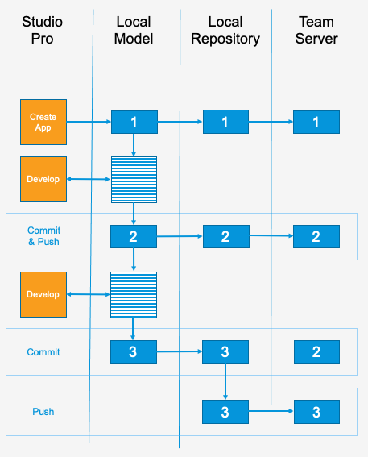
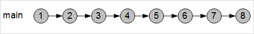
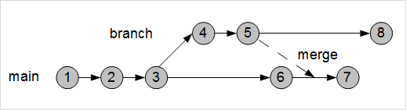

## 1 Introduction

Version Control allows you to manage your app development in two ways:

* Firstly, it allows you to store ([commit](#commit)) the current revision of your model and all its resources. You give it an identifier so that you can get that revision again and share it with other team members.
* Secondly, it allows work to take place on multiple [development lines](#development-line) so that several different features can be worked on at once. These development lines can then be [merged](#merge) back together so that your [main line](#main-line) contains all the completed features that have been worked on separately.

Version control in Mendix is built on top of either [Apache Subversion](https://subversion.apache.org/) or [Git](https://git-scm.com). The concepts will be familiar to seasoned users of these version control systems (VCS). Mendix simplifies the VCS commands by building them into Studio Pro, Studio, and the Developer Portal.

## 2 Concepts {#concepts}

### 2.1 Team Server {#team-server}

[Team Server](/developerportal/collaborate/team-server) is where all the committed versions of Mendix apps are stored. If you commit a revision of an app, it is stored on the Team Server.

To commit to the Team Server you will need to have a role in the app which allows you to edit the app. For more information, see the [Team Roles](/developerportal/collaborate/app-roles#team-roles) section *App Roles*.

### 2.2 Repository {#repository}

Within the [Team Server](#team-server) each app is stored in a repository. This repository contains all the [committed revisions](#commit) for the [Branches](#branches) of the app.

### 2.3 Revision {#revision}

A revision is the version of your app at a moment in time, stored on the [Team Server](#team-server).

Each revision of your app is given a unique alphanumeric identifier which enables you to find it in future. A new revision is created from Studio Pro in two circumstances:

* The app is committed to the repository
* A Studio Pro working copy is updated from a Studio working copy

### 2.4 Working Copy {#working-copy}

A working copy is the version of your app which is currently being worked on in Studio Pro or Studio. For Studio Pro, there is one working copy for each development line of the app. This model is held locally, on each computer where development work is taking place.

For Studio, there is one additional working copy, held in the cloud. Only one developer at a time can edit this.

### 2.5 Merge {#merge}

Merging is the action of taking one [revision](#revision) of an app and applying the differences which have been made in a different revision. See the [Merging Branches](#merging-branches) section for more information.

If any of the differences cannot be applied, then there is a [conflict](#conflict).

### 2.6 Conflict {#conflict}

A conflict occurs when two versions of the app cannot be combined automatically. This happens when the same document has been changed in a Studio Pro working copy and a committed [revision](#revision) and these changes cannot be reconciled. These are some examples:

* The properties of a widget are changed in the revision and the working copy but to different settings
* A document is moved or deleted in the revision but has been changed in a different way in the working copy

When a conflict occurs, a developer has to intervene to decide how it should be resolved before it can be committed to the Team Server as a new revision.

### 2.7 Update {#update}

Updating is the action, invoked in Studio Pro, which gets the latest revision of the current [development line](#development-line) from the repository and merges the differences into the current working copy.

If Studio is enabled for this development line, the process first ensures that the Studio working copy is stored as a new revision.

### 2.8 Commit/Push {#commit}

Committing is the action, invoked in Studio Pro, of creating a set of changes and sending/pushing all your changes to the [repository](#repository) and making a new [revision](#revision).

{}
When using Git, it is possible to store the committed data in a local repository, but not yet push it to the central [repository](#repository). In SVN these actions are always done together.
{}

If Studio is enabled for this development line, the process first ensures that the Studio working copy is stored as a new revision and merged into the working copy of Studio Pro. If there are not conflicts, the changes are then sent to the repository to make a new revision.

### 2.9 Development Line {#development-line}

Development of an app is done in a development line where a set of related changes is made. There are two types of development lines: the [main line](#main-line) and [branch lines](#branch-line).

#### 2.9.1 Main Line {#main-line}

The main line is the initial development line for the app and is usually kept as the version which will be deployed to the production environment. Simple apps, and apps which do not require a high degree of collaboration, may only have a main line.

#### 2.9.2 Branch Line {#branch-line}

A branch line is a way of making an independent set of changes which can be tested away from the main line.

See the [Branches](#branches) section below for more information on how branch lines can be used.

### 2.10 Studio Enabled {#studio-enabled}

You may enable Studio for one of the development lines. This means that a developer can make changes to the app through Studio and share changes with the team. All changes will be linked to the selected branch and committed as revisions to that branch. Changes made to other development lines will not be available in Studio.

Studio cannot be used to develop the app if it is not enabled for any development lines.

For app templates created via the Developer Portal, the main line of a new app will be Studio enabled.

### 2.11 Tag

A Tag is a way of identifying a commit in addition to the [revision](#revision) number. It is specified by the developer and has four parts:

* Major: used to identify significant new functionality, a new user interface, or other important change
* Minor: used to identify new functionality which augments the main function of the app
* Patch: used to identify a fix to an error in a previously-released app
* Revision: this is added automatically and is the revision number of the commit

{}
Tags will be supported by Studio Pro Git ([BYO](branch-line-manager-dialog#byo-server-app) and Team Server) from version 9.8.0.
{}

### 2.12 Repository Service

The Repository Service manages communication between Studio or Studio Pro and other supporting services (for example, Team Server). The developer will not generally be aware that they are communicating via the Repository Service.

## 3 Version Control Processes for a Single Branch {#vc-single}

The figure below shows how two developers might work on a [Studio-enabled](#studio-enabled) development line of an app. One developer is working in Studio, and one in Studio Pro. They both work on the same development line (for example, the main line).

### 3.1 Work in Studio Only

The developer works on the app in Studio. They start with the app in state 1, this can be a new app or a revision of the app. Changes are made continuously to the working copy for Studio, stored in the cloud.

### 3.2 Work in Studio Pro Only

Another (or the same) developer opens the app for the first time in Studio Pro. A new revision (state 2) is created on the Team Server from the current state of the Studio working copy. It is downloaded to the local machine as the working copy for Studio Pro. Studio is locked temporarily so that the Studio working copy is stable while it is copied.

The developer works in Studio Pro on the local working copy of the app. There is no work done in Studio in this scenario.

The developer can commit this to the Team Server repository at any time to make a new revision (state 3). This revision is copied into the Studio working copy and the developer using Studio will get the changes automatically.

### 3.3 Work in Studio & Studio Pro

Two developers are working on the same [development line](#development-line) of the same app at the same time. One is using Studio Pro, the other is using Studio. Changes from Studio Pro and Studio are stored in the respective working copies: on the local machine for Studio Pro and in the cloud for Studio.

### 3.4 Update Studio Pro Working Copy

The developer using Studio Pro wants to include the changes made by the developer using Studio. They choose to update their working copy.

All the changes from the Studio working copy are put into a new revision on the Team Server (state 4). This revision is merged into the Studio Pro working copy. While the Studio Pro working copy is being updated, Studio is locked temporarily so that the Studio working copy is stable while it is copied.

{}
This will also pick up changes from other developers using Studio Pro, if they have committed changes to this branch.
{}

If there are conflicts, the developer using Studio Pro will have to resolve them before they can commit the changes to the Team Server repository.

### 3.5 Commit Changes to Team Server Repository

The developer using Studio Pro wants to commit a new revision to the Team Server. This will enable the developer using Studio, or a different developer using Studio Pro, to see and work with the changes the developer has made. It also means that the revision can be deployed to the cloud.

The developer selects to commit, and the following things happen:

* Studio is locked temporarily
* The Studio working copy is committed as a revision (restore point – state 5)
* The revision just created (state 5) is merged with the Studio Pro working copy

If there are no merge [conflicts](#conflict), the updated Studio Pro working copy is committed as a new revision (state 6) and the Studio working copy is updated to the new revision and unlocked.

If there are conflicts, the developer using Studio Pro will need to resolve these. Studio will be unlocked, without receiving any of the changes from Studio Pro, while they do this. The developer using Studio Pro then needs to commit again, and the process starts from the beginning (Studio is locked ready for a new revision to be committed from the Studio Working Copy).

## 4 Working Locally

The image below illustrates how a single developer might work on changes and share them through the Team Server. In this use case, the developer creates an app first. The initial local model is than sent to the Team Server. After creating an app the developer makes changes, where they either have an option to send the changes directly to the server as indicated with change 2. Or they can first do a local commit, and then push the changes to the Team Server in a later stage. For example, it can be the case if the developer is working without access to a network.

## 5 Branches {#branches}

With more complex apps, you may want to manage your code in a more sophisticated way. For example, you may want to develop new features separately from the currently deployed version of your app so that you can fix any bugs without having to release all the new features.

This is done using [Branch Lines](#branch-line).

### 5.1 Main Line

All apps are developed along the main line. Here you have all development happening along a single line, with all changes built upon the previous revision:

This is the case for the version control processes described in the section [Version Control Processes for a Single Branch](#vc-single), above.

Initially, developers using Studio only have access to the development line for which Studio is enabled. They can be switched to another development line, however, by a developer using Studio Pro.

### 5.2 Branch Line

When you add a branch line, you take a copy of an existing [revision](#revision) and work separately on that copy. Changes made to one branch do not impact any other branches.

In Mendix each commit within a [repository](#repository) is given a unique identifier. 

{}
In SVN, the unique identifiers are numbers. As each commit has a unique number in this case, version numbers given to revisions along any chosen branch line may not be consecutive.
{}

### 5.3 Merging Branches {#merging-branches}

You may have a branch line which will continue independently and never need to be combined with any other development lines. For example, you may create a branch for a particular release of your app and only ever use it to fix bugs in that release.

On the other hand, you may want to add the features from one branch line into another development line. These are two cases for doing this:

* You develop new features in a branch line and want to include them in your main development line
* You want to take advantage of a bug fix which was made on another branch line

You can merge a specific revision of a branch line into your current [working copy](#working-copy). If, for example, you were working on the main line updated to revision 6, you can [merge](#merge) revision 5 from another branch line into your working copy. Then you can commit the result to create revision 7. If you want to merge several different committed changes from a branch, you will need to select a range of revisions which includes all the changes.

As with the examples in the [Version Control Processes for a Single Branch](#vc-single) section, there may be conflicts during the merge, and these will have to be resolved before you can commit the changes to your app.

Note that errors can be introduced by the [merge](#merge) process even if no conflicts are identified during the merge. Errors are inconsistencies which are flagged in Studio and Studio Pro and will prevent the app from being deployed. They could lead to a revision not being deployable, so it is important to check for errors after you have done a merge.

## 6 Main Documents in This Category

* [Using Version Control in Studio Pro](using-version-control-in-studio-pro) – presents technical details for using version control (theoretical concerns are described above)
* [Collaborative Development](collaborative-development) – describes the process of sharing app model changes when a team of more than one person is working on the app
* [Team Server](/developerportal/collaborate/team-server) – presents an overview of viewing Team Server information in the Developer Portal (for example, revision summary and details)
