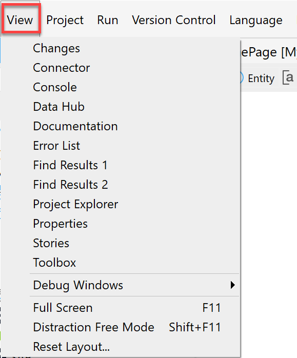
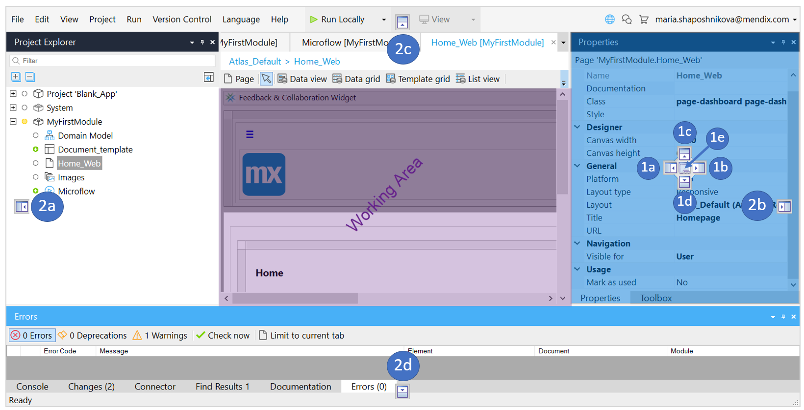

## 1 Introduction

Studio Pro supports a number of dockable window panes, such as the **Changes** and **Errors** panes. You can close some panes to just show the ones you need at the moment, but you can always reopen them via the **View** menu. 

Via this menu you can also enable or disable the [full screen mode](#full-screen) or [reset the layout](#reset-layout) of your project to the default.  

{}
{}

## 2 Layout of Panes {#layout-of-panes}

You can change the default layout of panes and arrange them in the layout you like.

{}

Note that this section describes the behavior of panes, not the behavior of documents in the working area. For more information on the behavior of documents open in the working area, see the [Document Tabs](studio-pro-overview#documents) section in *Studio Pro Overview*.

{}

When you drag a pane, you can see arrows that indicate where you can position this pane. You can position the pane either inside the current pane (arrows grouped together) or make it full-window height or width (individual arrows on the borders). Each position is labelled and explained below:

1. Within the current *pane* you can position a pane in one of the following ways:

   1. Pane-height – left 

   2. Pane-height – right 

   3. Pane-height – top

   4. Pane-height – bottom

   5. New pane as a new tab

      {}If you try to position the pane as a new pane inside the working area, it will be opened as a dialog window.
      
      {}

2. Within the current *window* you can position a pane in one of the following ways:

   1. Full-window height – left

   2. Full-window height – right

   3. Full-window height – top

   4. Full-window height – bottom

The video below shows examples of how to position a pane:

<video width="640" height="360" controls src="attachments/view-menu/positioning-panes.mp4">VIDEO</video>
If you have several panes grouped together in tabs, you can change the position of all the tabs at once by dragging the top-bar. To change the position of an individual tab, drag the tab itself. 

## 3 Menu Items

Menu items of the **View** menu are described in sections below.

### 3.1 Changes

For version control enabled projects (projects with [Team Server](/developerportal/develop/team-server) or other SVN servers), the [Changes pane](changes-pane) shows the local changes to the app project since the last commit. You can commit changes, update to the latest revision, and view the history from here. 

This pane has two levels, so when you zoom into a changed document, you can review all the changes within that document without going back and forth between levels. The zoomed-in level of the pane is split into two grids, with elements on the left and properties on the right. Selecting an element on the left presents the changed properties on the right:

### 3.2 Connector {#connector}

The **Connector** pane displays elements that can be connected to the currently selected element. For example, when a button is a selected, the **Connector** shows microflows that you can drag onto the button to connect them.

### 3.3 Console {#console}

The **Console** pane displays the output of the [Mendix Runtime](runtime) while running an application.

### 3.4 Documentation

The **Documentation** pane displays the documentation for the currently selected element (if applicable).

### 3.5 Error List

The [Errors pane](errors-pane) displays the [errors](consistency-errors), warnings, and deprecations that exist in your app project.

### 3.6 Find Results

This pane displays the results of the latest find action. You can search for text, usages of an element (for example, an attribute), and unused items.

There are two **Find Results** panes. If you lock the results of the first pane, the second one is used for subsequent find operations until you unlock the first one.

### 3.7 Project Explorer

The [Project Explorer](project-explorer) pane displays the complete structure of your app project, including all the documents inside the modules. By default, the active document is always selected, so you can quickly see where the document you are editing is in the tree. You can change this behavior in **Edit** > [Preferences](preferences-dialog).

### 3.8 Properties

The **Properties** pane displays the properties of the currently selected element. This is where a lot of editing in Studio Pro takes place.

### 3.9 Stories

For [Team Server](/developerportal/develop/team-server) app projects, the **Stories** pane shows the [stories](/developerportal/collaborate/stories) of the current [Sprint](/developerportal/develop/planning-development). For more information on the **Stories** pane and how to interact with it, see [Stories Pane](stories-pane). 

### 3.10 Toolbox {#toolbox}

The **Toolbox** pane displays the tools that can be used in the current editor. For example, in a page you can insert all kinds of widgets (for example, [data widgets](data-widgets)) by dragging them from the **Toolbox** onto your page.

### 3.11 Debug Windows

For more information on debugging, see [How to Debug Microflows](/howto/monitoring-troubleshooting/debug-microflows).

#### 3.11.1 Breakpoints

The **Breakpoints** pane shows all the breakpoints in your app project. You can enable and disable breakpoints from here.

#### 3.11.2 Debugger {#debugger}

The **Debugger** tool can be used to debug your application.

#### 3.11.3 Variables

In the **Variables** pane, you can view the current values of variables, lists, and objects when debugging your application.

### 3.12 Full Screen {#full-screen}

The **Full Screen** mode hides the title bar and makes the window fill the entire screen. This version of **Full Screen** was introduced in Studio Pro [8.3.0](/releasenotes/studio-pro/8.3#830); in previous versions, the **Full Screen** mode closed all dockable window panes. 
Shortcut key: <kbd>F11</kbd>

### 3.13 Distraction Free Mode {#distraction-free}

The **Distraction Free Mode** does the same as the **Full Screen** mode above, but also closes all dockable window panes. This was introduced in Studio Pro [8.3.0](/releasenotes/studio-pro/8.3#830).

Shortcut key: <kbd>Shift</kbd> + <kbd>F11</kbd>

### 3.14 Reset Layout {#reset-layout}

Resets the layout of dockable window panes to factory defaults.

## 4 Read More

* [Changes Pane](changes-pane)
* [Errors Pane](errors-pane)
* [Project Explorer](project-explorer)
* [Studio Pro Overview](studio-pro-overview)
