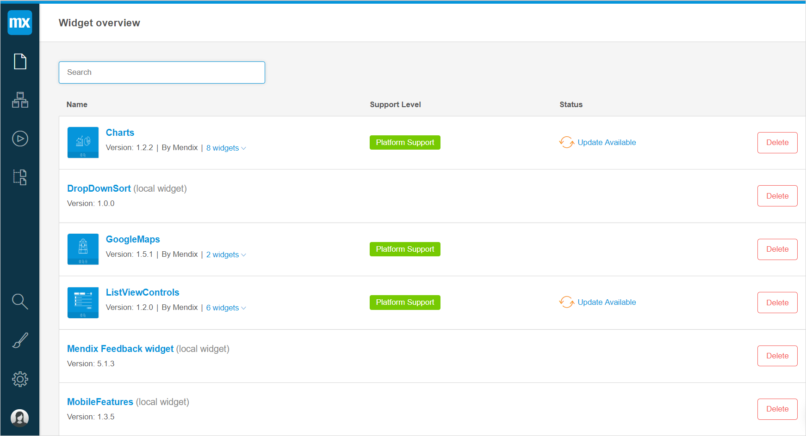

## 1 Introduction

**App Settings** contains information on Mendix App Store widgets and local widgets in your app. For more details on widgets, see [Widgets in the Web Modeler](page-editor-widgets-wm).

To open the **App Settings**, click the gear icon at the left menu bar.

## 2 App Settings Overview

**App Settings** contains an overview of all App Store widgets and local widgets in your project. 

The following types of widgets are included into the widget overview of the App Settings:

* App Store widgets that are Web Modeler approved, which are either, widgets that have been added by default when you created your app, or widgets you can download from the [App Store](../../community/app-store/) to your project directly from the Web Modeler (for more information on widgets, see [Widgets in the Web Modeler](page-editor-widgets-wm))
* Local widgets – widgets created by users in the Desktop Modeler (you can create local widgets yourself via the Desktop Modeler, for more information, see [Custom Widget Development](../../howto/custom-widget-development/))  

In the App Settings the following columns are displayed:

| Column            | Description                                                  |
| ----------------- | ------------------------------------------------------------ |
| Name              | Contains the following information on the widget: <ul><li>Widget icon</li><li> Name – the name of a single widget or the group of widgets</li><li>Version – the version of the widget installed in your project <li>Contributor's name – the name of the contributor who uploaded widgets in the App Store</li><li>Number of widgets in a package (when applicable) with a drop-down listing the widget names</li> |
| Support Level     | Indicates the level of Support for App Store content. It is determined by the content support category and the Service Level Agreement (SLA) the user possesses. The following support categories can be displayed in this column: <ul><li>**Platform Support** – Mendix supports all the content in this category when you are equipped with an Service Level Agreement (**platform**, **gold**, or **platinum**) with Mendix. Content in this category is proactively incorporated into test cycles as part of our platform release management. </li><li>**Community Support** – content is provided as-is by members of our Community and support depends on the availability and effort of the owner. </li></ul> For more information, see [App Store Content Support](../../community/app-store/app-store-content-support). |
| Status            | Indicates if the update is available. Click **Update Available** to update the particular widget. When the widget is updated, the new version of this widget is displayed in the **App Settings**. Also, the widget is updated on all pages where it is used. **Note** You may have a situation that the new version properties differ from the old one, and you can get consistency errors when publishing. For details on errors, see [Checks](checks-wm). |
| **Delete** button | Deletes the widget from your project and from all pages where it was used. |

## 3 Related Content

* [The Web Modeler Overview](overview-wm)
* [App Store Content Support](../../community/app-store/app-store-content-support)
