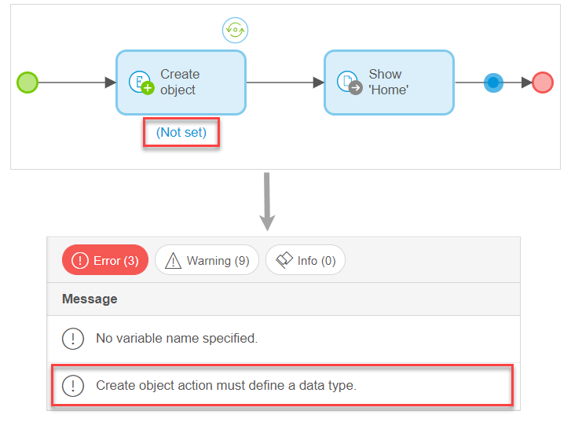

## 1 Introduction 

In this document, we will explain how to solve the most common consistency errors that can occur when configuring microflows in the Web Modeler. For more information on microflows, see [Microflows in the Web Modeler](microflows-wm).

An example of a consistency error is when you set a drag and drop a **Create Object** activity to the microflow, but do not specify what entity should be used as a data source to create the object. 

## 2 Properties Not Set Consistency Errors 

Many errors occur if you do not set properties (for example, a data source) for an element or an activity. The most common errors of this type are described in the table below:

| Text in the Checks Panel                                     | Element/ Activity                                            | Cause of an Error                                            | Way to Fix                                                   |
| ------------------------------------------------------------ | ------------------------------------------------------------ | ------------------------------------------------------------ | ------------------------------------------------------------ |
| No expression specified.                                     | [Exclusive Split](microflows-exclusive-split-wm)             | You have added an exclusive split to your microflow, but did not specify any condition for it. | Configure condition for the exclusive split: open **Properties** > **Data Source** and specify **Condition**. |
| Value ‘true’ is not handled by any outgoing sequence flow.   | [Exclusive Split](microflows-exclusive-split-wm)             | You have added an exclusive split to your microflow, and set an [attribute](domain-models-attributes-wm) of the Boolean type as a **Condition** but did not configure a case for the true value. | Open the properties of the exclusive split, in the **Cases** option click **New Case** > **Edit**. The **Exclusive Split Value** properties will open, in the  **Value** option select **True**. |
| Value ‘false’ is not handled by any outgoing sequence flow.  | [Exclusive Split](microflows-exclusive-split-wm)             | You have added an exclusive split to your microflow, and set an [attribute](domain-models-attributes-wm) of the Boolean type as a **Condition** but did not configure a case for the false value. | Open the properties of the exclusive split, in the **Cases** option click **New Case** > **Edit**. The **Exclusive Split Value** properties will open, in the  **Value** option select **False**. |
| Exclusive split cannot be the last object of a flow.         | [Exclusive Split](microflows-exclusive-split-wm)             | The exclusive split does not have any flows succeeding it.   | Add an outgoing flow after the exclusive split with another activity or an end event. |
| No variable specified to iterate over.                       | [Loop](microflows-loop-wm)                                   | You have added a loop to your microflow but did not specify a list variable to loop over. | Open the properties of the loop and set a list variable in the **Loop Over** property. |
| Iterator name is not set.                                    | [Loop](microflows-loop-wm)                                   | You have added a loop to your microflow but did not specify the variable name. | Open the properties of the loop and specify the **Loop Variable Name**. |
| A parameter can have one of the following types: Object, List, Boolean, Date and time, Decimal, Enumeration, Integer/Long, String or Float. | Parameter                                                    | You have added a parameter to your microflow but  did not specify an entity for it. | Open the properties of the parameter > the **Data Source** section, and set **Data Type** and **Entity**. |
| No input variable specified.                                 | Aggregate List                                               | You have added an **Aggregate List** activity to your microflow but did not select a list variable for it. | Open the properties of **Aggregate List** and set a variable in **Data Source** > **List variable**. |
| Aggregate function must specify a valid attribute.           | Aggregate List: Calculate Sum, Calculate Average, Calculate Maximum, Calculate Minimum operations | You have added an **Aggregate List** activity to your microflow and set **Operation** in the properties to **Calculate Sum**, **Calculate Average**, **Calculate Maximum**, **Calculate Minimum**, but did not select an attribute which the **Operation** would be applied to. | Open the properties of **Aggregate List** and select an attribute in **Behavior** > **Attribute**, or change **Operation** to **Count**. |
| A change variable is required.                               | Change Object                                                | You have added a **Change Object** activity to your microflow but did not specify a variable for it. | Open **Properties** of **Change Object** > **Data Source** and set **Variable**. |
| A commit variable is required.                               | Commit                                                       | You have added a **Commit** activity to your microflow but did not select a variable for it. | Open the properties of **Commit** and set a variable in **Data Source** > **Variable**. |
| Create object action must define a data type.                | Create Object                                                | You have added a **Create Object** activity to your microflow but did not select an entity for it. | Open the properties of **Create Object** and set an entity in **Data Source** > **Entity**. |
| No variable name specified.                                  | Create Object                                                | You have added a **Create Object** activity to your microflow but did not specify a variable name for its output. | Open the properties of **Create Object** and specify a variable name in **Output** > **Variable Name**. Note that this error can be a result of not setting an **Entity** in the **Data Source**, as once the entity is selected, **Variable Name** is filled out automatically. |
| No variable specified.                                       | Delete Object                                                | You have added a **Delete Object** activity to your microflow but did not select a variable for it. | Open the properties of **Delete Object** and set a variable in **Data Source** > **Variable**. |
| Retrieve object action must define a return type.            | Retrieve                                                     | The reasons of this error can be the following ones: <ul><li>You have added a **Retrieve** activity to your microflow and set **Source** > **By Association** in properties, but  did not select an association</li><li>You have added a **Retrieve** activity to your microflow and set **Source** > **From Database** in properties, but did not select an entity</li></ul> | Open the properties of **Retrieve** and set an association (for **Source** > **By Association** ) or an entity (for **Source** > **From Database**) in the **Data Source** section. |
| No association selected to retrieve by.                      | Retrieve                                                     | You have added a **Retrieve** activity to your microflow and have set **Source** > **By Association** in the properties, but did not select an association itself. | Open the properties of **Retrieve** and set an association in **Data Source**. |
| Select a page for this action activity.                      | Show Page                                                    | You have added a **Show Page** activity to your microflow but did not specify a page to show. | Open the properties of **Show Page** and set a page in **Data Source**. |
| No change variable selected.                                 | Change Variable                                              | You have added a **Change Variable** activity to your microflow but did not specify what variable to change. | Open the properties of **Change Variable** and set a variable in **Data Source**. |
| No change expression specified.                              | Change Variable                                              | You have added a **Change Variable** activity to your microflow but did not specify change the new value for the changed variable. | Open the properties of **Change Variable** and set **Value** in **Data Source**. |
| No initial value specified.                                  | Create Variable                                              | You have added a **Create Variable** activity to your microflow but did not specify the initial value for the variable. | Open the properties of **Create Variable** and set **Value** in **Data Source**. |

## 3 Properties Set Incorrectly Consistency Errors

If you have not configured properties of an element or an activity correctly, you will get consistency errors. For example, you have set an attribute of the integer type for an exclusive split, when only Boolean and enumeration types are allowed for it. 

The most common errors of this type are described in the table below. 

| Text in the Checks Panel                                     | Element/ Activity                                | Cause of an Error                                            | Way to Fix                                                   |
| ------------------------------------------------------------ | ------------------------------------------------ | ------------------------------------------------------------ | ------------------------------------------------------------ |
| Condition should be of type Boolean or enumeration but is of type {type of condition}. | [Exclusive Split](microflows-exclusive-split-wm) | You have configured an invalid condition expression in the exclusive split properties. The condition expression should return a Boolean or an enumeration. | Expression should return a Boolean or an enumeration: open the exclusive split properties > **Data Source** > **Condition**, and select a variable or an attribute of Boolean or enumeration type. |
| Value must be of type {type of value}.                       | [Exclusive Split](microflows-exclusive-split-wm) | You have configured a condition for the exclusive split which does not result in a Boolean or enumeration, so the selected split condition is invalid. | Open the exclusive split properties > **Data Source** > **Condition** and configure a condition that results in a Boolean or enumeration. |
| Variable {variable name} is defined but not in scope at this location. | Change Variable                                  | You have added a **Change Variable** activity to the microflow before an activity that creates this variable. | Change the order of the activities in the microflow placing the activity that creates a variable first. Only after that you will be able to change it: add a **Create Variable** activity before **Change Variable**. |
| Undefined variable {variable name}                           | Create Variable/ Change Variable                 | A variable that is not available anymore is used in the microflow. You have deleted an activity that provided the variable. **Parameter**, **Create Object**, or **Create Variable** can provide variables for the microflow, and that variable was used for **Create Variable** or **Change Variable** activities. | Add an activity that will provide the microflow with a variable that is missing, or select another variable for the **Create Variable**/ **Change Variable** activity in properties. |

## 4 Errors Connected with Desktop Modeler Settings

Some consistency errors may be connected with settings in the Desktop Modeler. The most common errors of this type are described in the table below. 

| Text in the Checks Panel                                     | Element/ Activity | Cause of an Error                                            | Way to Fix                                                   |
| ------------------------------------------------------------ | ----------------- | ------------------------------------------------------------ | ------------------------------------------------------------ |
| The selected microflow {name of the microflow} no longer exists. | Microflow         | You have deleted a microflow that is selected in the Desktop Modeler > **Project Settings** > **Runtime** > **After startup** or **Before shutdown** options. For more information on **After startup** /**Before shutdown** microflows, see section [7 After-Startup and Before-Shutdown Microflows](../clustered-mendix-runtime#startup-shutdown-microflows) in Clustered Mendix Runtime in the *Runtime category*. | There two ways to fix the error: <ul><li>In the Web Modeler: create a microflow with the same name</li><li>In the Desktop Modeler: open **Project** > **Settings**, in the **Project Settings** pop-up dialog  open the **Runtime** tab and either select a different microflow for **After startup** / **Before shutdown** options, or set these options to **None**.</li></ul> For information on how to sync the Web Modeler with the Desktop Modeler, see [How to Sync the Web Modeler with the Desktop Modeler](../../howto/web-modeler/syncing-webmodeler-desktop). |
| After startup microflow should return a boolean.             | Microflow         | This microflow is selected in the Desktop Modeler > **Project Settings** > **Runtime** > **After startup** or **Before shutdown** options, and should return a Boolean. For more information on **After startup** /**Before shutdown** microflows, see section [7 After-Startup and Before-Shutdown Microflows](../clustered-mendix-runtime#startup-shutdown-microflows) in Clustered Mendix Runtime in *Runtime category*. | Open the properties of the microflow's end event > the **Return Value** section, select **Value** option > set **Data Type** to Boolean and configure the **Value**. |

## 5 Related Content

* [Microflows in the Web Modeler](microflows-wm)
* [Page Editor Consistency Errors in the Web Modeler](consistency-errors-pages-wm)
* [Navigation Consistency Errors in the Web Modeler](consistency-errors-navigation-wm)
* [Checks Overview in the Web Modeler](checks-wm)
* [How to Publish and View Your App](../../howto/tutorials/start-with-a-blank-app-3-publish-and-view-your-app)
